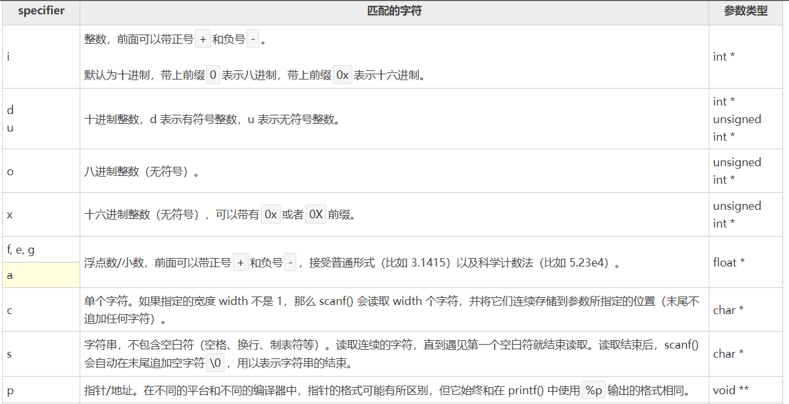

# 一、C的程序结构

- 预处理器指令
- 函数
- 变量
- 语句 & 表达式
- 注释
``` C
#include <stdio.h>
int main() 
{
/*第一个程序*/
	printf("Hello, World!\n");
	return 0;
} 

```
1. 程序的第一行 头文件 `# include <stdio.h>` 是预处理器指令，告诉 C 编译器在实际编译之前要包含 `stdio.h` 文件。即 定义了一些标准的函数 比如什么`printf、scanf、sizeof` 这些
2. 下一行`int main()`是主函数，程序从这里开始执行。
3. 下一行`/*.......*/` 将会被编译器忽略，这里放置程序的注释内容。它们被称为程序的注释。
4. 下一行 `printf(...)`是 C 中另一个可用的函数，会在屏幕上显示消息 "Hello, World!"。
5. 下一行` return 0`;终止 main() 函数，并返回值 0。
# 二、输入&输出
## 2.1  输出：printf的运用
- `printf()`函数用于将格式化的数据输出到标准输出设备（通常是屏幕）
```C
 printf("格式控制字符串",输出项列表);//printf 的一般格式
	 //格式控制字符串前要加 %  逗号后边的内容就是格式符那里要填补的内容
```


> 图 :  printf 常见格式符

- 格式符又叫占位符：
	**占位符**就是先占住一个固定的位置，等着你再往里面添加内容的符号，广泛用于计算机中各类文档的编辑。格式占位符(%)是在C/C++语言中格式输入函数，如 scanf、printf 等函数中使用。其意义就是起到格式占位的意思，表示在该位置有输入或者输出。
	
| 格式符                                | 含义                    |
| ---------------------------------- | --------------------- |
| `%d`, `%i`                         | 代表整数                  |
| `%f`                               | 浮点                    |
| `%s`                               | 字符串                   |
| `%c`                               | char                  |
| `%p`                               | 指针                    |
| `%fL`                              | 长 log                 |
| `%e`                               | 科学计数                  |
| `%g`                               | 小数或科学计数               |
| `%a`, `%A`                         | 读入一个浮点值（仅 C99 有效）     |
| `%c`                               | 读入一个字符                |
| `%d`                               | 读入十进制整数               |
| `%i`                               | 读入十进制、八进制、十六进制整数      |
| `%o`                               | 读入八进制整数               |
| `%x`, `%X`                         | 读入十六进制整数              |
| `%s`                               | 读入一个字符串，遇空格、制表符或换行符结束 |
| `%f`, `%F`, `%e`, `%E`, `%g`, `%G` | 用来输入实数，可以用小数形式或指数形式输入 |
| `%p`                               | 读入一个指针                |
| `%u`                               | 读入一个无符号十进制整数          |
| `%n`                               | 至此已读入值的等价字符数          |
| `%[]`                              | 扫描字符集合                |
| `%%`                               | 读 `%` 符号              |

- printf的简单用法：
``` C
#include <stdio.h>	 
int main() //程序的主函数，从这里开始执行（程序主入口）
{	printf("Hello world!\n");//输入函数，向屏幕输出内容 printf（参数1，参数2）;
	printf("我今年%d岁了\n",23);/*但是参数1并不能直接写你想输出的东西计算机看不懂，要写格式符才行,比如printf（"我今年__岁了",参数2）这个__位置应该写%d 参数2的位置写年龄23*/
	printf("韩某的身高为：%.2f米\n", 1.78); //%f表示输出浮点数，.2表示小数点后保留两位
	printf("%d\n", 18 + 18);
	printf("%c\n", 'H');//别忘了参数2位置上的字符用''括起来，而字符串用""括起来	
	printf("我的名字是%s\n","救苦救难韩天尊");
	printf("我的亲亲女朋友的姓名是：%s。性别：%s。年龄：%d岁。身高：%.2f米。体重：%d斤。\n","慕佩玲","女", 300, 1.75, 110);
	return 0;//返回值，向操作系统返回0，表示程序正常结束 
}
```
运行结果：
```
Hello world!
我今年23岁了
韩某的身高为：1.78米
36
H
我的名字是救苦救难韩天尊
我的亲亲女朋友的姓名是：慕佩玲。性别：女。年龄：300岁。身高：1.75米。体重：110斤。
```
## 2.2  输入scanf的使用
- `scanf()`函数用于从标准输入设备（通常是键盘）读取格式化的输入。
```C
int scanf(const char *format, ...);//scanf的语法
scanf（“占位符”，&变量名）;//scanf 的一般格式
```
### 2.2.1注意：
format 为格式字符串，由格式说明符和普通字符构成。其中：
- 格式说明符以`%`开头，比如 %d、%s、%c 等，表示要读取什么样的数据；

- 普通字符按照原样输入，比如英文、数字、逗号、空格等。

- 在这里，应当指出的是，`scanf()` 期待输入的格式与您给出的 `%s` 和 `%d` 相同，这意味着您必须提供有效的输入，比如 "string integer"，如果您提供的是 "string string"或 `"integer  integer"`，它会被认为是错误的输入。另外，在读取字符串时，只要遇到一个空格，scanf() 就会停止读取，所以 "this is test" 对 `scanf() `来说是三个字符串。==双引号内的是什么形式，等到在终端里边输入的时候也的是什么形式，有空格打空格。==

- 如果 `scanf()` 函数将转换后的数据存储到==基本数据类型==的变量当中，则在变量名前添加 &；

- 如果 `scanf()`函数将字符串存储到==字符数组==中，则在字符数组名前不用添加 &。

![[scanf常见格式符.png]]
> 图 :  scanf常见格式符

- `sacnf`的简单用法：
```C
# include <stdio.h>
int main()
{
//键盘录入的使用
	int a; //1.定义整型变量a
	printf("请输入一个整数");
	//fflush(stdout); // obsidian 里边需要写这一行来使用交互式的代码
	scanf("%d", &a);//2.键盘录入 
	//&a 取变量a的地址 用scanf就得加第一行的定义来取消安全警告		
	//不想定义就用scanf_s
	printf("变量a里面的值为：%d\n",a);
	//练习1：键盘录入一个整数并输出
	int age;
	printf("请输入您的年龄:");
	scanf("%d", &age);  //切记 键盘输入的东西一定要和scanf_s 里面的格式保持一致 否则会出错；
	printf("您的年龄为:%d岁\n",age);
	 
	/*//练习2：定义两个整数类型的num1和num2，键盘录入两个整数并输出它们的和； 
	int num1,num2;
	printf("请输入两个数字：");
	scanf("%d %d", &num1, &num2); //和printf一样 可以同时键入多个数据 用空格隔开且 格式 要对应； 
	printf("num1和num2的和为:%d\n", num1+num2);
	//练习3：键盘输入三个小数，分别表示长方体的长宽高，分别求A B C面的面积以及长方形的体积，结果保留两位小数。
	double length,width,height;
		printf("请分别输入长方体的长宽高：");
		scanf("%lf %lf %lf", &length, &width, &height);
	double areaA = length * width;
	double areaB = height * width;
	double areaC = length * height;
	double volume = length * width * height;	
		printf("A面的面积为：%.2lf\nB面的面积为：%.2lf\nC面的面积为：%.2lf\n长方形体积为：%.2lf\n", areaA, areaB, areaC,volume);
		//流程就是先定义变量 然后键盘录入数据 进行计算（列公式） 最后输出结果.*/
}
```
运行结果：
```
请输入一个整数4563
变量a里面的值为：4563
练习一：
请输入您的年龄:18
您的年龄为:18岁
练习二：
请输入两个数字：5 6
num1和num2的和为:11
练习三：
请分别输入长方体的长宽高：6 8 9
A面的面积为：48.00
B面的面积为：72.00
C面的面积为：54.00
长方形体积为：432.00
```
``
# 三.数据类型
- 数据类型指的是用于声明不同类型的变量或函数的一个广泛的系统。变量的类型决定了变量存储占用的空间，以及如何解释存储的位模式。

- 常用的数据类型有： [[整型数据类型.png]]  [[浮点类型.png]]
## 3.1 数据类型的转换

是将一个数据类型的值转换为另一种数据类型的值。

C 语言中有两种类型转换：

- **隐式类型转换：隐式类型转换是在表达式中自动发生的，无需进行任何明确的指令或函数调用。它通常是将一种较小的类型自动转换为较大的类型，例如，将int类型转换为long类型或float类型转换为double类型。隐式类型转换也可能会导致数据精度丢失或数据截断。
```C
# include <stdio.h>
int main()
{
	int i = 10;
	float f = 3.14;
	double d = i + f; // 隐式将int类型转换为double类型
	printf("d=%.2lf",d);
	return 0;
}
```

运行结果：
```
d=13.14
```
- **显式类型转换：显式类型转换需要使用强制类型转换运算符(你想强制换成的类型)，它可以将一个数据类型的值强制转换为另一种数据类型的值。强制类型转换可以使程序员在必要时对数据类型进行更精确的控制，但也可能会导致数据丢失或截断。
```C
#include <stdio.h>
int main()
	{
		double d = 3.14159;
		int i = (int)d; // 显式将double类型转换为int类型
		printf("i=%d",i);
		//  强制转换	
		short s1 = 10;
		short s2 = 20;
		short s3 = (short)s1 + s2;
		short s4 = (short)(s1 + s2);
		printf("%d\n",s4);
		printf("%zu\n",sizeof((short)s1 + s2));
		printf("%zu\n", sizeof((short)(s1 + s2)));
		//字符转数字
		printf("%d %d\n",'0','a');//ACSII码
		return 0;
	}
```

运行结果：
```c
i = 3
s4 = 30
sizeof((short)s1 + s2) = 4
sizeof((short)(s1 + s2)) = 2
48 97 
```
## 3.2 查看数据类型存储大小的方法：sizeof函数
```C
//sizeof(数据类型/变量名) 用来查看数据类型或者变量所占内存空间大小，单位是字节；	
	printf("%zu\n", sizeof(short));
	printf("%zu\n", sizeof(a));//注意：%zu 是专门用来打印size_t类型数据的占位符；
```
# 四.变量
- 变量其实只不过是程序可操作的存储区的名称。C 中每个变量都有特定的类型，类型决定了变量存储的大小和布局，该范围内的值都可以存储在内存中，运算符可应用于变量上。

- 变量的名称可以由字母、数字和下划线字符组成。它必须以字母或下划线开头。大写字母和小写字母是不同的，因为 C 是大小写敏感的。

- 注意：变量只在所属的大括号中生效。
## 4.1 变量的基本类型
- [[变量的基本类型.png]] 

- C 语言也允许定义各种其他类型的变量，比如枚举、指针、数组、结构、共用体等等。
## 4.2 变量的定义和初始化
### 4.2.1变量的定义
```C
type variable_list;
```
- **type** 表示变量的数据类型，可以是整型、浮点型、字符型、指针等，也可以是用户自定义的对象。

- **variable_list** 可以由一个或多个变量的名称组成，多个变量之间用逗号,分隔，变量由字母、数字和下划线组成，且以字母或下划线开头。
### 4.2.2 变量的初始化
**使用前的初始化**

- 在 C 语言中，变量的初始化是在定义变量的同时为其赋予一个初始值。变量的初始化可以在定义时进行，也可以在后续的代码中进行。

	-  初始化由一个等号，后跟一个常量表达式组成
```C
type variable_name = value;
```
**后续初始化变量：**

- 在变量定义后的代码中，可以使用赋值运算符 = 为变量赋予一个新的值。
```C
type variable_name;    // 变量定义
variable_name = new_value;    // 变量初始化
```
- 需要注意的是，==变量在使用之前应该被初始化==。未初始化的变量的值是未定义的，可能包含任意的垃圾值。因此，为了避免不确定的行为和错误，建议在使用变量之前进行初始化。
**变量不初始化**
- 在 C 语言中，如果变量==没有显式初始化==，那么它的默认值将==取决于该变量的类型和其所在的作用域==。

- 对于全局变量和静态变量（在函数内部定义的静态变量和在函数外部定义的全局变量），它们的默认初始值为零。

```C
以下是不同类型的变量在没有显式初始化时的默认值：
	整型变量（int、short、long等）：默认值为0。
	浮点型变量（float、double等）：默认值为0.0。
	字符型变量（char）：默认值为'\0'，即空字符。
	指针变量：默认值为NULL，表示指针不指向任何有效的内存地址。
	数组、结构体、联合等复合类型的变量：它们的元素或成员将按照相应的规则进行默认初始化，这可能包括对元素递归应用默认规则。
```
- 需要注意的是，局部变量（在函数内部定义的非静态变量）不会自动初始化为默认值，它们的初始值是未定义的（包含垃圾值）。因此，在使用局部变量之前，应该显式地为其赋予一个初始值。

- 总结起来，C 语言中变量的默认值取决于其类型和作用域。全局变量和静态变量的默认值为 **0**，字符型变量的默认值为 \0，指针变量的默认值为 NULL，而局部变量没有默认值，其初始值是未定义的。

# 五.常量
- 常量是固定值，在程序执行期间不会改变。这些固定的值，又叫做**字面量**。
	
	* 常量可以是任何的基本数据类型，比如整数常量、浮点常量、字符常量，或字符串字面值，也有枚举常量。
	
	* 常量*就像是常规的变量，只不过常量的值在定义后不能进行修改。
	
	* 常量可以直接在代码中使用，也可以通过定义常量来使用。
	* [[常量类型.png]]    字符常量需要单引号引起来； 字符串常量需要用双引号 。
## 5.1 整型常量
- 整数常量可以是十进制、八进制或十六进制的常量。前缀指定基数：0x 或 0X 表示**十六进制**，0 表示**八进制**，不带前缀则默认表示**十进制**。
	
	- 整数常量也可以带一个后缀，后缀是 U 和 L 的组合，**U** 表示**无符号整数**（unsigned），L 表示长整数（long）。后缀可以是大写，也可以是小写，U 和 L 的顺序任意。
	
	- 关于整型常量：0.93=.93 或者 18.0=18.也即==小数点前后的0可以不写。==
```C
212         /* 合法的 */
215u        /* 合法的 */
0xFeeL      /* 合法的 */
078         /* 非法的：8 不是八进制的数字 */
032UU       /* 非法的：不能重复后缀 */
85         /* 十进制 */
0213       /* 八进制 */
0x4b       /* 十六进制 */
30         /* 整数 */
30u        /* 无符号整数 */
30l        /* 长整数 */
30ul       /* 无符号长整数 */
//整数常量可以带有一个后缀表示数据类型，例如：
int myInt = 10;
long myLong = 100000L;
unsigned int myUnsignedInt = 10U;
```
## 5.2 浮点常量
- 浮点常量由整数部分、小数点、小数部分和指数部分组成。可以使用小数形式或者指数形式来表示浮点常量。

- 当使用小数形式表示时，必须包含整数部分、小数部分，或同时包含两者。当使用指数形式表示时，必须包含小数点、指数，或同时包含两者。带符号的指数是用 e 或 E 引入的。
```C
3.14159       /* 合法的 */
314159E-5L    /* 合法的 */
510E          /* 非法的：不完整的指数 */
210f          /* 非法的：没有小数或指数 */
.e55          /* 非法的：缺少整数或分数 */
//浮点数常量可以带有一个后缀表示数据类型，例如：
float myFloat = 3.14f;
double myDouble = 3.14159;
```
## 5.3 字符常量
- 字符常量是==括在单引号‘’==中，例如，'x' 可以存储在 **char** 类型的简单变量中。

- 字符常量可以是一个普通的字符（例如 'x'）、一个转义序列（例如 '\t'），或一个通用的字符（例如 '\u02C0'）。

- 在 C 中，有一些特定的字符，当它们前面有反斜杠时，它们就具有特殊的含义，被用来表示如换行符（\n）或制表符（\t）等。
## 5.4 字符串常量
- 字符串字面值或常量是==括在双引号 " " ==中的。一个字符串包含类似于字符常量的字符：普通的字符、转义序列和通用的字符。可以使用空格做分隔符，把一个很长的字符串常量进行分行。
- 字符串常量在内存中以 null 终止符 \0 结尾
## 5.5 常量的定义

在 C 中，有两种简单的定义常量的方式：

1. 使用 **#define** 预处理器： #define 可以在程序中定义一个常量，它在编译时会被替换为其对应的值。
2. 使用 **const** 关键字：const 关键字用于声明一个只读变量，即该变量的值不能在程序运行时修改。
```C
//#define 常量名 常量值
define PI 3.14159 //在程序中使用该常量时，编译器会将所有的 PI 替换为 3.14159。

//const 数据类型 常量名 = 常量值;
const int MAX_VALUE = 100;//在程序中使用该常量时，其值将始终为100，并且不能被修改

```
### 5.5.1 两者区别
- **const** 定义的是变量不是常量，只是这个变量的值不允许改变是常变量！带有类型。编译运行的时候起作用存在类型检查。

- **define** 定义的是不带类型的常数，只进行简单的字符替换。在预编译的时候起作用，不存在类型检查。

**(1) 编译器处理方式不同**

- #define 宏是在预处理阶段展开。
-  const 常量是编译运行阶段使用。

**(2) 类型和安全检查不同**

-  #define 宏没有类型，不做任何类型检查，仅仅是展开。
-  const 常量有具体的类型，在编译阶段会执行类型检查。

**(3) 存储方式不同**

- #define宏仅仅是展开，有多少地方使用，就展开多少次，不会分配内存。（宏定义不分配内存，变量定义分配内存。）
- const常量会在内存中分配(可以是堆中也可以是栈中)。

**(4) const 可以节省空间，避免不必要的内存分配。 例如：**
```C
#define NUM 3.14159 //常量宏
const doulbe Num = 3.14159; //此时并未将Pi放入ROM中 ......
double i = Num; //此时为Pi分配内存，以后不再分配！
double I= NUM; //编译期间进行宏替换，分配内存
double j = Num; //没有内存分配
double J = NUM; //再进行宏替换，又一次分配内存！
const 定义常量从汇编的角度来看，只是给出了对应的内存地址，而不是像 #define 一样给出的是立即数，所以，const 定义的常量在程序运行过程中只有一份拷贝（因为是全局的只读变量，存在静态区），而 #define 定义的常量在内存中有若干个拷贝。
```
**(5) 提高了效率。** 编译器通常不为普通const常量分配存储空间，而是将它们保存在符号表中，这使得它成为一个编译期间的常量，没有了存储与读内存的操作，使得它的效率也很高。

**(6) 宏替换只作替换，不做计算，不做表达式求解**；宏预编译时就替换了，程序运行时，并不分配内存。

# 六. 运算符

## 6.1 算术运算符

  假设变量 **A** 的值为 10，变量 **B** 的值为 20，则：

| 运算符 | 描述               | 示例            |
| --- | ---------------- | ------------- |
| +   | 把两个操作数相加         | A + B 将得到 30  |
| -   | 从第一个操作数中减去第二个操作数 | A - B 将得到 -10 |
| *   | 把两个操作数相乘         | A * B 将得到 200 |
| /   | 分子除以分母           | B / A 将得到 2   |
| %   | 取余运算符，整除后的余数     | B % A 将得到 0   |
| ++  | 自增运算符，整数值增加 1    | A++ 将得到 11    |
| --  | 自减运算符，整数值减少 1    | A-- 将得到 9     |
- 算术运算符的简单示例1：
```C
# include <stdio.h>
int main()
{
//取各位置的数字
	//键盘输入一个三位数，将其拆分为个位、十位、百位分别输出
	/* "123"  个位:3  十位:2  百位:1 
	  123 除以 10  商12 余3； 12除以10 商1 余2； 1除以10 商0 余1*/ 	
	printf("请输入一个三位数：");
	int num;
	scanf_s("%d", &num);
	//该数 对10取余 可得num的个位数
	int ge, shi, bai;
	ge = num % 10; //123 除10 商为12 余3 再拿商对10取余数可得商的个位即num的十位
	shi = (num / 10) % 10;
	bai = num / 100; //百位就简单了 直接除以 100 即可取得
	printf("该三位数的个位十位百位分别是：%d %d %d ", ge, shi, bai);
	//公式就是： 个位：数值%10  
	//          十位：(数值/10)%10  
	//          百位：数值/100
	//          千位：数值/1000	
	return 0;
}
```
运算结果：
```C
请输入一个三位数：753
该三位数的个位十位百位分别是：3 5 7
```
- 算术运算符的简单示例2：关于自增++和自减--运算符
```C
	//自增自减运算符++ --
	//1.单独使用及其单独放在一行时++或--在前在后没有区别都是自增或自减1；
	# include <stdio.h>
	int main()
	{
	int i = 10;
	i++;
	printf("%d\n", i);
	
	//2.参与表达式计算
	int a = 10;
	int b = a++;
	printf("%d\n%d\n", b, a); //a=11 b=10  ++在后面，先赋值后自增
	int m = 10;
	int n = ++m;
	printf("%d\n%d\n", n, m);//m=11 n=11  ++在前面，先自增后赋值
	return 0;
	}
```
## 6.2 关系运算符

假设变量 **A** 的值为 10，变量 **B** 的值为 20，则：

| 运算符 | 描述                              | 示例           |
| --- | ------------------------------- | ------------ |
| ==  | 检查两个操作数的值是否相等，如果相等则条件为真。        | (A == B) 为假  |
| !=  | 检查两个操作数的值是否相等，如果不相等则条件为真。       | (A != B) 为真。 |
| >   | 检查左操作数的值是否大于右操作数的值，如果是则条件为真。    | (A > B) 为假。  |
| <   | 检查左操作数的值是否小于右操作数的值，如果是则条件为真。    | (A < B) 为真。  |
| >=  | 检查左操作数的值是否大于或等于右操作数的值，如果是则条件为真。 | (A >= B) 为假。 |
| <=  | 检查左操作数的值是否小于或等于右操作数的值，如果是则条件为真。 | (A <= B) 为真。 |

## 6.3 逻辑运算符

假设变量 **A** 的值为 1，变量 **B** 的值为 0，则：

| 运算符      | 描述                                | 示例            |
| -------- | --------------------------------- | ------------- |
| && 逻辑与   | 如果两个操作数都非零，则条件为真。                 | (A && B) 为假   |
| \|\| 逻辑或 | 如果两个操作数中有任意一个非零，则条件为真。            | (A \|\| B) 为真 |
| ！逻辑非     | 用来逆转操作数的逻辑状态。如果条件为真则逻辑非运算符将使其为假。。 | !(A && B) 为真  |

- ==P.S==.
```C
	//Plus：逻辑运算符的有一种叫短路现象 
	//即前边的条件已经可以决定最终结果时，后边的条件就不再计算	
	# include <stdio.h>
	int A = 1, B = 5;
	A > 0 && ++B;
	printf("a=%d,b=%d\n",A,B);	
	
	int C = 1, D = 5;	
	C > 10 && ++D; //前边条件为假，后边不计算所以D不自增
	printf("X=%d,Y=%d", C, D);
```
运算结果：
```C
A = 1
B = 6
C = 1
D = 5
```
## 6.4 赋值运算符
- 赋值 `+= -= *= /= %=` 运算符
```C
	# include <stdio.h>
	// a+=b  等价于  a = a + b  就是将b加到a上，然后再赋值给a 即把右边        操作数加上左边操作数的结果赋值给左边操作数
		int a = 10;
		int b = 20;
		a += b;    // a = a + b;	
		printf("%d\n%d\n",a,b); //a=30 b=20
		a *= b;
		printf("%d\n%d\n",a,b);//a=600 b=20
		return 0;

```
- 关于运算符的一些小练习：
```C
	
	//练习1.输入一个两位整数，要求该数字不能含有数字7,如果符合要求，输出 1，不符合输出0；
	printf("请输出一个两位数字");
	int number1;
	scanf_s("%d",&number1);
	int result1=number1 / 10 != 7 && number1 % 10 != 7;
	printf("%d\n", result1);
	/*思路：对该两位数字的十分和个位同时判断是否不等于7，不等于即为符合要求输出1;所以要用到对十位做除法 / 取整，对个位做取余 % 操作，然后用 && 连接两个条件*/
```
## 6.5 三元运算符  ?   : 
```C
格式：关系表达式 ？ 表达式1 ： 表达式2;  关系表达式成立，结果为表达式1的值，否则为表达式2的值 
```
- 三元运算符的简单示例1：
```C
// 练习1： 找出两个整数中的较大值
	int a = 10, b = 20;
	a > b ? a : b;
	int c= a > b ? a : b;
	printf("%d\n",c);
	//练习2：找出三个整数中的最大值:先比俩，得出较大值，再用较大值和第三个数比较
	int x = 20, y = 30, z = 90;
	int temp =x > y ? x : y;  //x比y大吗（>） 我问一下（ ？） 是则取x 否则（ ：） 取y；
	int max = temp > z ? temp : z;
	printf("%d",max);
	return 0;
```
运算结果：
```C
c = 20
max = 90
```
- 简单示例2：
```C
	//主持人给出任意一个数字：有三位小朋友对这个数字进行了不同的操作，
	//注意：每个小朋友都是拿着前一个的结果进行操作的
	//第一个：变成该数字的绝对值 第二个：除以三获取余数 第三个：乘以10
	# include <stdio.h>
	int main()
	{
	int number=-16;
	printf("%d\n",(number=number >= 0 ? number : -number,number %=  3,number *= 10));
	return 0;
	}
	
```
# 七.流程控制语句
## 7.1 判断语句
### 7.1.1 if 判断
- **if** 格式1：
```C
if(关系表达式)
{
   语句体；/* 如果布尔表达式为真将执行的语句 */
}
```
- 如果表达式为 **true**，则 if 语句内的代码块将被执行。如果表达式为 **false**，则 if 语句结束后的第一组代码（闭括号后）将被执行。

- C 语言把任何**非零**和**非空**的值假定为 **true**，把**零**或 **null** 假定为 **false**。

- if语句里边的语句体如果只有一行，可以省略大括号。

- 简单示例：
```C
	//需求1:温度大于37.5°就会有语音警告
	double tempture = 38;
	if (tempture > 37.5)
	{
	    printf("体温过高，语音报警\n"); 
	}
```

```C
    //需求2：游戏中人物血条
    //初始100血受到80伤害再自己恢复了100的血最后血条是多少
    int hpMAX = 200;
    int hurt = 80;
    int recover = 100;
	//逻辑 初始血-受到的伤害+恢复的血量
    hpMAX = hpMAX - hurt + recover;//这个已经是符合题意了，但是无上限
    if (hpMAX>200) //但是严谨一些，上限为200 所以要加个判断
    {
        hpMAX = 200; 
    }
    printf("%d\n",hpMAX);
```
* **if** 格式2：
```C
     if格式2：
            if(条件表达式)
            {
                语句体1；
            }
            else
            {
                语句体2；
			}
```
简单示例：
```C
    /* 需求3.我和慕佩玲去看电影，如果在同一排且连着坐，我会开心的看电影
	如果不在同一排或者不连着坐，我会开心的打游戏 */
    int row_me = 5;
    int col_me = 6;
    int row_mup = 6;
    int col_mup = 8;
	//想想 怎么是同一排：相等运算符== 看row_me是否==row_mup
	//怎么是连着坐：列号相差1 即相减为正负1均可
    if ((row_me == row_mup) && (col_me - col_mup == 1 || col_me - col_mup == -1))
    {
        printf("我会开心的看电影");
    }
    else
    {
        printf("我会开心的打游戏");
    }
```
运行结果：
```C
我会开心的打游戏
```
- if格式3：
```C
	if(boolean_expression 1)
	{
	   /* 当布尔表达式 1 为真时执行 */
	}
	else if( boolean_expression 2)
	{
	   /* 当布尔表达式 2 为真时执行 */
	}
	else if( boolean_expression 3)
	{
	   /* 当布尔表达式 3 为真时执行 */
	}
	else 
	{
	   /* 当上面条件都不为真时执行 */
	}
```
简单示例：
```C
	/*需求4：键盘输入一个游戏氪金的总额度，不同的额度VIP等级不同
    1~99元：尊贵的VIP1
	100~499元：豪华的VIP2
	500~999元：至尊的VIP3
	1000元及以上：土豪VIP4*/
    int money;
    printf("请输入您所花费的金额:");
    scanf_s("%d",&money);
    if (money == 0) 
    {
        printf("您是零充玩家");
    }
    else if (money>=1 && money<=100)
    {
        printf("您是尊贵的VIP1");
    }
    else if (money>100 && money<=500) 
    {
        printf("您是豪华的VIP2");
    }
    else if (money>500 && money<=1000) 
    {
        printf("您是至尊的VIP3");
    }
    else 
    {
        printf("您是土豪VIP4");
    }
```
运行结果：
```C
请输入您所花费的金额:999
您是至尊的VIP3
```
**当使用 if...else if...else 语句时，以下几点需要注意：**
- 一个 if 后可跟零个或一个 else，else 必须在所有 else if 之后。
- 一个 if 后可跟零个或多个 else if，else if 必须在 else 之前。
- 一旦某个 else if 匹配成功，其他的 else if 或 else 将不会被测试。
### 7.1.2 switch 判断
- **switch**语法
```C
switch(expression){
    case constant-expression  :
	   语句体1；
       break; /* 可选的 */
    case constant-expression  :
       语句体2
       break; /* 可选的 */
  
    /* 您可以有任意数量的 case 语句 */
    default : /* 可选的 */
       语句体3
}
```
**switch 语句说明：**

- switch 后面的表达式的值将会与每个 case 后面的常量值进行比较，直到找到匹配的值或者执行到 default（如果存在）。

- 如果找到匹配的值，将执行相应 case 后面的代码块，然后跳出 switch 语句。

- 如果没有匹配的值，并且有 default，则执行 default 后面的代码块。

- 如果没有匹配的值，并且没有 default，则跳过整个 switch 语句直到结束。

**switch** 语句必须遵循下面的规则：

- **switch 表达式的类型：** switch 语句中的表达式必须是整数类型（char、short、int或枚举），或者是能够隐式转换为整数类型的表达式。

- **case 标签的唯一性：** 在 switch 语句中，每个 case 标签必须是唯一的，不能有重复的值。

- **默认情况的可选性：** switch 语句中的 default 标签是可选的。如果没有匹配的 case 标签，则会执行 default 标签下的代码块（如果存在）。

- **case 标签中的常量值：** case 标签后面的值必须是一个常量表达式，这意味着它的值在编译时就能确定。

- **case 标签的顺序：** switch 语句中的 case 标签的顺序并不重要，它们可以按照任意顺序编写。程序会按照 case 标签出现的顺序依次匹配。

- **break 语句的使用：** 在每个 case 标签的代码块结束处通常需要使用 break 语句来终止 switch 语句的执行。如果没有 break 语句，程序将会继续执行下一个 case 标签中的代码，直到遇到 break 语句或 switch 语句结束。

- **switch 语句的嵌套：** switch 语句可以嵌套在其他 switch 语句中，但是需要注意代码的可读性和复杂性。

- **case 标签和表达式的范围：** switch 语句的 case 标签可以是整数常量表达式，但不能是浮点数或字符串。

- 简单示例：
```C
	/*需求2：当我们在拨打电话是时，一般有不同的按键选择不同的服务
	假设现在我们拨打了一个机票预定电话：
	1.预定机票 2.退订机票 3.改签机票 4.人工服务 5.其他服务*/
	int choice;
	printf("欢迎使用机票预定系统，请选择您需要的服务：\n");
	scanf_s("%d",&choice);
	switch (choice)
	{	case 1:
			printf("您选择了预定机票服务，请稍后...\n");
			break;
		case 2:
			printf("您选择了退订机票服务，请稍后...\n");
			break;
		case 3:
			printf("您选择了改签机票服务，请稍后...\n");
			break;
		case 4:
			printf("您选择了人工服务，请稍后...\n");
			break;
		case 5:
			printf("您选择了其他服务，请稍后...\n");
			break;
		default:
			printf("您输入的选项有误，请重新选择！\n");
			break;
	}
```
运行结果：
```C
欢迎使用机票预定系统，请选择您需要的服务：
6
您输入的选项有误，请重新选择！
欢迎使用机票预定系统，请选择您需要的服务：
4
您选择了人工服务，请稍后...
```
## 7.2 循环语句
### 7.2.1 for循环
- for语法：
```C
	在实际开发中，如果要获取一个范围中的每一个数据时，通常会使用for循环
	for (初始化语句①; 条件判断语句②; 条件控制语句③)
	{
		循环体语句④；
	} 
		第一次循环：i=1 即：①②④③
		第二次循环：i=2 即：②④③
		第三次循环：i=3 即：②④③	
```
- **for循环执行流程：**
1. **初始化语句** 会首先被执行，且只会执行一次。这一步允许您声明并初始化任何循环控制变量。也可以不在这里写任何语句，只要有一个分号出现即可。
2. 接下来，会判断 **条件判断语句**。如果为真，则执行循环主体。如果为假，则不执行循环主体，且控制流会跳转到紧接着 for 循环的下一条语句。
3. 在执行完 for 循环主体后，控制流会跳回上面的 **条件控制语句** 语句。该语句允许您更新循环控制变量。该语句可以留空，只要在条件后有一个分号出现即可。
4. 条件再次被判断。如果为真，则执行循环，这个过程会不断重复（循环主体，然后增加步值，再然后重新判断条件）。在条件变为假时，for 循环终止。
- 简单示例1：
```C
	// 要求打印1-5 和 打印5-1
	int i;
	for (i=1;i<=5;i++) 
	{
		printf("%d\n",i);
	}
	printf("----------------\n");
	int j;
	for (j=5;j>=1;j--) 
	{
		printf("%d\n", j);
	
	}
```
运行结果：
```C
1
2
3
4
5
----------------
5
4
3
2
1
```
- 简单示例2：
```C
	/*需求3：求1 - 100之间所有整数的和
	 循环能显示1-100之间的所有整数，所以还需要一个变量来保存最终的和 即用 sum+i 最后再赋给sum即可。
	 第一次循环：i=1 sum=0
				1+0=1 再把结果赋给sum 
	 第二次循环：i=2 sum=1
				2+1=3 再把结果赋给sum
	*/
	int i;
	int sum=0;
	for (i=1;i<=100;i++) 
	{
		sum = sum + i;   // 如果把int sum=0; 写在这里面，则每次循环sum都会被重新初始化为0，最终结果就是100
	}
	printf("%d\n",sum);
	/*所以 如果想要每次循环都能在上一次的结果基础上进行累加操作，就需要把变量定义在循环外面
	如果想要每次循环都是一个全新的变量，就需要把变量定义在循环里面*/
```
运行结果：
```C
5050
```
- 示例3：
```C
//需求4：求1 - 100之间所有偶数的和
	int i;
	int sum = 0;
	 先获取这100个数的和然后再用 判断语句 去筛出偶数进行累加
	for (i=1;i<=100;i++) 
	{
		if (i % 2 == 0) // 判断是否i是否取到偶数了,取到就执行累加
		{	
			sum += i;
		}
	
	}
	printf("%d\n",sum);
	/*所以 意思就是当想要使用 每一个的 数据的时候，仅用for循环就可以了 
	但是 当如果只想要使用 部分 数据的时候，就需要在循环体内加上判断语句来进行筛选*/
```
运行结果：
```C
2550
```
- 示例4：
```C
	/*需求5：键盘录入两个数字，表示一个范围，统计这个范围内既能被6整除又能被8整除的数字有多少个
	  Plus:统计思想：定义一个变量 count 来保存数量，每当发现一个符合要求的数字时，就让 count 自增1 */
	  /* 思路：for循环获取范围内的所有数字，统计数量用一个变量的自增来统计，也就是统计循环了多少次。*/
	int num1,num2;
	printf("请输入两个数字表示范围");
	scanf_s("%d %d",&num1.&num2);
	int min= num1 < num2 ? num1 : num2;
	int max= num1 > num2 ? num1 : num2;
	int count = 0;
	printf("符合要求的数字分别为：");
	for(int i=min;i<=max;i++)
	{
	  if(i % 24 ==0) //同时被6和8整除 即对24取余数等于0
	  {
		  printf("%d\n",i);
		  count++;
	  }
	  else if(count == 0)
	  {
		  printf("无这样的数字");
	  }
	  else
	  {
		  printf("即符合要求的数字有：%d个"，count)
	  }
	}
  
```
运行结果：
```C
请输入两个数字表示范围:50 500
符合要求的数字分别为:72 96 120 144 168 192 216 240 264 288 312 336 360 384 408 432 456 480 即符合要求的数字有：18个
请输入两个数字表示范围:50 60
符合要求的数字分别为:无符合要求的数字
```
### 7.2.2 while循环
- while语法：
```C
	初始化语句；
	while(条件判断语句)
	{
	循环体语句；
	条件控制语句；
	}
```
- **运行流程:**
1. 在这里，**循环体语句** 可以是一个单独的语句，也可以是几个语句组成的代码块。
2. **条件判断语句** 可以是任意的表达式，当为任意非零值时都为 true。当条件为 true 时执行循环。 当条件为 false 时，退出循环，程序流将继续执行紧接着循环的下一条语句。
- **for循环 和 while循环的区别：**
	知道循环次数，用for循环，不知道循环次数只知道循环结束条件，用 while循环。
- 简单示例：
```C
	//  打印5次“Hello World！”
	int i = 1;
	while (i <= 5)
	{
		printf("Hello World!\n");
		i++;
	}
```
运行结果：
```C
Hello World!
Hello World!
Hello World!
Hello World!
Hello World!
```
## 7.3 循环的一些练习
1. **输入一个整数n，请判断该整数是否是 2 的幂次方.**
	举例：
	n=1  输出：yes 2的0次方
	n=2  输出：yes 2的1次方
	n=3  输出：no
	n=4  输出：yes 2的2次方
	n=5  输出：no
	分析：先找规律 
			0      1
			1	2
			2	4
			3	8
			4	16
			5	32
		即：一个数字不断除以2，如果最后能除到1，则说明是2的幂次方，否则不是。
		
		“不断” 就意味着循环 由于不知道循环多少次，所以用while循环
		
		那循环结束的条件是什么：
		1.当结果是1时，输出yes
		2.当得到的结果不是1且不能被2整除时，输出no
		
	```C
	# include <stdio.h>
	int main()
	{
	int n;
	printf("请输入一个数：");
	scanf_s("%d",&n);
	int count = 0;//因为要展示出是2的几次方，就相当于除以2除了几次，统计次数
	while(n > 1 && n % 2 == 0) //注意while的判断语句是和结束结束条件反着的
	{
	    	count++;
	    	n /= 2;//每次循环 n除以2并再赋给n 一直循环该条件直到n不能被2整除了
	}
	if(n == 1)
	{
		printf("Yes 且n为 2 的 %d 次幂", count);
	}
	else
	{
		printf("NO 即n不为 2 的任何次幂");	
	}
	return 0;
	}
	
	```
	运行结果：
	```C
		运行结果：
	请输入一个整数：8
	Yes 且n为 2 的 3 次幂
	请输入一个整数：6
	NO 即n不为 2 的任何次幂
	```

2. **输入一个非负整数x，计算并返回x的算术平方根。结果只保留整数部分，小数部分将被舍去.**
	例：x=4 返回2
	x=8  返回2  因为2.82842... 只保留整数部分2
	
	`从1开始不断试探乘方结果，直到乘方结果大于x时停止 故这句话取反就是while的条件判断语句,则该整数部分就是上一个数即x-1`
	
	```C
	int num;
	printf("请输入一个非负整数：")
	scanf_("%d",&num)
	while(i * i <= num)
	{
		i++;	
	}
	printf("%d\n",num-1);
	```
	运行结果：
	```C
	请输入一个非负整数：89
	9
	```
3. **整数反转输出,将123反转输出为321.**
	`反转其实就是把个位十位百位拿出来重新排列了，所以需要有一个变量temp来存储每一位数字以及rev存储反转后得数字`
	
	`就还是取一个数的个十百位只不过用循环处理了：个位：该数对10取余赋给temp，十位：该数先除以10得到12后，再12对10取余，再将余数赋给temp`
	
	`取出个位后：rev=rev*10+temp，把每一位"拼装"起来,注意拼装不是简单的把temp赋给rev，而是先把rev乘10之后再和temp相加`
	
	`循环结束条件：该数等于0了`
	
	```C
	int num = 123;
	int rev = 0;
	while(num != 0)//循环条件和结束条件相反
	{
		int temp = num % 10;//取出最低为数字
		num /= 10;//三位变两位，继续取最低为数字，整除相除会自动舍弃小数部分
		rev = rev *10 +temp; //拼装数字
	}
	printf("%d\n",rev);
	```
	运行结果：
	```C
	321
	```

4. **输入一个数判断是否为回文数.**
	回文数：正序（从左向右）和倒序（从右向左）读都是一样的数,例如：121就是回文数 123不是 454 
	
	`和练习3一样，需要先反转数字然后和原来的数字做比较，即增添判断语句`
	`需要注意的是：需要定义一个临时变量来储存最一开始没有反转的数字，来和最后已经反转后的数字进行比较`
	

	```C
	int num;
	printf("请输入一个三位数字：")
	scanf_s("%d",&num)
	int rev = 0;
	int original = num;
	while(num != 0)
	{
		int temp = num % 10;
		num /=10;
		rev = rev *10 +temp
	}
	//printf("%d",rev);这就和练习3一样了
	if(rev == original)
	{
		printf("该数字是回文数");
	}
	else
	{
		printf("该数字不是回文数");
	}
	```
	运行结果：
	```C
	请输入一个数：456
	该数不是回文数
	请输入一个数：121
	该数是回文数
	```

5. **1-100中找到 第一个 既能被3整除又能被5整除的数字打印出来**
	`要对知道每一个具体数字，就得需要for循环`
	
	`同时被3和5整除就是对15取余数看是否等于0`
	
	`遍历1~100之间的数，找到第一个了怎么办，答：用break结束循环，不过不加break就把1到100之间符合题意得数全打印出来了`
	
	```C
	for(int i = 0;i <= 100;i++)
	{   if(i % 15 == 0)
		{
			printf("%d\n",i);//这就是把所有符合的数字全给打印出来了
			break;
		}  
	}
	```
	运行结果：
	```C
		15
	```

6.  **给定整数n，获取所有小于等于n的质数的数量。**
	例：给定：n=100 输出：25个质数  质数：只能被1和本身整除的数
	`定义一个变量number来存储一个数，再判断 一个数是不是质数`
	
	`判断一个数是否为质数：由质数的定义：质数只能被1和本身整除，那 从2到number-1的数要是也能使number被整除的话，那就说明number就不是质数了`
	
	`具体的算法：因为要用到一个范围内的具体数字，所以用for循环来遍历获取这些数字，再使用if判断进行筛选，筛选出能让number整除的数，然后统计循环了多少次就是有几个这样的数能使number被整除`
	
	`然后把这个判断做100次，即双循环结构`
	
	```C
	//这是判断一个数是否为质数的方法
	int number=50;
	int count = 0;
	/*该循环条件可以优化
	for(int j = 0; j * j <= number;j++)
	{
	if(number % j == 0)
		{
			count++;
		}
	}
	*/
	for(int j = 2; j < number; j++)
	{
		if(number % j == 0)
		{
			count++;
		}
	}
	if(count ==0)
	{
		printf("%d是质数",number);
	}
	else
	{
		printf("%d不是质数",number);
	}
	```
	- 此循环要做100次，故还是使用循环
	```C
	int count1 = 0;
	for(int i = 2;i<=100;i++)
	{   
		int count = 0;
		for(int j = 2; j < i; j++)
		{
			if(i % j == 0)
			{
				count++;
			}
		}
		if(count ==0)
	{
		printf("%d是质数",i);
		count1++;//统计双循环做了多少次，即1到100内有多少个质数
	}
	else
	{
		printf("%d不是质数",i);
	}	
	
	}
	printf("一共有%d个质数"，count1);
	
	```

6. **打印一个三行五列的 * 星号.**
	`*****`
	`*****`
	`*****`
	`即：将*打印五个，然后把这个动作再做三遍，还是for的双循环`
	
	```C
	for(int i = 0; i < 3; i++)
	{
		for(int j = 0; j <5; j++)
		{
			printf("*");
		}
		printf("\n");//打印完一行5个*之后换行再继续执行该动作
	}
	```
7.  **打印两个五行五列的直角三角形.**
	`*****`                       `*`
	`****`          和           `**`
	`***`                          `***`
	`**`                           `****`
	`*`                            `*****` 
	
	`一行打印五个*，然后换行打印四个*，再换行打印三个*..... `
	
	`双循环，内循环 管 一行打印几个* 外循环 管 内循环打印的这个动作做几次`
	
	`内循环 for(){},循环控制条件：int j=1；j<=5;j++  这样的话，就能一行打印五个*  第二次循环j=2的时候，就能打印四个* 第三次循环j=3后打印3个*`
	
	`所以发现j=？等号右边的数和外循环的次数一致，所以内循环的循环控制条件就是j=i`
	
	```C
	for(int i = 1; i <= 5; i++)
	{
		for(int j = i; j <=5;j++)
		{
			printf("*");
		}
		printf("\n");
	}
	```
	运行结果：
	```C
	*****
	****
	***
	**
	*
	```
	第二个:
	```C
	for(int i=1; i <= 5;i++)
	{
		for(int j=1; j <= i;j++) //通过更改循环控制条件来控制打印多少个
		{
			printf("*");
		}
	printf("\n");
	}
	```
	运行结果：
	```C
	*
	**
	***
	****
	*****
	```

8. **1的1次方 + 2的2次方 + 3的3次方 + .... + 10的10次方最终和是多少.**
	
	`有点像第8题的直角三角形，第一次打印一个*，第二次打印两个*...`
	
	 `只不过从 * 变成 i*i 了`
	 
	```C
	long long sum = 0;
	for(int i = 1;i <= 10;i++)
	{
		long long pow = 1;
		for(int j = 1;j <= i;j++)
		{
			pow = pow * i;
			//第八题的循环体为printf("*");
		}
		sum = sum + pow;
	}
	printf("%lld\n",sum); //sum=10405071317
	```


# 八、函数
## 8.1 函数的基本结构
- 函数是一组一起执行一个任务的语句。每个 C 程序都至少有一个函数，即主函数 **main()** ，所有简单的程序都可以定义其他额外的函数。
- 语法 or 格式
```C
return_type function_name( parameter list )
{
   body of the function
}

函数的格式：
返回值类型 函数名(形参1,形参2....)
{
	函数体;
	return 返回值;  // 这个语句就是把最后的结果交还给函数调用的地方
}
```
 在 C 语言中，函数由一个函数头和一个函数主体组成。下面列出一个函数的所有组成部分：

- **返回类型：**一个函数可以返回一个值。**return_type** 是函数返回的值的数据类型。有些函数执行所需的操作而不返回值，在这种情况下，return_type 是关键字 **void**。

- **函数名称：**这是函数的实际名称。函数名和参数列表一起构成了函数签名。

- **参数：**参数就像是占位符。当函数被调用时，您向参数传递一个值，这个值被称为实际参数。参数列表包括函数参数的类型、顺序、数量。参数是可选的，也就是说，函数可能不包含参数。

- **函数主体：**函数主体包含一组定义函数执行任务的语句。`

## 8.2 函数声明
- 函数**声明**会告诉编译器函数名称及如何调用函数。函数的实际主体可以单独定义。函数声明包括以下几个部分：
```C
return_type function_name( parameter list );
```
- 在函数声明中，参数的名称并不重要，只有**参数的类型是必需的**，因此下面也是有效的声明：
```C
int max(int, int);
```
## 8.3 函数调用
- 创建 C 函数时，会定义函数做什么，然后通过调用函数来完成已定义的任务。

- 调用方式1：用变量去接收函数的结果 即 变量 = 函数名（实参...）;
- 调用方式2：printf("占位符"，函数名(实参....));

- 当程序调用函数时，程序控制权会转移给被调用的函数。被调用的函数执行已定义的任务，当函数的返回语句被执行时，或到达函数的结束括号时，会把程序控制权交还给主程序。

- 调用函数时，传递所需参数，如果函数返回一个值，则可以存储返回值。例如：
```C
#include <stdio.h>
 
/* 函数声明 */
int max(int num1, int num2);
 
//int main ()
{
   /* 局部变量定义 */
   int a = 100;
   int b = 200;
   int ret;
 
   /* 调用函数来获取最大值 */
   ret = max(a, b);
 
   printf( "Max value is : %d\n", ret );
 
   return 0;
}
 
/* 函数返回两个数中较大的那个数 */
int max(int num1, int num2) 
{
   /* 局部变量声明 */
   int result;
 
   if (num1 > num2)
      result = num1;
   else
      result = num2;
 
   return result; 
}
```
- 运行结果：
```C
Max value is : 200
```
## 8.4 函数参数
- 如果函数要使用参数，则必须声明接受参数值的变量。这些变量称为函数的**形式参数**。

- 形式参数就像函数内的其他局部变量，在进入函数时被创建，退出函数时被销毁。

- 当调用函数时，有两种向函数传递参数的方式：

| 调用类   型 | 描述                                               |
| ------- | ------------------------------------------------ |
| 传值调用    | 该方法把参数的实际值复制给函数的形式参数。在这种情况下，修改函数内的形式参数不会影响实际参数。  |
| 引用调用    | 通过指针传递方式，形参为指向实参地址的指针，当对形参的指向操作时，就相当于对实参本身进行的操作。 |
**简单示例：**
- ==值传递： 交换两数的位置==
	```C
	# include <stdio.h>
	void swap(int x, int y);//当然如果函数定义在main函数上边其实也不用再声明函数了
	void swap(int x, int y)
	{
	    int temp;
	    temp = x;
	    x = y;
	    y = temp;
	}
	int main ()
	{
	    int a = 5;
	    int b = 10;
	    swap(a, b); //调用交换函数
	    printf("交换结果为 a = %d, b = %d\n",a,b);
	    return 0;
	}
	```
	- 运行结果：
	```C
	交换结果为 a = 5, b = 10
	```
	- 由于值传递是单向传递，传递过程中只是改变了形参的数值，并未改变实参的数值，因此并不会改变a和b原有的值。
	- 原因：
	1. 数据的复制
		当你传递 `a` 和 `b` 给函数时，系统并没有把 `a` 和 `b` 这两个“容器”本身交给 `swap` 函数，而是把它们里面装的数值（5 和 10）**复制**了一份，交给了 `swap` 函数中的参数 `x` 和 `y`。
	2. 独立的内存空间
		**`main` 函数的 `a` 和 `b`**：它们存在于 `main` 函数的栈帧（Stack Frame）中。
		**`swap` 函数的 `x` 和 `y`**：它们存在于 `swap` 函数的栈帧中。它们是全新的变量，只是恰好初始值等于 5 和 10。
	3. 交换的是副本
		在 `swap` 函数内部：
		```C
		int temp;
		temp = x;
		x = y;
		y = temp;
		```
		这一系列操作确实成功地交换了 `x` 和 `y` 的值。此时在 `swap` 内部，`x` 变成了 10，`y` 变成了 5。
		4. 函数结束，副本销毁
			当 `swap` 函数运行结束（遇到 `}`）时，它的栈帧被释放，变量 `x` 和 `y` 随之销毁。
		5. 原变量未受影响
			回到 `main` 函数时，`a` 和 `b` 还是原来的 `a` 和 `b`，它们住在完全不同的内存地址，根本不知道刚才在 `swap` 函数里发生了什么。
- ==指针传递：==
	```C
	#include <stdio.h>
	
	void swap(int *x, int *y);//声明函数
	void swap(int *x, int *y)
	{
	    int temp;
	    temp = *x;
	    *x = *y;
	    *y = temp;
	}
	
	int main()
	{
	    int a = 5;
	    int b = 10;
	    swap(&a, &b); //调用交换函数
	    printf("交换结果为 a = %d, b = %d\n",a,b);
	    return 0;
	}
	```
	- 运行结果为：
	```C
	交换结果为 a = 10, b = 5
	即指针传递过程中，将a和b的地址分别传递给了x和y，在函数体内部改变了a、b所在地址的值，即交换了a、b的数值 
	```
> 根据函数能否被其他源文件调用，将函数区分为内部函数和外部函数。
### 8.4.1 内部函数

- 如果一个函数只能被本文件中其他函数所调用，它称为内部函数。在定义内部函数时，在函数名和函数类型的前面加 static，即
```C
static 类型名 函数名 （形参表）

eg.函数的首行：
static int max(int a,int b)
```
- 内部函数又称静态函数。使用内部函数，可以使函数的作用域只局限于所在文件。即使在不同的文件中有同名的内部函数，也互不干扰。提高了程序的可靠性。
### 8.4.2 外部函数
- 如果在定义函数时，在函数的首部的最左端加关键字 extern，则此函数是外部函数，可供其它文件调用。
```C
eg.函数的首部为：
extern int max (int a,int b)
```
- C 语言规定，如果在定义函数时省略 extern，则默认为外部函数。在需要调用此函数的其他文件中，需要对此函数作声明（不要忘记，即使在本文件中调用一个函数，也要用函数原型来声明）。在对此函数作声明时，要加关键字 extern，表示该函数是在其他文件中定义的外部函数。

## 8.5 定义函数的方法：
	1. 我定义函数，是为了干什么事情？ 确定函数体
	2. 我干完这件事，需要用什么才能完成？ 确定形参
	3. 干完这件事后，调用处是否需要继续使用？ 确定返回值  需要继续使用 必须写 不用 则写 void

- 简单示例:
	```C
	//给定两个长方形，判断谁的面积更大？
	double getArea(double len,double wid)；
	int main()
	{
	double area1 = getArea(5.6,4.9)； //函数的返回值用area1来接收
	double area2 = getArea(6.9,3.4)；
		if (area1 > area2)
	{
		printf("长方形1面积更大")；
	
	}
	else if (area1 < area2)
	{
		printf("长方形2面积更大")；
	}
	else 
	{
		printf("两个长方形面积一样大")；
	
	}
	return 0;
	}
	//定义函数是为了求长方形面积 用什么求长方形面积 答 长和宽 即形参就是double类型的长和宽.
	double getArea(double len,double wid) // 不知道写什么类型先写成void 后边再改
	{
		double area = len * wid；
		return area；//调用出还用不用了 答 用来判断谁更大 所以需要写返回值 return
	}
	```
	运行结果：
	```C
	长方形1面积更大
	```
## 8.6 随机数函数
>使用随机数函数需添加头文件<stdlib.h> standard library 标准库 以及#include<time.h> 
>
   srand(time(NULL)) 设置种子
   rand()  获取随机数

`1.设置种子` 
	 种子就是初始值， 因为每一个随机数都是通过前一个数字再结合一系列复杂的计算得到的
	 但是种子不能不变 因为种子不变则结果不变 所以我们需要用 时间 来充当种子
	 且 如果人为忘记设置种子 程序也会自己默认有种子 1 
```C
	int main()
	{     
		srand(time(NULL));
		for(int i = 1; i <=10;i++)
		{
			int num =rand();
			printf("%d",num);
		}
	}
```
- 但是这么写会有两个弊端:
	1.只要种子不变，得到的随机数也就一直是一样的
	2.随机数的范围不能确定 默认范围是0~32767
- 所以,生成随机数的思路:所以 用于==生成任意范围的随机数==的思路:
	1.把这个范围先变成包头不包尾，包左不包右 即 比如想找1-100之间的随机数 就先变成 1-101 
	2.拿着尾巴-开头 101-1=100 
	3.修改代码中的 rand（）

- 对上方代码的优化：
	```C
	srand(time(NULL));
	for(int i = 1; i <=10;i++)
	{
		int num = rand() % 100 + 1;//意思就是不管你随机数是多少 都对100取余数得到的余数都是0-99的数 然后再加1 就变成1到100之间的随机数了
		printf("%d ", num);
	}
	```
	运行结果：
	```C
	5 11 46 8 84 17 6 21 69 21
	50 16 100 15 16 23 13 7 55 52
	73 51 45 18 82 42 100 16 64 84
	```

- 再比如：
	```C
	srand(time(NULL)); //生成1-53之间的随机数  1. 1-53 变成1-54 2. 拿54减去1=53 3.修改代码
	for (int i = 1; i <= 5; i++)
	{
	int num = rand() % 53 + 1; //对53取余余数一定是0-52再加1即可得1-53	
	printf("%d\n", num);
	}
	```
	运行结果：
	```C
	25 50 32 21 16
	1 19 43 2 2
	31 41 2 22 42
	```
- 关于随机数函数的简单示例：
	生成1-100之间的随机数，再使用键盘录入去猜,猜中为止 
	 `首先：生成1-100之间的一个随机数 则1.先写成1到101 2.用101减去头部1得100 3.修改代码`
	 `由于一直在猜，猜中为止，故一直在做动作即用while循环 猜 这个动作`
	 ` 猜 这个动作就是对比，就是if判断然后打印输出`
	
	```C
	#include<stdio.h>
	#include<stdlib.h>
	#include<time.h>
	int main()
	{
	srand(time(NULL));
	int number = rand() % 100 + 1;
	int guess;
	while (1) 
	{
		printf("您要猜的数字:\n");
		scanf_s("%d",&guess);
		if (guess<number) 
		{
			printf("您猜的小了\n");
		
		}
		else if (guess > number)
		{
			printf("您猜的大了\n");
		}
		else  
		{
			printf("恭喜您猜中了！\n");
			break;
		}
	}
	}
	```

# 九、数组
## 9.1 数组的基础

>数组是一种容器，可以用来存储同种数据类型的多个值

- 语法或结构
```C
	type arrayName [ arraySize ];
	
	数组的声明并初始化的格式：
	数据类型 数组名[]={};
```
- 所有的数组都是由==连续的内存位置==组成。最低的地址对应第一个元素，最高的地址对应最后一个元素。
- 数组中的特定元素可以通过索引访问，第一个索引值为 0,即索引0所代表的元素就是数组中第一个位置内的元素。==最小索引为0，最大索引为数组长度-1==
- 这叫做一维数组。**arraySize** 必须是一个大于零的整数常量，**type** 可以是任意有效的 C 数据类型。==数组的数据类型要严格和数组内元素的数据类型一致==
例如：
```C
double balance[5] = {1,,89,56,23,45};
```
- 大括号 { } 之间的值的数目**不能大于**我们在数组声明时在方括号 [ ] 中指定的元素数目。
- 但 可以只给部分元素赋值，当 { } 中值的个数**少于**元素个数时，只给前面部分元素赋值。后边元素 就被自动赋值为0.
- 如果省略掉了数组的大小，数组的大小则为初始化时元素的个数。未赋值的部分则有默认值`整数: 0 小数:0.0  字符:'\0'  字符串:NULL(什么都没有)`
## 9.2 访问数组元素

>利用索引来访问数组元素

数组元素可以通过数组名称加索引进行访问。元素的索引是放在方括号内，跟在数组名称的后边。例如：
```C
double salary = balance[4];
```
- 简单示例：
	```C
	/*需求1.定义一个长度为5的数组，并进行初始化：1 2 3 4 5
	 完成下列要求：
	1.获取索引为0,2,4的元素，并求和
	2.把最后一个索引上的元素修改为10*/
	int main()
	{
		int arr[5] = {1,2,3,4,5};
		int num1 = arr[0];
		int num2 = arr[2];
		int num2 = arr[4];
		int sum = num1 + num2 + num3;
		printf("%d\n",sum);
		printf("更改数值前为：%d\n",arr[4]);
		arr[4] = 10;
		printf("更改数值后为：%d\n",arr[4]);
		return 0
	}
	```
	运行结果：
	```C
	sum = 9
	更改数值前为：5
	更改数值后为：10
	```
## 9.3 获取数组的长度
>利用`sizeof`函数来获取数组的长度，数组长度计算公式：总长度/数据类型占用的字节个数

例如：
```C
int arr[] = { 1,2,1,2,1,2,1,2,1,2,1,2 };
int len = sizeof(arr) / sizeof(int);//后边的括号内可写arr[0]
printf("%d",len);
//结果为 12
```
注意的是：长度即这个数组一共占多少字节，所以跟数组的数据类型有关。

## 9.4 数组名
>在 C 语言中，数组名表示数组的地址，即数组首元素的地址。当我们在声明和定义一个数组时，该数组名就代表着该数组的地址。

例如：
```C
int myArr[5] = {1,2,3,4,5}
```
- 这里，`myArr`为数组名，它表示整数类型的数组，包含5个元素。
- `myArr` 也代表着**数组的地址**，即**第一个元素的地址**，所以：数组本身就是个常量指针。
- 可使用 `&` 取地址符 来获取该数组的地址
	```C
	int myArr[5] = {1,2,3,4,5};
	int* p = &myArr [0];//可以不写索引0 只写数组名也可
	printf("%p\n",p);
	printf("%p\n",&myArr[1]);//看看这行和下边这行的结果一致否?
	printf("%p\n",p+1);
	printf("%p\n",&myArr[2]);
	```
	- 此时指针p就被初始化为数组的地址，即第一个元素的地址。
	运行结果为：
	```C
	00000091093FFD80
	00000091093FFD84  //结果一样，说明p+1指向的地址就是索引1元素的地址
	00000091093FFD84
	00000091093FFD88
	```
	- 发现确实数组内元素地址确实都是连续的，因为数组类型是int所以都隔着4个字节

- ==**数组作为函数的参数用来传递的时候，需要注意什么？**==
	答：实际上函数**仅仅传递了该数组的首地址**，所以如果要在函数中对数组进行遍历的话，还要把数组的长度一起传递过去。
	即：数组定义处`arr`就是代表着一个完整的数组
	而：函数中的`arr`仅仅是代表着是一个变量，一个储存着数组首地址的变量。
	- 就是，虽然数组名表示数组的地址，但在大多数情况下，==数组名会自动转换为指向数组首元素的指针==。这意味着我们可以直接将数组名用于指针运算，例如在函数传递参数或遍历数组时：
	```C
	void printArray(int arr[], int size) 
	{
	    for (int i = 0; i < size; i++)
	     {
	        printf("%d ", arr[i]); // 数组名arr被当作指针使用
	    }
	}
	
	int main() 
	{
	    int arr[5] = {10, 20, 30, 40, 50};
	    printArray(arr, 5); // 将数组名传递给函数，这里5不具有一般性，2.5介绍当不知道数组长度时的遍历
	    return 0;
	} 
	```

## 9.5 数组的遍历
>遍历数组意思是打印出数组内部的各个元素

示例：
```C
	int arr[] = { 1,2,1,2,1,2,1,2,1,2,1,2};
	int len = sizeof(arr) / sizeof(int);//养成好习惯，定义数组紧接着就计算该数组的长度
	//遍历数组需要告诉计算机数组的长度
	for(int i = 0;i < len;i++)
	{
		printf("%d ",arr[i]);//这代表每次循环时每次打印索引i
	}  
	//结果为：1 2 1 2 1 2 1 2 1 2 1 2
```

## 9.6 一些应用
1. 已知数组元素为{ 30，5，44，55}   找出数组中的最大值
	`1.定义数组`
	`2.定义变量max将索引0赋给max `
	`3.遍历数组使每一个数都和max进行比较，若>max，则替换max`
	```C
	int main()
	{
		int arr[] = {30,5,44,55};
		int len = sizeof(arr) / sizeof(int);
		int max = arr[0];
		for(int i = 0;i < len;i++)
		{
			if(max < arr[i])
			{
				max = arr[i];
			}
		}
		printf("数组中的最大值为：%d"，max);
		return 0;
	}
	```
	运行结果为：
	```C
	数组中的最大值为：55
	```


2. 生成10个1到100之间的随机数存入数组，然后求出所有数据的和
	`1.定义一个数组`
	`2.生成10个随机数存入数组`
	`3.因为需要使用到数组内具体的数据求和，所以要遍历数组获取数据`
	```C
	#include<stdio.h>
	#include<stdlib.h>
	#include<time.h>
	int main()
	{
		int myArr[10];//定义一个数组并将其初始化
		int len =sizeof(myArr) /sizeof(int);
		srand(time(NULL));//生成随机数函数 srand 种子用 time(NULL)
		/*
			平常是已知数组元素遍历读取并打印各个元素
			但是要将数据存入就也还是做遍历，把printf变为赋值操作
		*/
		for(int i = 0;i < len;i++)
		{
		 int num = rand() % 100 + 1;
			/*生成1-100的随机数:
			 1.把要求的范围变成包头不包尾的范围即 1-100 ——> 1-101
			 2.拿101-首部即 101-1=100 
			 3.最后修改代码即 对2的结果取余再+1 */
		 myArr[i]=num;//再存入数组
		}
		//然后再遍历数组来使用每一个元素相加
		int sum = 0;
		for(int i = 0;i < len;i++)
		{
			sum += arr[i];//sum = sum + arr[i];
		}
		printf("sum = %d",sum);  
		return 0;
	}
	//结果为：sum = 439  因为是用时间作为随机数种子的，所以最后的和会不一样
	```


3. 生成10个1到100之间的随机数存入数组且要求==数据不能重复==，然后求出所有数据的和,求所有数据的平均数，统计比平均数小的数据有几个
	`1.定义一个数组`
	`2.生成10个随机数存入数组，只不过这次存入数组的数据不能重复`
	`3.定义个函数来单独判断生成的随机数是否重复，重复则返回1，然后继续生成随机数继续判断是否重复，直到所有数都不重复即可`
	`4.再遍历该数组进行求和 求平均数 再利用if判断来筛选比平均数小的数据同时再利用count++ 来统计有多少个`
	```C
	#include<stdio.h>
	#include<stdlib.h>
	#include<time.h>
	int contains(int arr[],int len,int num);//声明函数
	int main()
	{
		int myArr[10];
		int len = sizeof(myArr) / sizeof(int);
		srand(time(NULL));
		for(int i = 0;i < len;)
		{
			int num = rand() % 100 + 1;
			int flag = contains(myArr,len,num);
			if(!flag)//如果！flag为真（即flag ==0），则说明新生成的随机数 与 数组内现有的所有数据都不重复，然后进行执行循环，将数据写入数组
			{
				myArr[i] = num;
				i++;  //为什么要把i++从括号里拿到这里，因为：i++在for后边括号内的话，就会 出现如果有重复的数据时 if不执行赋值，也就是说数组现在这个元素的位置没有被赋值，即为0相当于直接跳过该位置，所以要把i++写到if中去。
			}
			
		}
		for (int i = 0; i < len; i++) //遍历展示数
		{
			printf("%d ",myArr[i]);
		} 
		printf("\n");
		int sum = 0;
		for (int i = 0; i < len; i++)//求和
		{
			sum += myArr[i];
		}
		printf("所有数据的和为：%d\n", sum);
		int avg = sum / len;//求平均数
		printf("所有数据的平均数为：%d\n",avg);
		int count = 0;//统计 比平均数小的有几个
		for (int i = 0; i < len; i++)
		{
			if (myArr[i] < avg)
			{
				count++;
		}
	}
	printf("比平均数小的数据有：%d个\n",count);
	return 0;
	}
	//怎么判断是否有重复的数，答 遍历数组获取当前数组内的所有元素和num比较
	int contains(int myArr[],int len,int num)
	{
		for(int i = 0;i < len;i++)
		{
			if(myArr[i] == num)
			{
				return 1; //如果有则函数contains返回 1 给main函数，然后main函数再做出相应的动作，所以main函数中得有个变量来接收返回值
			}
		}
		return 0;
	}
	```
	运行结果：
	```C
	41 25 56 15 93 57 52 61 20 51
	所有数据的和为：471
	所有数据的平均数为：47
	比平均数小的数据有：4个
	```

4. 键盘录入五个数据并存入数组，完成以下需求：遍历数组 反转数组 再次遍历
	`1.键盘输入五个数据存入数组和练习3差不多的思路都是利用for循环,每次执行一次scanf来存入`
	
	`2.因为要遍历两次，所以单独定义一个函数来做遍历`
	
	`3.反转数组，将两个指针充当索引，然后 头指针 和 尾指针 一直利用一个临时变量temp交换位置，直至相遇或者头指针移动到尾指针的右边即可完成反转` `该算法被称为'双指针法'，但此处的指针并不指的是c中通过*定义的内存地址指针，而是一种标记`
	```C
	void printArr(int myArr[],int len);//声明用来遍历的函数
	int main()
	{
		int myArr[5] = {0};
		int len = sizeof(myArr) / sizeof(int);
		for(int i = 0; i < len; i++)
		{
			printf("请输入第%d个数据：",i+1);//这里i+1，是因为前边表述问题，问的是第几个数据，而i代表索引从0开始，也就是说0索引代表第一个数据，1索引代表第二个数据。
			scanf_s("%d",&myArr[i]);
		}//该循环每次执行一次scanf就把一个数据写入了数组
		printf("----------------------------------------\n");
		printArr(myArr,len);//反转前调用一次
		printf("----------------------------------------\n");
		int i = 0;
		int j =len - 1;
		while(i < j)//由于不知道交换多少次才能反转所以用while，只要i < j,就交换
		{
			int temp = myArr[i];
			myArr[i] = myArr[j];
			myArr[i] = temp;
			i++;
			j--;
		}
		printArr(myArr,len);//反转后再调用
		return 0;
	}
	void printArr(int myArr[],int len)
	{
			for(int i = 0; i < len; i++)
		{
			printf("%d \n",myArr[i]);
		}
	}
	```
	运行结果为：
	```C
	请输入第1个数据:465
	请输入第2个数据:213
	请输入第3个数据:546
	请输入第4个数据:123
	请输入第5个数据:89
	----------------------------------------
	465
	213
	546
	123
	89
	----------------------------------------
	89
	123
	546
	213
	465
	```

5. 定义一个数组，存入1~5，并将其打乱后遍历
	`1.定义一个数组先`
	`2.存入数据，练习2 3 4都是往数组内存入数据，这个题要打乱数据，那怎么打乱？ 答 用随机数（这里的随机数就是索引）即随机生成的索引代表的元素和存入的元素进行交换即可实现打乱 所以还是练习2 只不过换成生成 0到4之间的随机数了`
	```C
	#include<stdio.h>
	#include<stdlib.h>
	#include<time.h>
	int main()
	{
		int arr[] = {1,2,3,4,5};
		int len = sizeof(arr) / sizeof(int);
		srand(time(NULL));
		for(int i = 0;i < len;i++)
		{
			int index = rand() % len; //这里因为我们要生成索引，所以随机数的范围应该是0~4.
			int temp = arr[i];
			arr[i] = arr[index];
			arr[index] = temp; 
		}
		for(int i = 0;i < len;i++)
		{
			printf("%d",arr[i]);
		}
		return 0;
	}
	```
	运行结果为：
	```C
	4 1 5 2 3
	```

## 9.7 一些常见的算法

-  **查找算法1：数组的基本查找=顺序查找**
	`1。目标就是给一个数据看这个数据是否在数组内，在就返回索引值，不在就返回-1，查找肯定先得知道元素都有什么 即遍历数组`、
	
	`2.用函数来遍历，即从函数返回数组：C 语言不允许返回一个完整的数组作为函数的参数。但是，可以通过指定不带索引的数组名来返回一个指向数组的指针。`
	```C
	int order(int arr[],int len,int num);//声明函数
	int main()
	{
	int arr[]={1,2,3,4,5};
	int len = sizeof(arr) / sizeof(int);
	int num = 6;
	int flag= order(arr,len,num);
		if (flag ==-1)
		{
		   printf("该数组不存在此数");
		}
		else
		{
		   printf("该数在数组内部，为第%d个索引",flag);
		}
	return 0;
	}
	int order(int arr[],int len,int num)
	{
		for(int i = 0;i < len; i++)
		{
			if(arr[i] == num)
			{
				return 0;
			}
		}
		return -1;
	}
	```
	运行结果为：
	```C
	num = 6 时：该数组不存在此数
	num =3 时：该数在数组内部，为第2个索引
	```

-  **查找算法2：数组的二分查找**
	在7，23，56，78，96，120，160，中利用二分查找法查找数据
	`1.二分查找必须先排序：从小到大或者从大到小。`
	
	`2.所谓 二分查找 ，说到底不过是 插值查找 的一种特殊情况罢了！`
	
	`3.而插值查找 核心在于 mid=min + （target-arr[min]）/(arr[max]-arr[min]) *(max-min) 以及循环的条件更改一下防止越界,这公式就是权重的意思`
	
	`4.二分查找：它的工作原理类似于猜数字游戏来理解： 假设要在 1 到 100 之间猜一个数字，通过回答“大了”或“小了”来缩小范围。 如果你猜 50，由于 50 是中间值，如果目标比 50 大，你就立刻排除了 1-50 这通常一半的数字。每一次比较，都将搜索范围缩小一半。`
	
	`5.有点像2.6练习3的反转数组中的 '双指针法'，定义双指针来作为标记，取这两个双指针的中点为判断依据，所以要求数组必须有序：单增或者单减，来判断想查找的数字是比这个中点索引所对应的元素是大了还是小了，如果所给数字大 了，说明所给数字在中点索引元素的右边，则更改 头指针，令头指针=中点+1 小了，更改尾指针，令尾指针=中点-1 `
	
	 `6.用函数来单独实现二分查找，然后返回索引值给主函数实现查找`
	
	```C
	int binarysearch(int arr[],int len,int num);
	int main()
	{
	int arr[] = {7,23,56,78,96,120,160};//不排序了就直接定义个有序的数组
	int len = sizeof(arr) / sizeof(int);
	int num = 120;
	int index =binarysearch(arr,len,num);
		if (index == -1)
		{
		   printf("该数组不存在此数");
		}
		else
		{
		   printf("该数在数组内部，为第%d个索引",index);
		}
	return 0;
	}
	
	int binarysearch(int arr[],int len,int num)
	{
		int min = 0;//"头指针"
		int max = len - 1;//"尾指针"
		while(min <= max)
		{
			int mid = (min+max) / 2;
			if(arr[mid] < num) //注意mid是索引，arr[mid]是元素
			{
				//此时说明所给数字在中点索引元素的右边
				min = mid + 1;
			}
			else if(arr[mid] > num)
			{
				max = mid - 1;
			}
			else
			{
			//当mid索引所代表的元素及不大于也不小于所给数字时，就找到该数字了，即返回索引值
				return mid;
			}
		}
		return -1;//若min > max ，则数据不存在
	}
	```
	运行结果：
	```C
	num = 120时 该数在数组内部，为第5个索引
	num = 150时 
	该数组不存在此数
	```

- **排序算法1：冒泡排序**
	`1.冒泡排序：将数组中的数据从小到大或者从大到小排序，冒泡排序讲究的是相邻两个数据之间比大小，小的放左边，大的放右边`
	
	`2.冒泡排序的特性是“每轮循环都会将当前最大的元素'冒泡'到数组的最末端”。`
	
	`3.经典交换位置的方法：用一个临时temp变量来实现，`
	
	`4.因为是仅拿一个数据来和其他数据做对比，然后安排好顺序，所以先找最大值放到最右边，再找次大值放到倒数第二个位置.... 所以一个动作要做好几遍 即循环，而做对比的时候涉及到数组内的具体数值，所以又是循环，即 主体就是嵌套循环`
	
	`5.len - 1 是为了保命（不越界），- i 是为了省力（不重复做无用功）。`
	
	```C
	int main()
	{
	int arr[] = {84,128,56,35,983};
	int len = sizeof(arr) / sizeof(int);
	//先做内循环，即 相邻两个索引代表的元素来比较大小，大的放右边小的放左边
	for(int i = 0;i < len;i++)
	{
	for(int j = 0;j < len - 1 - i;j++) //注意 如果写j<len，则当j=4的时候，arr[5]不存在，同时不需要跟自己比，所以j的最大值为len-2，所以要改成len-1 
	{
		if(arr[j] > arr[j + 1])
		{
			int temp =arr[j];
			arr[j] = arr[j + 1];
			arr[j + 1] = temp;
		}
	}// 这只是找到了最大值，还要找次大值，即再次执行该流程，只不过起始条件换一下,第二次循环的时候，因为索引4的元素已经冒泡到末端了是最大的了，就只需要在剩下的4个数据即索引0到3之间寻找最大值了，所以内循环的范围需要减去-1，这个-1就-i。
	}
	//最后遍历数组即可
	for (int i = 0; i < len; i++)
	{
		printf("%d ",arr[i]);
	}
	return 0;
	}
	```
	运行结果为：
	```C
	35 56 84 128 983
	```

- 排序算法2：选择排序
	`选择排序：从0索引开始，拿着每一个索引上的元素跟后边元素依次比较,小的放左边，大的放右边`
	```C
	int main()
	{
		//选择排序数组{3,5,2,1,4}
		int arr[] = { 3,5,2,1,4 };
		int len = sizeof(arr) / sizeof(int);
		for (int i = 0; i < len - 1; i++)//外循环：拿着每一个索引对应的元素跟后边元素比较
		{
			for (int j = i+1; j < len; j++) //注意这里是j=i+1 因为内循环是 0索引和1索引比较的 i就是0索引 j就是1 2 3 4索引代表的元素
			{
				if (arr[i] > arr[j])
				{
					int temp = arr[i];
					arr[i] = arr[j];
					arr[j] = temp;
				}
			}
		}
		//遍历
		for (int i = 0; i < len; i++)
		{
			printf("%d ",arr[i]); //结果为：1 2 3 4 5
		}
		return 0;
	}
	```

# 十、指针！！！！！！
>指针也就是**内存地址**，指针变量是用来存放内存地址的变量。就像其他变量或常量一样，必须在使用指针存储其他变量地址之前，对其进行声明.

格式或语法：
```C
type *var_name;

数据变量 * 变量名
```
- 在这里，**type** 是指针的基类型，它必须是一个有效的 C 数据类型，**var_name** 是指针变量的名称。用来声明指针的星号 * 与乘法中使用的星号是相同的。但是，在这个语句中，星号是用来指定一个变量是指针。
例如：
```C
int    *ip;    /* 一个整型的指针 */
double *dp;    /* 一个 double 型的指针 */
float  *fp;    /* 一个浮点型的指针 */
char   *ch;    /* 一个字符型的指针 */
```

## 10.1 指针的一些复杂说明
-  `int p;` -- 这是一个普通的整型变量
-  `int *p; `-- 首先从 p 处开始,先与 * 结合,所以说明 p 是一个指针, 然后再与 int 结合, 说明指针所指向的内容的类型为 int 型。所以 p 是一个返回整型数据的指针。
-  `int p[3]` -- 首先从 p 处开始,先与[ ] 结合,说明 p 是一个数组, 然后与 int 结合, 说明数组里的元素是整型的, 所以 p 是一个由整型数据组成的数组。
-  `int *p[3]; `-- 首先从 p 处开始, 先与 [ ] 结合, 因为其优先级比 * 高,所以 p 是一个数组, 然后再与 * 结合, 说明数组里的元素是指针类型, 然后再与 int 结合, 说明指针所指向的内容的类型是整型的, 所以 p 是一个由返回整型数据的指针所组成的==数组==。
-  `int (*p)[3];` -- 首先从 p 处开始, 先与 * 结合,说明 p 是一个指针然后再与 [] 结合(与"()"这步可以忽略,只是为了改变优先级), 说明指针所指向的内容是一个数组, 然后再与int 结合, 说明数组里的元素是整型的。所以 ==p 是一个==指向由整型数据组成的数组的==指针==。
-  `int **p;` -- 首先从 p 开始, 先与 * 结合, 说是 p 是一个指针, 然后再与 * 结合, 说明指针所指向的元素是指针, 然后再与 int 结合, 说明该指针所指向的元素是整型数据。由于二级指针以及更高级的指针极少用在复杂的类型中, 所以后面更复杂的类型我们就不考虑多级指针了, 最多只考虑一级指针。
- ` int p(int)`; -- 从 p 处起,先与 () 结合, 说明 p 是一个函数, 然后进入 () 里分析, 说明该函数有一个整型变量的参数, 然后再与外面的 int 结合, 说明函数的返回值是一个整型数据。
-  `int (*p)(int); `-- 从 p 处开始, 先与指针结合, 说明 p 是一个指针, 然后与()结合, 说明指针指向的是一个函数, 然后再与()里的 int 结合, 说明函数有一个int 型的参数, 再与最外层的 int 结合, 说明函数的返回类型是整型, 所以 p 是一个指向有一个整型参数且返回类型为整型的函数的指针。
-  `int *(*p(int))[3];` -- 可以先跳过, 不看这个类型, 过于复杂从 p 开始,先与 () 结合, 说明 p 是一个函数, 然后进入 () 里面, 与 int 结合, 说明函数有一个整型变量参数, 然后再与外面的 * 结合, 说明函数返回的是一个指针, 然后到最外面一层, 先与[]结合, 说明返回的指针指向的是一个数组, 然后再与 * 结合, 说明数组里的元素是指针, 然后再与 int 结合, 说明指针指向的内容是整型数据。所以 p 是一个参数为一个整数据且返回一个指向由整型指针变量组成的数组的指针变量的函数。

## 10.2 如何使用指针

- 使用指针时会频繁进行以下几个操作：定义一个指针变量、把变量地址赋值给指针、访问指针变量中可用地址的值。这些是通过使用解引用符 * 来返回位于操作数所指定地址的变量的值。
	```C
	int main ()
	{
	   int  var = 20;   /* 实际变量的声明 */
	   int  *ip;        /* 指针变量的声明 ，该星 * 是一个标志，标志着变量ip是一个指针变量   */
	 
	   ip = &var;  /* 在指针变量中存储 var 的地址 */
	 
	   printf("var 变量的地址: %p\n", &var  );
	 
	   /* 在指针变量中存储的地址 */
	   printf("ip 变量存储的地址: %p\n", ip );
	 
	   /* 使用指针访问值 */
	   printf("*ip 变量的值: %d\n", *ip );//此星 * 即为解引用符
	 
	   return 0;
	}
	```
	运行结果为：
	```C
	var 变量的地址: 0000005CD43FFBE4
	ip 变量存储的地址: 0000005CD43FFBE4
	*ip 变量的值: 20
	```

## 10.3 指针的作用
- 1.操作其他函数的中的变量:[[#8.4 函数参数]]
- 2.返回多个值:
	- 具体思路：我需要返回两个值，return无法实现，所以我们通过指针来实现，所以我在主函数准备两个箱子准备接收最大值最小值，接着定义函数来获取最大值最小值，然后因为需要把这两个箱子的地址传给getMinandMax这个函数，所以定义函数时需要在参数列表里边多定义上两个指针，然后让函数getMinandMax判断出最大值最小值及时存入该地址中，再返回给主函数main也就是变相的改变了p1和p2的值。
	
	```C
	//定义函数，求一个数组的最大最小值，并返回
	int main()
	{
	int arr[] = {1,2,3,4,5,6,7,6,8,9,10};
	int len = sizeof(arr) / sizeof(int);
	int p1 = arr[0];
	int p2 = arr[0];
	getMinandMax=(arr,len,&p1,&p2);
	printf("最大值为：%d\n",p1);
	printf("最小值为：%d\n",p2);
	return 0;
	}
	void getMinandMax(int arr[],int len,int *max,int *min)//这里定义的时候还要定义两个指针是为了让函数判断出最大最小值之后有地方存入，再将该地址返回给主函数
	{
	*max = arr[0];
	for(int i = 0; i < len; i++)
	{
		if(arr[i] > *max)
		{
			*max = arr[i];
		}
	}
	*min = arr[0];
	for(int i = 0; i < len; i++)
	{
		if(arr[i] < *min)
		{
			*min = arr[i];
		}
	}
	}
	```
	运行结果：
	```C
	最大值为：10
	最小值为：1
	```
	 函数定义的时候为什么要写int * max和int * min：
	 - `既然我是要求最大值和最小值，它们应该是结果，为什么要把结果写在参数列表（输入端）里呢？这种思维障碍是因为目前将“参数”等同于“输入数据”。但在 C 语言的底层逻辑中，参数分为两种角色：输入参数（Input）和输出参数（Output）。`
	 - 具体见：[[函数返回多值]]

3. 将函数的 结果 和 计算状态 分别开来
	```C
	//定义一个函数，将两数相除，获取余数
	//能获得余数但是我们怎么判断计算是否结束呢
	int getReminder(int num1,int num2,int* res);
	int main()
	{
	int a = 10;
	int b = 6;
	int res =0;
	int flag=getReminder(a, b, &res);
		if (!flag) 
		{
			printf("获取的余数为：%d\n",res);
		}
		else 
		{
			printf("输入有误请重试");
		}
		return 0;
	}
	int getReminder(int num1,int num2,int* res)
	{
		if(num2 ==0) //用来判断此次计算是否成立，因为0不能做分母
		{
			return 1;
		}
		*res = num1 % num2;//res这是一个指针变量，它里面存的不是整数，而是 `main` 函数里那个 `int res` 的内存地址，*res此举将取得余数存入res的地址中去，再由函数返回给主函数打印
		return 0;
	}
	```
	运行结果为：
	```C
	获取的余数为：4
	```
## 10.4 指针的运算
>C 指针是一个用数值表示的地址，所以可以对指针进行四种算术运算：++、--、+、-。
- 指针的每一次递增，它其实会指向下一个元素的存储单元。
- 指针的每一次递减，它都会指向前一个元素的存储单元。
- 指针在递增和递减时跳跃的字节数(步长)取决于指针所指向变量数据类型长度，比如 int 就是 4 个字节。
简单示例：
```C
int a = 10;
int* p = &a;
printf("%p\n", p);//000000CC48BCFBE4
printf("%p\n", p + 1); //00000058F56FF738
printf("%p\n", p - 1); //00000058F56FF730
```


