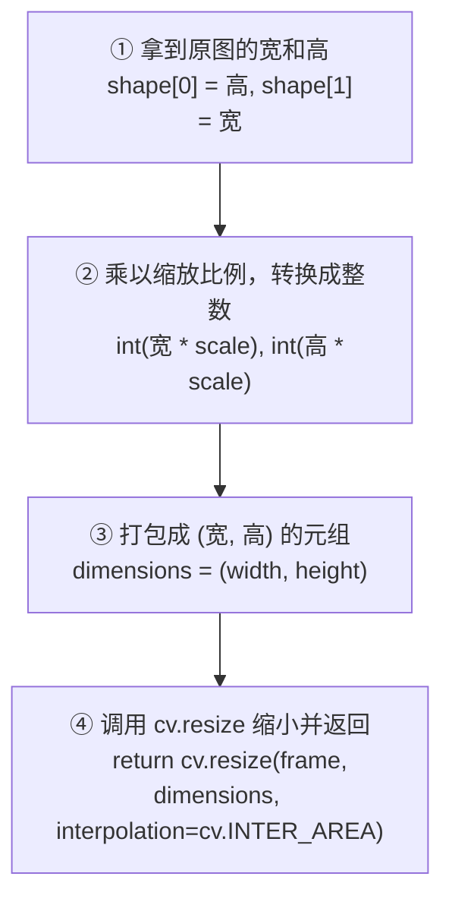

> [!warning] NumPy vs OpenCV：宽高顺序的"暗坑"
> 
> 这是 OpenCV 初学者最容易犯的错，**贯穿所有后续操作**（画图、缩放、裁剪等），务必牢记。
> 
> | 来源 | 顺序 | 代码写法 |
> |:---:|:---:|------|
> | **NumPy**（`shape`） | **(高, 宽)** | `frame.shape[0]` = 高度，`frame.shape[1]` = 宽度 |
> | **OpenCV**（`resize`、`circle` 等） | **(宽, 高)** | `dimensions = (width, height)` |
> 
> **为什么顺序不同？**
> *   **NumPy 的视角（矩阵视角）**：把图片看作矩阵，规格是"行 × 列"，行数 = 高度，列数 = 宽度 → 所以是 **(高, 宽)**。
> *   **OpenCV 的视角（几何视角）**：使用数学课上的**笛卡尔坐标系 $(X, Y)$**，$X$ = 宽度，$Y$ = 高度 → 所以是 **(宽, 高)**。
> 
> **口诀：读 shape 是"高宽"，传参数是"宽高"。** 懂了这一个坑，你就超越了 90% 的 OpenCV 初学者。

## 一、Open CV 的安装

可以在虚拟环境下安装也可以全局安装 <br>

```
打开终端输入以下命令:

📌 先建立虚拟环境
python -m venv .venv  

📌 再激活该虚拟环境
.venv\Scripts\activate

📌 最后安装 opencv 包
pip install opencv-python

如果想全局安装直接执行: pip install opencv-python 即可

```


## 二、读取图片和视频

> [!tip] 如何正确拼接文件路径？ [[📁 Python 路径拼接（os.path vs pathlib）]]


1. 图片的读取:<br>
	  `.imread()` 用来读取图片，把图片文件加载到内存里变成一个数组,读取完, img 就是个数组 ,里边的值就是每个像素的颜色。
	<br>

```python
import cv2 as cv

path1 = "E:/All_Projects/pycharm_project/Data _analysis_study/Opencv/attachments/Ellie.png"

img = cv.imread(path1)

if img is None:
	raise FileNotFoundError(f"图片读取失败：{path1}")

📌 弹窗显示图片,参数1显示图片名字,参数二是要显示的图片
cv.imshow("Ellie", img) 

cv.waitKey(0)
print(img.shape) # 输出图片的尺寸信息

```

> 注意 : 
> 
> 1. `.imread()` 返回的不是原图文件，是副本，改 img 不会影响原文件。
> <br>
> 2. VS Code 的 Pylance 静态分析可能会提示"shape”不是 "None" 的已知属性。它的意思是说 cv2.imread 有可能 返回 **None**（比如文件不存在时），以此提醒你 .shape 可能出问题。所以添加一个 **if判断**抛出错误。
> 	<br>
> 3. `.waitKey(自己填入数值):`  等待按键事件，就是显示图片后暂停程序，不让窗口马上关闭 括号内数值为等待的时间, 单位毫秒。
> <br>

<br>
> [!info] 图像在计算机中存储的核心本质
> 
> **像素颜色和图像尺寸，其实就是同一个多维数组（矩阵）的值和形状。** 理解了"三维数组"，就理解了计算机视觉的基石。更直观的类比见下方 ↓

### 🧩 图解：像素、图片尺寸与多维数组的关系

我们把这个抽象的数学概念，拆解成一个**看得见、摸得着的物理模型**。

请暂时忘掉"三维数组"这种计算机专业词汇，我们用 **"药盒"** 来做类比。

---

#### 第一步：先看最基础的单位——"像素"（一格药盒）

屏幕上的每一个彩色发光点，叫一个**像素（Pixel）**。
为了配出任何颜色，每个像素点里都有三个微小的发光灯管：**红灯、绿灯、蓝灯**（OpenCV 里的顺序是蓝、绿、红 BGR）。

在 Python 里，我们要描述某一个像素点的颜色，需要 3 个数字。比如：
`[255, 0, 0]` （代表蓝灯开到最亮，绿灯和红灯熄灭。在 OpenCV 里这就是纯蓝色）。

*   **物理模型**：这就像一个**只能装 3 颗药丸的小药盒**。
*   这个小药盒的内部结构是：`[第一格放蓝药, 第二格放绿药, 第三格放红药]`。

---

#### 第二步：把小药盒拼成一个"药盒矩阵"（宽和高）

现在，我们要拼出一张宽为 4 个像素、高为 3 个像素的微型彩色图片。

我们拿 **12 个**刚才那样的小药盒，整整齐齐地摆在桌子上，摆成 **3 行、4 列**：

```
第一行： [药盒] [药盒] [药盒] [药盒]
第二行： [药盒] [药盒] [药盒] [药盒]
第三行： [药盒] [药盒] [药盒] [药盒]
```

这就是你的图片。

---

#### 第三步：现在，我们要数数了（理解 `img.shape`）

当你在 Python 里输入 `img.shape` 时，计算机其实是在帮你数这个"药盒方阵"的尺寸。它会按照 **"由外到内"** 的顺序数出三个数字：

1.  **第一个数字（高 Height）**：数一数，桌子上有几行药盒？ 👉 答：**3 行**。
2.  **第二个数字（宽 Width）**：数一数，每行有几列药盒？ 👉 答：**4 列**。
3.  **第三个数字（通道数 Channels）**：打开任意一个药盒，里面有几格放药的位置？ 👉 答：固定是 **3 格**（放蓝、绿、红药丸）。

所以，计算机数出来的结果就是：`shape = (3, 4, 3)`

---

#### 第四步：怎么用坐标找药丸？（理解图片定位）

如果你想吃 **"第二行、第三列药盒里的红药丸"**，你在 Python 里该怎么写？

在 Python（Numpy 数组）里，**计数是从 0 开始的**：
*   "第二行"对应的索引是 `1`
*   "第三列"对应的索引是 `2`
*   "红药丸"（第3格）对应的索引是 `2`（0是蓝，1是绿，2是红）

所以，你直接在代码里写：

```python
药丸 = img[1, 2, 2]
```

计算机就会精准地定位到第二行、第三列那个药盒，打开第三个格子，把里面的数字（比如 `255`）取出来给你。

---

#### 总结：为什么说它们是"同一个东西的两个角度"？

| 角度 | 描述 | 对应概念 |
|:---:|------|------|
| **A. 尺寸/形状** | 从远处看，这是一个 $3 \times 4 \times 3$ 的三维药盒立方体 | `img.shape` |
| **B. 像素/颜色** | 凑近看，里面每一个格子里存的数字（0\~255），决定了那个位置发什么光 | 图像的像素值 |

图片在计算机里**根本不是什么艺术品**，它就是一个**整整齐齐码放数字的、有长宽深的立方体盒子**。理解了这一点，你就真正入门了计算机视觉（CV）。
> 


2. 视频的读取:<br>
		`.VideoCapture():` 打开视频,即 python 拿到一个视频对象
		<br>
		`xxx.read():` 读取视频的一帧, 因为视频就是连续动的图片,read()每次只能读取一张画面, 所以使用while循环来读取每一帧画面。
		<br>
```python
import cv2 as cv
path2 = "E:/All_Projects/pycharm_project/Data _analysis_study/Opencv/attachments/5.1-2025-深圳大学(2).mp4"

cap = cv.VideoCapture(path2)

📌 因为是视频是一帧一帧读取的, 所以需要使用while循环
while True:
	isTrue, frame = cap.read() # 首先读取视频
	if not isTrue:
		print("📹 视频播放结束，或者摄像头已断开连接。安全退出中...")
		break
	cv.imshow("video", frame)
	
	if cv.waitKey(20) & 0xFF == ord('0')
		break
		
cap.release()
cv.destroyAllWindows()
```

> 注意 : 
> 1.  `.read()`会返回两个值,且这两个值会以**元组**的形式打包在一起返回, 所以要使用 **两个变量** 来接收返回值。
> 	 <br>
> 2. 第一个返回值 isTrue（行业内通常写成 ret，即 return value 的缩写)：
> 	- 它是一个**布尔值 (Boolean)**，只有 True（真）或 False（假）两种状态。
> 	- **作用**：告诉你“这一帧画面有没有读取成功”。如果视频正在正常播放，它就是 True；如果视频放完了，或者摄像头突然被拔掉了，它就会变成 False。
> 	<br>
> 3. **第二个返回值 frame**：
> 	- 它才是真正的**图像矩阵（numpy 数组）**。
> 	

<br>

> [!question] OpenCV为什么要设置 `isTrue` ,为什么不能直接返回 `frame` ?
> - 这就是**控制工程中的“鲁棒性（Robustness/健壮性）”设计**
> 	<br>
> - 如果视频播放完了，或者摄像头线断了，cap.read() 拿不到图像。如果它只返回 frame，你的程序在执行到 imshow 时就会因为读到空数据而**直接闪退（Crash）**。这在工业机器人控制中是极其致命的。
> 	<br>
> - 有了 isTrue，就可以在程序里做一个“**安全保护/边界拦截**”。即 if条件语句判断。
> 	<br>
> -  `ord()` 是 Python 的一个内置函数，它的全称是 **ordinal（序号/顺序）**。**作用:** 输入一个字符,返回ASCII 码值。
> 	<br>
> - `& 0xFF` 是 **按位与** 操作, 作用是保留低8位, 屏蔽高位。
> 	<br>
> 	- 在 64 位操作系统上，`cv.waitKey()` 返回的可能是一个 32 位的整数（而不仅仅是 8 位的 ASCII 码）。
> 	<br>
> 	- `0xFF` 的二进制是 `11111111`（即低 8 位全为 1，高位全为 0）。
> 	<br>
> 	- 通过按位与运算 `& 0xFF`，可以将返回的 32 位整数的高 24 位全部清零，只保留最右边的 8 位。
> 	<br>
> 	- 这样可以确保在不同操作系统（如 Windows, Linux, macOS）或不同架构（32位/64位）下，获取到的按键值都是标准的 ASCII 码，避免因系统差异导致比对失败。
> 	<br>


## 三、调整和缩放视频帧与图像尺寸/

1. 为什么需要缩放？

在控制工程和机器人视觉中，摄像头的原始画面可能非常大（比如 $1920 \times 1080$）。如果直接让算法去处理这么大的图片，电脑会非常卡（**实时性变差**）。

所以我们需要一个工具：**把每一帧画面等比例缩小（比如缩小到 75%），从而提高程序的运行速度。**

> [!tip] 1.缩放本地视频文件或静态图片
> 不要去死记硬背整段代码。把写代码的过程想象成 **"把人类的语言，翻译成计算机的步骤"**。下面这个流程图，就是从中文逻辑翻译到代码的完整过程：




```python
import cv2 as cv

📌 因为是个重复动作,以后可能会复用,所以写成函数而不是直接塞进while循环

def rescaleFrame(frame, scale=0.75)

	width = int(frame.shape[1] * scale) # 拿到原图的宽然后缩小
	height = int(frame.shape[0] * scale) # 拿到原图的高然后缩小
	dimensions = (width,height) # OpenCV 缩放函数需要的尺寸参数是一个元组（Tuple），所以把算好的宽和高用圆括号 () 打包在一起。
return cv.resize(frame, dimensions, interpolation=cv.INTER_AREA)

path2 = "E:/All_Projects/pycharm_project/Data _analysis_study/Opencv/attachments/5.1-2025-深圳大学(2).mp4"

cap = cv.VedioCapture(path2)

while True:
	isTrue, frame = cap.read() 
	frame_resized = rescaleFrame(frame)
	if not isTrue:
		print("📹 视频播放结束，或者摄像头已断开连接。安全退出中...")
		break
	
	cv.imshow("ori_video", frame)
	cv.imshow("resized_video", frame_resized)
	
	if cv.waitKey(20) & 0xFF == ord('0')
		break

cap.realse()
cv.destoryAllWindows()
```

> [!tip]
> - 我们不需要自己写复杂的图像缩放数学公式，OpenCV 提供了一个现成的 API 叫 `cv.resize(frame, dimensions, interpolation = cv.INTER_AREA)`。
> 	<br>
>  - 只需要去查它的**函数签名（接口说明）**，知道它需要三个参数：
> 	  - 参数1：frame（原图）
> 	  - 参数2：dimensions（新尺寸）
> 	  - 参数3：interpolation（插值算法）。代码里用的 `cv.INTER_AREA` 是 OpenCV 官方推荐的 **最适合缩小图像** 的数学算法。
> 	  - 类似的还有 :
>		  - `cv.INTER_NEAREST`（最近邻插值）：直接复制最近的像素，不计算。**最快但最粗糙**，适合放大像素画。
>		  - `cv.INTER_LINEAR`（双线性插值）：用周围 4 个像素加权平均。**默认值**，速度和质量平衡。
>		  - `cv.INTER_CUBIC`（双三次插值）：用周围 16 个像素加权平均。比 LINEAR 更平滑，适合**放大**图像。
>		  - `cv.INTER_LANCZOS4`（Lanczos 插值）：用周围 8×8 像素计算。**质量最高但最慢**。
>
>	**选择口诀：**
>	  - **缩小**图像 → 用 `INTER_AREA`（避免波纹伪影）
>	  - **放大**图像 → 用 `INTER_CUBIC` 或 `INTER_LANCZOS4`（更清晰）
>	  - **速度优先** → 用 `INTER_NEAREST`（最快）
>	  - **不确定** → 不写这个参数，默认 `INTER_LINEAR`（够用）

---

> [!tip] 2. 专门针对实时视频流（如摄像头实时画面）修改分辨率 的方法
> - **直接修改摄像头等硬件的采集参数**。即在画面还没采集出来前，通知摄像头按指定的宽高捕获画面。
> - **仅适用于实时视频（Live Video）**：

即 `capture.set(propId, value)` ,该方法用于直接设置视频流的各种硬件/流属性：

```python

📌 1. 开启摄像头（0 代表默认摄像头） 
capture = cv.VideoCapture(0)

📌 直接在硬件级别设置摄像头帧的宽高
def changeRes(width, height):
    capture.set(3, width)
    capture.set(4, height)
    
📌 将摄像头的捕获分辨率强制更改为 $1280 \times 720$ (720P 高清) 
changeRes(1280, 720)
    
📌 这里的 `capture` 是通过 `cv.VideoCapture` 创建的视频捕获对象。
```

- **参数 `3`**：代表宽度属性，在 OpenCV 中对应的常量是 `cv.CAP_PROP_FRAME_WIDTH`。这行代码的意思是将视频流的帧宽度设置为传入的 `width`。
    
- **参数 `4`**：代表高度属性，在 OpenCV 中对应的常量是 `cv.CAP_PROP_FRAME_HEIGHT`。这行代码的意思是将视频流的帧高度设置为传入的 `height`。
    
- **参数 `10`**  可能代表亮度属性 `cv.CAP_PROP_BRIGHTNESS`，传入数值可以调节画面的采集亮度。

## 四、在图像上绘制形状和书写文字 

### 1. 创建画布

OpenCV 里没有"新建画布"按钮，但可以用 NumPy 创建一张纯黑的空白图像：

```python
import cv2 as cv
import numpy as np

blank_image = np.zeros((500, 500, 3), dtype='uint8')  # 500x500 的黑色图像

white_image = np.ones((500, 500, 3), dtype='uint8') * 255 # 500×500 的白色图像
```

*   `np.zeros()` 创建一个全零数组（全零 = 全黑）
*   `(500, 500, 3)` → 高500、宽500、3个颜色通道（BGR）
*   `dtype='uint8'` → 每个像素值范围 0\~255（无符号8位整数）

### 2. 给图像上色

```python
📌 全图铺满颜色（注意 BGR 顺序，不是 RGB）
blank_image[:] = 34, 139, 34
cv.imshow('Green', blank_image)

📌 部分区域上色：200到300行，300到400列的区域涂成红色
blank_image[200:300, 300:400] = 0, 0, 255
cv.imshow('Green with Red Square', blank_image)
```

### 3. 绘制矩形

**函数签名：**

```python
cv.rectangle(img, pt1, pt2, color, thickness=1, lineType=LINE_8, shift=0)
```

**逐个参数解释：**

*   **`img`**：要绘制的图像（NumPy 数组）。这里是 `blank_image`。
*   **`pt1`**：矩形的**左上角**坐标，格式为 `(x, y)`。这里写 `(0, 0)` 表示从图像左上角开始画。
*   **`pt2`**：矩形的**右下角**坐标，格式为 `(x, y)`。这里写 `(blank_image.shape[1]//2, blank_image.shape[0]//2)`，即宽的一半、高的一半，画到图像中心。
    *   ⚠️ 注意：又是那个**宽高顺序**的坑！`shape[1]` 是宽（X），`shape[0]` 是高（Y）。
    *   `//` 是整除运算符，保证坐标是整数（像素不能是小数）。
*   **`color`**：矩形的颜色，格式为 `(B, G, R)`。这里写 `(46, 123, 85)`。
*   **`thickness`**：线条粗细（像素）。这里写 `5`。如果设为 **`-1`**，则**填充满整个矩形**，不画边框。
*   **`lineType`**：线条类型，一般用默认值就好，不需要改。
*   **`shift`**：坐标小数点位数，一般用默认值 `0`，不需要改。

```python
cv.rectangle(blank_image, (0, 0), (blank_image.shape[1]//2, blank_image.shape[0]//2), (46, 123, 85), thickness=5)
cv.imshow("Rectangle", blank_image)
```

### 4. 绘制圆形

**函数签名：**

```python
cv.circle(img, center, radius, color, thickness=1, lineType=LINE_8, shift=0)
```

**逐个参数解释：**

*   **`img`**：要绘制的图像。这里是 `blank_image`。
*   **`center`**：圆心坐标，格式为 `(x, y)`。这里写 `(blank_image.shape[1]//2, blank_image.shape[0]//2)`，即图像正中心。
*   **`radius`**：半径（像素）。这里写 `40`。
*   **`color`**：颜色，格式为 `(B, G, R)`。这里写 `(0, 0, 255)`，纯红色。
*   **`thickness`**：线条粗细。这里写 **`-1`**，表示**填充实心圆**。如果写正数（比如 `3`），则只画一个空心圆环。
*   **`lineType`**：线条类型，默认值即可。
*   **`shift`**：坐标小数点位数，默认值 `0` 即可。

```python
cv.circle(blank_image, (blank_image.shape[1]//2, blank_image.shape[0]//2), 40, (0, 0, 255), thickness=-1)
cv.imshow("Circle", blank_image)
```

### 5. 绘制线条

**函数签名：**

```python
cv.line(img, pt1, pt2, color, thickness=1, lineType=LINE_8, shift=0)
```

**逐个参数解释：**

*   **`img`**：要绘制的图像。这里是 `blank_image`。
*   **`pt1`**：起点坐标，格式为 `(x, y)`。这里写 `(0, 0)`，即左上角。
*   **`pt2`**：终点坐标，格式为 `(x, y)`。这里写 `(blank_image.shape[1]//2, blank_image.shape[0]//2)`，即图像中心。
*   **`color`**：颜色，格式为 `(B, G, R)`。这里写 `(255, 255, 255)`，纯白色。
*   **`thickness`**：线条粗细（像素）。这里写 `3`。
*   **`lineType`**：线条类型，默认值即可。
*   **`shift`**：坐标小数点位数，默认值 `0` 即可。

```python
cv.line(blank_image, (0, 0), (blank_image.shape[1]//2, blank_image.shape[0]//2), (255, 255, 255), thickness=3)
cv.imshow("Line", blank_image)
```

### 6. 绘制文字

**函数签名：**

```python
cv.putText(img, text, org, fontFace, fontScale, color, thickness=1, lineType=LINE_8, bottomLeftOrigin=False)
```

**逐个参数解释：**

*   **`img`**：要绘制的图像。这里是 `blank_image`。
*   **`text`**：要写的文字内容。这里写 `"Hello World"`。
*   **`org`**：文字**左下角**的坐标，格式为 `(x, y)`。这里写 `(225, 225)`。
    *   ⚠️ 注意：不是左上角，是**左下角**！这是 OpenCV 文字绘制的特殊约定。
*   **`fontFace`**：字体样式。这里写 `cv.FONT_HERSHEY_TRIPLEX`（三线体，最常用的字体）。
    *   其他可选值：`FONT_HERSHEY_SIMPLEX`（简体）、`FONT_HERSHEY_COMPLEX`（复体）等。
*   **`fontScale`**：字体大小（缩放倍数）。这里写 `1.0`，即原始大小。写 `2.0` 就放大一倍。
*   **`color`**：颜色，格式为 `(B, G, R)`。这里写 `(255, 255, 255)`，纯白色。
*   **`thickness`**：笔画粗细（像素）。这里写 `2`。
*   **`lineType`**：线条类型，默认值即可。
*   **`bottomLeftOrigin`**：坐标原点是否在左下角，默认 `False`，一般不需要改。

```python
cv.putText(blank_image, "Hello World", (225, 225), cv.FONT_HERSHEY_TRIPLEX, 1.0, (255, 255, 255), thickness=2)
cv.imshow("Text", blank_image)
```

### 完整代码

```python
import cv2 as cv
import numpy as np

blank_image = np.zeros((500, 500, 3), dtype='uint8')

📌 1. 给图像上色
blank_image[:] = 34, 139, 34
cv.imshow('Green', blank_image)

blank_image[200:300, 300:400] = 0, 0, 255
cv.imshow('Green with Red Square', blank_image)

📌 2. 绘制矩形
cv.rectangle(blank_image, (0, 0), (blank_image.shape[1]//2, blank_image.shape[0]//2), (46, 123, 85), thickness=5)
cv.imshow("Rectangle", blank_image)

📌 3. 绘制圆形
cv.circle(blank_image, (blank_image.shape[1]//2, blank_image.shape[0]//2), 40, (0, 0, 255), thickness=-1)
cv.imshow("Circle", blank_image)

📌 4. 绘制线条
cv.line(blank_image, (0, 0), (blank_image.shape[1]//2, blank_image.shape[0]//2), (255, 255, 255), thickness=3)
cv.imshow("Line", blank_image)

📌 5. 绘制文字
cv.putText(blank_image, "Hello World", (225, 225), cv.FONT_HERSHEY_TRIPLEX, 1.0, (255, 255, 255), thickness=2)
cv.imshow("Text", blank_image)

cv.waitKey(0)
```

## 五、图像预处理与边缘提取

### 为什么要进行灰度化
1. 数据量瞬间压缩 66%（极大地提高实时计算速度）

	-  彩色图片是 (H, W, 3) 三维数组，每个像素有 B, G, R 三个值。而灰度图片是 (H, W) 二维数组，每个像素只有 **1 个**亮度值（0代表纯黑，255代表纯白）。	
	- **计算复杂度对比**：
	    - 彩色图像：你要处理 
        `H×W×3` 个数字。
	    - 灰度图像：你只需要处理 
        `H×W×1` 个数字。
        
	- **物理效果**：灰度化让图像的数据量**瞬间减少了 2/3**。对于需要高频循环（如 30 FPS 以上）的机器人控制算法，处理的数据越少，控制延迟就越低，系统就越稳定。

2. 几何与结构特征与"颜色"无关
	
- 在大多数 CV 算法中，我们关注的是物体的**形状、边缘、轮廓和纹理**，而不是它的颜色。
	
- 比如：你要识别一张人脸、一个手势、或者一个圆形工件。
	*   一个绿色的圆、一个红色的圆、一个蓝色的圆，它们的**几何特征完全相同**。
	*   计算机识别"圆形"靠的是**明暗交界处的梯度（边缘）**，而不是颜色本身。

```text
彩色原图： 🔴 (红圆)   🔵 (蓝圆)   🟢 (绿圆)
	            │           │           │
灰度化后： ⚪ (灰圆)   ⚪ (灰圆)   ⚪ (灰圆)  <-- 形状特征完全保留，干扰颜色被过滤
```

- 灰度化可以**过滤掉光照颜色变化带来的干扰**，让算法专注于识别物体的"骨架"和"结构"。

---

3. 经典算法的"数学必然性"

- 计算机视觉中许多经典的图像特征提取算法，在数学原理上就只支持**单通道（一维）输入**：

	- **Canny 边缘检测**：它通过计算像素点左右、上下的"亮度差（灰度梯度）"来找边界。三维颜色向量是没法直接算导数（偏微分）的，必须降维成一维灰度。
	- **人脸检测（Haar特征）**、**特征点匹配（ORB/SIFT）**：这些算法的设计初衷就是分析局部的明暗变化。

- 所以，像 `cv.Canny()` 这样的函数，你如果传一张彩色图进去，它在底层也会**强行先把它转成灰度图**再处理。

---

> [!warning] 黄金法则
> *   如果你的任务是**"靠颜色认物体"**（如红绿灯识别、特定颜色工件抓取） → **绝对不能灰度化**，应该转到 **HSV 空间**。
> *   如果你的任务是**"靠形状、轮廓、特征点认物体"**（如车牌识别、人脸识别、三维重建） → **第一步必须是灰度化 (`COLOR_BGR2GRAY`)**。

### '组合拳' : 边缘提取与轮廓闭合

-  **Canny边缘检测（“边缘级联”） + 膨胀（Dilate） + 腐蚀（Erosion）**，是计算机视觉中最经典、最伟大的 **“边缘提取与轮廓闭合”黄金管道（Pipeline）**

	>*“用来提取出物体完美、连续、没有断裂的精准轮廓，供机器人进行形状识别和定位抓取。”*


**下面用一个实际场景来拆解这三个阶段是怎么配合工作的：**

假设摄像头拍到了一张”方形箱子”的图片，由于光照不均匀、表面反光或噪点，直接处理会遇到麻烦。整个管道的工作流程如下：

```text
【 原始灰度图 】 ──> 1. Canny：提取边缘 ──> 2. Dilate：加粗融合 ──> 3. Erode：瘦身复原 ──> 【 完美轮廓 】
```

#### 初始阶段: 读图并灰度化、高斯模糊（滤除噪点）

```python
img = cv.imread(path)
if img is None:
	raise FileNotFoundError(f"图片读取失败:{path}")
gray = cv.cvtcolor(img, cv.COLOR_BGR2GRAY) # convert 
blur = cv.GaussianBlur(img, (3, 3), cv.BORDER_DEFAULT) # (3,3) 为高斯模糊核 kernal size的缩写 即'要用多大的橡皮擦去涂抹图像'
cv.imshow('Gray', gray)
```

#### 阶段 1：Canny 边缘检测算子（提取骨架，但有“断裂”）

*   **动作**：Canny 算法去寻找图像中明暗变化最剧烈的地方，把箱子的边缘画出来。
*   **结果**：画出了箱子的边缘。但是，因为箱子表面有反光，导致**边缘线条极度纤细（只有 1 像素宽），并且在反光处断开了，变成了“虚线”**。
*   **痛点**：机器人无法识别不闭合的虚线，它会以为这是几条不相干的碎线，而不是一个箱子。

```python
📌 图片边缘检测
canny = cv.Canny(img, 125, 175)
cv.imshow('Canny', canny) 
```

---

> [!question] `125` 和 `175` 这两个数字是什么？
>
> Canny 算法的**”双阈值检测”**：每个像素有一个”梯度得分”（0\~255），两条分数线把像素分成三档：
>
> ```text
>  255 ┐
>      │  强边缘（>= 175）  ──> 100% 保留
>  175 ┼────────────────────────────── (高阈值)
>      │  弱边缘（125~175） ──> 连着强边缘就保留，孤立就丢弃
>  125 ┼────────────────────────────── (低阈值)
>      │  非边缘（< 125）   ──> 100% 丢弃（噪声）
>    0 ┘
> ```
>
> **为什么用双阈值？** 高阈值确保**干净**（只留硬核边缘），低阈值确保**连续**（顺着骨架把断线拉回来）。单阈值做不到两者兼顾。

---

#### 阶段 2：膨胀（Dilate）——“融合虚线”

*   **动作**：我们对这张“虚线边缘图”进行**膨胀**。
*   **结果**：纤细的边缘虚线**开始变胖、变粗**。随着线条变粗，原本断开的微小缝隙被挤压、融合在了一起，**虚线变成了连续的“实线粗管道”**。
*   **新痛点**：缝隙虽然连上了，但现在的边缘**太粗、太臃肿了**，机器人无法精准定位箱子的真实边界在哪里（误差可能长达数个像素）。

```python
import numpy as np
📌 "膨胀核" kernal 使用OpenCV 的结构元素生成器
kernal = cv.getStructuringElement(cv.MORPH_RECT, (3, 3))

📌 或者使用  NumPy 凭空生成全 1 矩阵
kernal1 = np.ones((3, 3), dtype = np.uint8)

dilated = cv.dilate(canny, kernal, iterations=1)
cv.imshow('Dilated', dilated) 
```

#### 阶段 3：腐蚀（Erosion）——“瘦身复原”

*   **动作**：我们对粗管道图像进行**腐蚀（让白色变瘦）**，膨胀了几次，就腐蚀几次。
*   **结果**：臃肿的粗线条开始**向内收缩，重新变回 1 像素宽的纤细线条**。
*   **奇迹时刻**：因为在“阶段 2（膨胀）”中，断开的缝隙已经**彻底融合并连成一体**了，现在的腐蚀操作**只会把线条变细，而绝对不会把已经融合的地方重新拉断**。

```python
import numpy as np
kernal1 = np.ones((3, 3), dtype = np.uint8
eroded = cv.erode(dilated, kernal1, iterations=1)
cv.imshow("Eroded", eroded)
```

> [!info] 关于 "核(kernal)"
> 1. "核" : 又称 **"结构元素"**,本质是 形态学操作(模糊、膨胀、腐蚀)中的 **"刷子"** , 由 0 和 1 组成的二维 Numpy 矩阵 。
> <br>
> 2. "核" : 算法在图像上逐像素滑动这把刷子，通过刷子内部的数值分布（0 与 1）来决定如何改变图像边缘。
> <br>
> 3. "核" :  三种标准构建方法
> 	- 最基础的 **矩形（Rectangular）** 膨胀/腐蚀。由于矩阵内所有元素均为 1，代表一个实心的矩形刷子。
> 	- **椭圆形（Elliptical）**。适合处理圆形或曲面物体的边缘，膨胀/腐蚀时更均匀、不会在对角线上留下锯齿。
> 	- **十字形（Cross）**。只在上下左右四个方向生效（对角线位置为 0），效果最温和，适合只需要轻微连接或断开的场景。
> 
> 	```python
> 	# 方式 1：使用 OpenCV 内置方法（推荐，可选形状）
> 	rect_kernel = cv.getStructuringElement(cv.MORPH_RECT,   (5, 5))  # 实心方块
> 	ellipse_kernel = cv.getStructuringElement(cv.MORPH_ELLIPSE, (5, 5))  # 实心椭圆
> 	cross_kernel   = cv.getStructuringElement(cv.MORPH_CROSS,  (5, 5))  # 十字架
> 	# 方式 2：使用 NumPy 手动创建（推荐使用Numpy）
> 	import numpy as np
> 	kernel = np.ones((5, 5), dtype='uint8')  # 全 1 的 5x5 矩形核，等价于 MORPH_RECT
> 	```

## 六、图形变换


```python

import cv2 as cv
import numpy as np

# ==========================================
# 【步骤一】读取原图
# ==========================================
img = cv.imread("test.jpg") 

# ==========================================
# 【步骤二】获取原图尺寸
# ==========================================
h, w = img.shape[:2] # 注意Numpy视角下为先

# ==========================================
# 【步骤三】构建矩阵 M（根据需求更换这里的函数即可）
# ==========================================
# 比如今天我想做旋转：
center = (w // 2, h // 2)
M = cv.getRotationMatrix2D(center, angle=30, scale=0.8)

# ==========================================
# 【步骤四】调用固定核心函数
# ==========================================
result = cv.warpAffine(img, M, (w, h))

# ==========================================
# 【步骤五】输出看效果
# ==========================================
cv.imshow("Output", result)
cv.waitKey(0)
cv.destroyAllWindows()
```
