#  👀 Open CV 的学习

>[!warning] NumPy vs OpenCV：宽高顺序的"暗坑"
> 
> 这是 OpenCV 初学者最容易犯的错，**贯穿所有后续操作**（画图、缩放、裁剪等），务必牢记。
> 
> | 来源 | 顺序 | 代码写法 |
> |:---:|:---:|------|
> | **NumPy**（`shape`） | **(高, 宽)** | `frame.shape[0]` = 高度，`frame.shape[1]` = 宽度 |
> | **OpenCV**（`resize`、`circle` 等） | **(宽, 高)** | `dimensions = (width, height)` |
> 
> **为什么顺序不同？**
> *   **NumPy 的视角（矩阵视角）**：把图片看作矩阵，规格是"行 × 列"，行数 = 高度，列数 = 宽度 → 所以是 **(高, 宽)**。
> *   **OpenCV 的视角（几何视角）**：使用数学课上的**笛卡尔坐标系 $(X, Y)$ **， $X$ = 宽度， $Y$ = 高度 → 所以是 **(宽, 高)**。
> 
> **口诀：读 shape 是"高宽"，传参数是"宽高"。** 懂了这一个坑，你就超越了 90% 的 OpenCV 初学者。 

## 目录
- [[#一、Open CV 的安装|一、Open CV 的安装]]
- [[#二、读取图片和视频|二、读取图片和视频]]
    - [[#🧩 图解：像素、图片尺寸与多维数组的关系|🧩 图解：像素、图片尺寸与多维数组的关系]]
- [[#三、调整和缩放视频帧与图像尺寸/|三、调整和缩放视频帧与图像尺寸]]
- [[#四、在图像上绘制形状和书写文字|四、在图像上绘制形状和书写文字]]
    - [[#1. 创建画布|1. 创建画布]]
    - [[#2. 给图像上色|2. 给图像上色]]
    - [[#3. 绘制矩形|3. 绘制矩形]]
    - [[#4. 绘制圆形|4. 绘制圆形]]
    - [[#5. 绘制线条|5. 绘制线条]]
    - [[#6. 绘制文字|6. 绘制文字]]
    - [[#四、在图像上绘制形状和书写文字#完整代码|完整代码]]
- [[#五、图像预处理与边缘提取|五、图像预处理与边缘提取]]
    - [[#为什么要进行灰度化|1. 为什么要进行灰度化]]
    - [[#'组合拳' : 边缘提取与轮廓闭合|2. '组合拳' : 边缘提取与轮廓闭合]]
- [[#六、仿射变换：从数学原理到 OpenCV 实现|六、仿射变换：从数学原理到 OpenCV 实现]]
    - [[#1. 为什么二维矩阵无法搞定平移？|1. 为什么二维矩阵无法搞定平移？]]
    - [[#2. 升维打击：齐次坐标|2. 升维打击：齐次坐标]]
    - [[#3. 对接 OpenCV 的代码|3. 对接 OpenCV 的代码]]
- [[#七、轮廓检测|七、轮廓检测]]
    - [[#1. 什么是轮廓(Contours)|1. 什么是轮廓(Contours)]]
    - [[#2. 轮廓(Contours)与边界(Edge)|2. 轮廓(Contours)与边界(Edge)]]
    - [[#3. 图解处理流向(轮廓检测)|3. 图解处理流向]]
    - [[#4. 完整的 API 与参数详解(轮廓检测)|4. 完整的 API 与参数详解]]
    - [[#5. 完整代码(轮廓检测)|5. 完整代码]]
- [[#八、图像颜色通道分割与合并(Split & Merge)|八、图像颜色通道分割与合并(Split & Merge)]]
    - [[#OpenCV的 BGR 存储机制|1. OpenCV 的 BGR 存储机制]]
    - [[#为什么拆分出的单通道图像显示未 “灰度图”|2. 为什么拆分出的单通道图像显示为 “灰度图”]]
    - [[#彩色单通道可视化原理|3. 彩色单通道可视化原理]]
    - [[#完整的 API 与参数详解(颜色通道分割与合并)|4. 完整的 API 与参数详解]]
    - [[#八、图像颜色通道分割与合并(Split & Merge)#完整代码|5. 完整代码]]
- [[#九、图像平滑与模糊（Smoothing & Blurring）|九、图像平滑与模糊（Smoothing & Blurring）]]
    - [[#卷积核（Kernel）与邻域（Neighborhood）|1. 卷积核（Kernel）与邻域（Neighborhood）]]
    - [[#四大模糊算法原理|2. 四大模糊算法原理]]
    - [[#完整的 API 与参数解释(模糊)|3. 完整的 API 与参数解释]]
    - [[#完整代码(平滑与模糊)|4. 完整代码]]
    - [[#为什么要模糊、什么时候该用什么时候不该用?|5. 为什么要模糊、什么时候该用什么时候不该用?]]
    - [[#模糊算法在工业级 CV 管道中的核心地位|6. 模糊算法在工业级 CV 管道中的核心地位]]
- [[#十、 图像位运算（Bitwise Operators）|十、图像位运算（Bitwise Operators）]]
    - [[#四大位运算符逻辑模型|1. 四大位运算符逻辑模型]]
    - [[#图解处理流向 (位运算)|2. 图解处理流向]]
    - [[#完整的 API 与参数详解(位运算)|3. 完整的 API 与参数详解]]
    - [[#为什么要使用位运算?|4. 为什么要使用位运算?]]
    - [[#什么时候用哪种位运算?|5. 什么时候用哪种位运算?]]
    - [[#位运算在大型复杂系统中的地位|6. 位运算在大型复杂系统中的地位]]
- [[#十一、图像掩膜（Image Masking）|十一、图像掩膜（Image Masking）]]
    - [[#什么是掩膜(Mask)|1. 什么是掩膜(Mask)]]
    - [[#核心方案对比：掩膜裁剪 vs 矩阵切片（Crop）|2. 核心方案对比：掩膜裁剪 vs 矩阵切片（Crop）]]
    - [[#完整的 API 与参数详解(掩膜)|3. 完整的 API 与参数详解]]
    - [[#完整代码(掩膜)|4. 完整代码]]
    - [[#为什么要使用掩膜?|5. 为什么要使用掩膜?]]
    - [[#什么时候使用掩膜?|6. 什么时候使用掩膜?]]
- [[#十二、图像直方图计算与可视化（Histograms Computation & Visualization）|十二、图像直方图计算与可视化]]
    - [[#什么是直方图?|1. 什么是直方图]]
    - [[#核心概念对比: 灰度直方图 vs 3D 彩色直方图 vs 分离彩色直方图|2. 核心概念对比：灰度 vs 3D 彩色 vs 分离彩色直方图]]
    - [[#完整的 API 与参数详解(直方图计算与可视化)|3. 完整的 API 与参数详解]]
    - [[#完整代码(直方图计算与可视化)|4. 完整代码]]
    - [[#为什么要用 直方图计算与可视化？|5. 为什么要用直方图计算与可视化？]]
    - [[#学术与工程疑难：画”直方图”为什么用的是”折线图 (plt.plot)”而不是”柱状图 (plt.hist)”？|6. 学术疑难：为什么用折线图而不是柱状图？]]
    - [[#什么时候使用直方图分析?|7. 什么时候使用直方图分析？]]
    - [[#直方图计算与可视化 在大型复杂系统/具身机器人管道中的地位|8. 在大型复杂系统/具身机器人管道中的地位]]
- [[#十三、图像阈值化与二值化（Thresholding / Binarization）|十三、图像阈值化与二值化]]
    - [[#什么是简单全局阈值化(Simple Thresholding)|1. 什么是简单全局阈值化]]
    - [[#核心概念对比：简单阈值化 vs 自适应均值滤波 vs 自适应高斯滤波|2. 核心概念对比：简单 vs 自适应均值 vs 自适应高斯]]
    - [[#系统架构与数据流/处理图解(阈值化与二值化)|3. 系统架构与数据流/处理图解]]
    - [[#十三、图像阈值化与二值化（Thresholding / Binarization）#完整的 API 与参数详解|4. 完整的 API 与参数详解]]
    - [[#十三、图像阈值化与二值化（Thresholding / Binarization）#完整代码|5. 完整代码]]
    - [[#为什么要用 阈值化与二值化?|6. 为什么要用阈值化与二值化？]]
    - [[#什么时候该用 阈值化与二值化?|7. 什么时候该用阈值化与二值化？]]
    - [[#阈值化与二值化 在大型复杂系统/具身机器人管道中的地位|8. 在大型复杂系统/具身机器人管道中的地位]]
- [[#十四、图像梯度与边缘检测（Gradients & Edge Detection）|十四、图像梯度与边缘检测（Gradients & Edge Detection）]]
    - [[#核心概念与底层物理/数学逻辑模型|1. 核心概念与底层物理/数学逻辑模型]]
    - [[#完整 API 与 参数详解|2. 完整 API 与参数详解]]
    - [[#十四、图像梯度与边缘检测（Gradients & Edge Detection）#完整代码|3. 完整代码]]
    - [[#为什么要用它?|4. 为什么要用它？]]
    - [[#什么时候使用微分梯度?|5. 什么时候使用微分梯度？]]
    - [[#梯度与边缘检测 在大型复杂系统/具身机器人管道中的地位|6. 在大型复杂系统/具身机器人管道中的地位]]
- [[#十五、基于 Haar 级联的人脸检测（Face Detection with Haar Cascades）|十五、基于 Haar 级联的人脸检测（Face Detection with Haar Cascades）]]
    - [[#核心概念与底层物理/数学/逻辑模型|1. 核心概念与底层物理/数学/逻辑模型]]
    - [[#核心概念对比：Haar 级联 vs LBP 级联 vs 深度学习检测器（如 MTCNN / YOLO-Face）|2. 核心概念对比：Haar vs LBP vs 深度学习检测器]]
    - [[#系统架构与数据流/处理图解|3. 系统架构与数据流/处理图解]]
    - [[#十五、基于 Haar 级联的人脸检测（Face Detection with Haar Cascades）#完整的 API 与参数详解|4. 完整的 API 与参数详解]]
    - [[#十五、基于 Haar 级联的人脸检测（Face Detection with Haar Cascades）#完整代码|5. 完整代码]]
    - [[#为什么要用它?为什么不用高级 CNN 神经网络?|6. 为什么要用它？为什么不用高级 CNN？]]
    - [[#什么时候该用 Haar 级联|7. 什么时候该用 Haar 级联]]
    - [[#Haar 级联 在大型复杂系统/具身机器人管道中的地位|8. 在大型复杂系统/具身机器人管道中的地位]]

## 一、Open CV 的安装

可以在虚拟环境下安装也可以全局安装 <br>

```
打开终端输入以下命令:

📌 先建立虚拟环境
python -m venv .venv  

📌 再激活该虚拟环境
.venv\Scripts\activate

📌 最后安装 opencv 包
pip install opencv-python

如果想全局安装直接执行: pip install opencv-python 即可

```


## 二、读取图片和视频

> [!tip] 如何正确拼接文件路径？ [[📁 Python 路径拼接（os.path vs pathlib）]]


1. 图片的读取:<br>
	  `.imread()` 用来读取图片，把图片文件加载到内存里变成一个数组,读取完, img 就是个数组 ,里边的值就是每个像素的颜色。
	<br>

```python
import cv2 as cv

path1 = "E:/All_Projects/pycharm_project/Data _analysis_study/Opencv/attachments/Ellie.png"

img = cv.imread(path1)

if img is None:
	raise FileNotFoundError(f"图片读取失败：{path1}")

📌 弹窗显示图片,参数1显示图片名字,参数二是要显示的图片
cv.imshow("Ellie", img) 

cv.waitKey(0)
print(img.shape) # 输出图片的尺寸信息

```

> 注意 : 
> 
> 1. `.imread()` 返回的不是原图文件，是副本，改 img 不会影响原文件。
> <br>
> 2. VS Code 的 Pylance 静态分析可能会提示"shape”不是 "None" 的已知属性。它的意思是说 cv2.imread 有可能 返回 **None**（比如文件不存在时），以此提醒你 .shape 可能出问题。所以添加一个 **if判断**抛出错误。
> 	<br>
> 3. `.waitKey(自己填入数值):`  等待按键事件，就是显示图片后暂停程序，不让窗口马上关闭 括号内数值为等待的时间, 单位毫秒。
> <br>

<br>
> [!info] 图像在计算机中存储的核心本质
> 
> **像素颜色和图像尺寸，其实就是同一个多维数组（矩阵）的值和形状。** 理解了"三维数组"，就理解了计算机视觉的基石。更直观的类比见下方 ↓

### 🧩 图解：像素、图片尺寸与多维数组的关系

我们把这个抽象的数学概念，拆解成一个**看得见、摸得着的物理模型**。

请暂时忘掉"三维数组"这种计算机专业词汇，我们用 **"药盒"** 来做类比。

---

#### 第一步：先看最基础的单位——"像素"（一格药盒）

屏幕上的每一个彩色发光点，叫一个**像素（Pixel）**。
为了配出任何颜色，每个像素点里都有三个微小的发光灯管：**红灯、绿灯、蓝灯**（OpenCV 里的顺序是蓝、绿、红 BGR）。

在 Python 里，我们要描述某一个像素点的颜色，需要 3 个数字。比如：
`[255, 0, 0]` （代表蓝灯开到最亮，绿灯和红灯熄灭。在 OpenCV 里这就是纯蓝色）。

*   **物理模型**：这就像一个**只能装 3 颗药丸的小药盒**。
*   这个小药盒的内部结构是：`[第一格放蓝药, 第二格放绿药, 第三格放红药]`。

---

#### 第二步：把小药盒拼成一个"药盒矩阵"（宽和高）

现在，我们要拼出一张宽为 4 个像素、高为 3 个像素的微型彩色图片。

我们拿 **12 个**刚才那样的小药盒，整整齐齐地摆在桌子上，摆成 **3 行、4 列**：

```
第一行： [药盒] [药盒] [药盒] [药盒]
第二行： [药盒] [药盒] [药盒] [药盒]
第三行： [药盒] [药盒] [药盒] [药盒]
```

这就是你的图片。

---

#### 第三步：现在，我们要数数了（理解 `img.shape`）

当你在 Python 里输入 `img.shape` 时，计算机其实是在帮你数这个"药盒方阵"的尺寸。它会按照 **"由外到内"** 的顺序数出三个数字：

1.  **第一个数字（高 Height）**：数一数，桌子上有几行药盒？ 👉 答：**3 行**。
2.  **第二个数字（宽 Width）**：数一数，每行有几列药盒？ 👉 答：**4 列**。
3.  **第三个数字（通道数 Channels）**：打开任意一个药盒，里面有几格放药的位置？ 👉 答：固定是 **3 格**（放蓝、绿、红药丸）。

所以，计算机数出来的结果就是：`shape = (3, 4, 3)`

---

#### 第四步：怎么用坐标找药丸？（理解图片定位）

如果你想吃 **"第二行、第三列药盒里的红药丸"**，你在 Python 里该怎么写？

在 Python（Numpy 数组）里，**计数是从 0 开始的**：
*   "第二行"对应的索引是 `1`
*   "第三列"对应的索引是 `2`
*   "红药丸"（第3格）对应的索引是 `2`（0是蓝，1是绿，2是红）

所以，你直接在代码里写：

```python
药丸 = img[1, 2, 2]
```

计算机就会精准地定位到第二行、第三列那个药盒，打开第三个格子，把里面的数字（比如 `255`）取出来给你。

---

#### 总结：为什么说它们是"同一个东西的两个角度"？

| 角度 | 描述 | 对应概念 |
|:---:|------|------|
| **A. 尺寸/形状** | 从远处看，这是一个 $3 \times 4 \times 3$ 的三维药盒立方体 | `img.shape` |
| **B. 像素/颜色** | 凑近看，里面每一个格子里存的数字（0\~255），决定了那个位置发什么光 | 图像的像素值 |

图片在计算机里**根本不是什么艺术品**，它就是一个**整整齐齐码放数字的、有长宽深的立方体盒子**。理解了这一点，你就真正入门了计算机视觉（CV）。

---

2. 视频的读取:<br>
		`.VideoCapture():` 打开视频,即 python 拿到一个视频对象
		<br>
		`xxx.read():` 读取视频的一帧, 因为视频就是连续动的图片,read()每次只能读取一张画面, 所以使用while循环来读取每一帧画面。
		<br>
```python
import cv2 as cv
path2 = "E:/All_Projects/pycharm_project/Data _analysis_study/Opencv/attachments/5.1-2025-深圳大学(2).mp4"

cap = cv.VideoCapture(path2)

📌 因为是视频是一帧一帧读取的, 所以需要使用while循环
while True:
	isTrue, frame = cap.read() # 首先读取视频
	if not isTrue:
		print("📹 视频播放结束，或者摄像头已断开连接。安全退出中...")
		break
	cv.imshow("video", frame)
	
	if cv.waitKey(20) & 0xFF == ord('0')
		break
		
cap.release()
cv.destroyAllWindows()
```

> 注意 : 
> 1.  `.read()`会返回两个值,且这两个值会以**元组**的形式打包在一起返回, 所以要使用 **两个变量** 来接收返回值。
> 	 <br>
> 2. 第一个返回值 isTrue（行业内通常写成 ret，即 return value 的缩写)：
> 	- 它是一个**布尔值 (Boolean)**，只有 True（真）或 False（假）两种状态。
> 	- **作用**：告诉你“这一帧画面有没有读取成功”。如果视频正在正常播放，它就是 True；如果视频放完了，或者摄像头突然被拔掉了，它就会变成 False。
> 	<br>
> 3. **第二个返回值 frame**：
> 	- 它才是真正的**图像矩阵（numpy 数组）**。
> 	

<br>

> [!question] OpenCV为什么要设置 `isTrue` ,为什么不能直接返回 `frame` ?
> - 这就是**控制工程中的“鲁棒性（Robustness/健壮性）”设计**
> 	<br>
> - 如果视频播放完了，或者摄像头线断了，cap.read() 拿不到图像。如果它只返回 frame，你的程序在执行到 imshow 时就会因为读到空数据而**直接闪退（Crash）**。这在工业机器人控制中是极其致命的。
> 	<br>
> - 有了 isTrue，就可以在程序里做一个“**安全保护/边界拦截**”。即 if条件语句判断。
> 	<br>
> -  `ord()` 是 Python 的一个内置函数，它的全称是 **ordinal（序号/顺序）**。**作用:** 输入一个字符,返回ASCII 码值。
> 	<br>
> - `& 0xFF` 是 **按位与** 操作, 作用是保留低8位, 屏蔽高位。
> 	<br>
> 	- 在 64 位操作系统上，`cv.waitKey()` 返回的可能是一个 32 位的整数（而不仅仅是 8 位的 ASCII 码）。
> 	<br>
> 	- `0xFF` 的二进制是 `11111111`（即低 8 位全为 1，高位全为 0）。
> 	<br>
> 	- 通过按位与运算 `& 0xFF`，可以将返回的 32 位整数的高 24 位全部清零，只保留最右边的 8 位。
> 	<br>
> 	- 这样可以确保在不同操作系统（如 Windows, Linux, macOS）或不同架构（32位/64位）下，获取到的按键值都是标准的 ASCII 码，避免因系统差异导致比对失败。
> 	<br>


## 三、调整和缩放视频帧与图像尺寸/

1. 为什么需要缩放？

在控制工程和机器人视觉中，摄像头的原始画面可能非常大（比如 $1920 \times 1080$）。如果直接让算法去处理这么大的图片，电脑会非常卡（**实时性变差**）。

所以我们需要一个工具：**把每一帧画面等比例缩小（比如缩小到 75%），从而提高程序的运行速度。**

> [!tip] 1.缩放本地视频文件或静态图片
> 不要去死记硬背整段代码。把写代码的过程想象成 **"把人类的语言，翻译成计算机的步骤"**。下面这个流程图，就是从中文逻辑翻译到代码的完整过程：

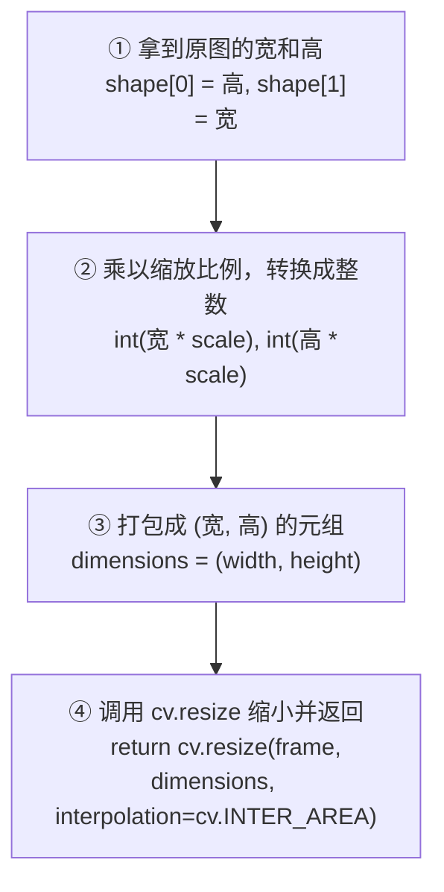


```python
import cv2 as cv

📌 因为是个重复动作,以后可能会复用,所以写成函数而不是直接塞进while循环

def rescaleFrame(frame, scale=0.75)

	width = int(frame.shape[1] * scale) # 拿到原图的宽然后缩小
	height = int(frame.shape[0] * scale) # 拿到原图的高然后缩小
	dimensions = (width,height) # OpenCV 缩放函数需要的尺寸参数是一个元组（Tuple），所以把算好的宽和高用圆括号 () 打包在一起。
return cv.resize(frame, dimensions, interpolation=cv.INTER_AREA)

path2 = "E:/All_Projects/pycharm_project/Data _analysis_study/Opencv/attachments/5.1-2025-深圳大学(2).mp4"

cap = cv.VedioCapture(path2)

while True:
	isTrue, frame = cap.read() 
	frame_resized = rescaleFrame(frame)
	if not isTrue:
		print("📹 视频播放结束，或者摄像头已断开连接。安全退出中...")
		break
	
	cv.imshow("ori_video", frame)
	cv.imshow("resized_video", frame_resized)
	
	if cv.waitKey(20) & 0xFF == ord('0')
		break

cap.realse()
cv.destoryAllWindows()
```

> [!tip]
> - 我们不需要自己写复杂的图像缩放数学公式，OpenCV 提供了一个现成的 API 叫 `cv.resize(frame, dimensions, interpolation = cv.INTER_AREA)`。
> 	<br>
>  - 只需要去查它的**函数签名（接口说明）**，知道它需要三个参数：
> 	  - 参数1：frame（原图）
> 	  - 参数2：dimensions（新尺寸）
> 	  - 参数3：interpolation（插值算法）。代码里用的 `cv.INTER_AREA` 是 OpenCV 官方推荐的 **最适合缩小图像** 的数学算法。
> 	  - 类似的还有 :
>		  - `cv.INTER_NEAREST`（最近邻插值）：直接复制最近的像素，不计算。**最快但最粗糙**，适合放大像素画。
>		  - `cv.INTER_LINEAR`（双线性插值）：用周围 4 个像素加权平均。**默认值**，速度和质量平衡。
>		  - `cv.INTER_CUBIC`（双三次插值）：用周围 16 个像素加权平均。比 LINEAR 更平滑，适合**放大**图像。
>		  - `cv.INTER_LANCZOS4`（Lanczos 插值）：用周围 8×8 像素计算。**质量最高但最慢**。
>
>	**选择口诀：**
>	  - **缩小**图像 → 用 `INTER_AREA`（避免波纹伪影）
>	  - **放大**图像 → 用 `INTER_CUBIC` 或 `INTER_LANCZOS4`（更清晰）
>	  - **速度优先** → 用 `INTER_NEAREST`（最快）
>	  - **不确定** → 不写这个参数，默认 `INTER_LINEAR`（够用）

---

> [!tip] 2. 专门针对实时视频流（如摄像头实时画面）修改分辨率 的方法
> - **直接修改摄像头等硬件的采集参数**。即在画面还没采集出来前，通知摄像头按指定的宽高捕获画面。
> - **仅适用于实时视频（Live Video）**：

即 `capture.set(propId, value)` ,该方法用于直接设置视频流的各种硬件/流属性：

```python

📌 1. 开启摄像头（0 代表默认摄像头） 
capture = cv.VideoCapture(0)

📌 直接在硬件级别设置摄像头帧的宽高
def changeRes(width, height):
    capture.set(3, width)
    capture.set(4, height)
    
📌 将摄像头的捕获分辨率强制更改为 $1280 \times 720$ (720P 高清) 
changeRes(1280, 720)
    
📌 这里的 `capture` 是通过 `cv.VideoCapture` 创建的视频捕获对象。
```

- **参数 `3`**：代表宽度属性，在 OpenCV 中对应的常量是 `cv.CAP_PROP_FRAME_WIDTH`。这行代码的意思是将视频流的帧宽度设置为传入的 `width`。
    
- **参数 `4`**：代表高度属性，在 OpenCV 中对应的常量是 `cv.CAP_PROP_FRAME_HEIGHT`。这行代码的意思是将视频流的帧高度设置为传入的 `height`。
    
- **参数 `10`**  可能代表亮度属性 `cv.CAP_PROP_BRIGHTNESS`，传入数值可以调节画面的采集亮度。

## 四、在图像上绘制形状和书写文字 

### 1. 创建画布

OpenCV 里没有"新建画布"按钮，但可以用 NumPy 创建一张纯黑的空白图像：

```python
import cv2 as cv
import numpy as np

blank_image = np.zeros((500, 500, 3), dtype='uint8')  # 500x500 的黑色图像

white_image = np.ones((500, 500, 3), dtype='uint8') * 255 # 500×500 的白色图像
```

*   `np.zeros()` 创建一个全零数组（全零 = 全黑）
*   `(500, 500, 3)` → 高500、宽500、3个颜色通道（BGR）
*   `dtype='uint8'` → 每个像素值范围 0\~255（无符号8位整数）

### 2. 给图像上色

```python
📌 全图铺满颜色（注意 BGR 顺序，不是 RGB）
blank_image[:] = 34, 139, 34
cv.imshow('Green', blank_image)

📌 部分区域上色：200到300行，300到400列的区域涂成红色
blank_image[200:300, 300:400] = 0, 0, 255
cv.imshow('Green with Red Square', blank_image)
```

### 3. 绘制矩形

**函数签名：**

```python
cv.rectangle(img, pt1, pt2, color, thickness=1, lineType=LINE_8, shift=0)
```

**逐个参数解释：**

*   **`img`**：要绘制的图像（NumPy 数组）。这里是 `blank_image`。
*   **`pt1`**：矩形的**左上角**坐标，格式为 `(x, y)`。这里写 `(0, 0)` 表示从图像左上角开始画。
*   **`pt2`**：矩形的**右下角**坐标，格式为 `(x, y)`。这里写 `(blank_image.shape[1]//2, blank_image.shape[0]//2)`，即宽的一半、高的一半，画到图像中心。
    *   ⚠️ 注意：又是那个**宽高顺序**的坑！`shape[1]` 是宽（X），`shape[0]` 是高（Y）。
    *   `//` 是整除运算符，保证坐标是整数（像素不能是小数）。
*   **`color`**：矩形的颜色，格式为 `(B, G, R)`。这里写 `(46, 123, 85)`。
*   **`thickness`**：线条粗细（像素）。这里写 `5`。如果设为 **`-1`**，则**填充满整个矩形**，不画边框。
*   **`lineType`**：线条类型，一般用默认值就好，不需要改。
*   **`shift`**：坐标小数点位数，一般用默认值 `0`，不需要改。

```python
cv.rectangle(blank_image, (0, 0), (blank_image.shape[1]//2, blank_image.shape[0]//2), (46, 123, 85), thickness=5)
cv.imshow("Rectangle", blank_image)
```

### 4. 绘制圆形

**函数签名：**

```python
cv.circle(img, center, radius, color, thickness=1, lineType=LINE_8, shift=0)
```

**逐个参数解释：**

*   **`img`**：要绘制的图像。这里是 `blank_image`。
*   **`center`**：圆心坐标，格式为 `(x, y)`。这里写 `(blank_image.shape[1]//2, blank_image.shape[0]//2)`，即图像正中心。
*   **`radius`**：半径（像素）。这里写 `40`。
*   **`color`**：颜色，格式为 `(B, G, R)`。这里写 `(0, 0, 255)`，纯红色。
*   **`thickness`**：线条粗细。这里写 **`-1`**，表示**填充实心圆**。如果写正数（比如 `3`），则只画一个空心圆环。
*   **`lineType`**：线条类型，默认值即可。
*   **`shift`**：坐标小数点位数，默认值 `0` 即可。

```python
cv.circle(blank_image, (blank_image.shape[1]//2, blank_image.shape[0]//2), 40, (0, 0, 255), thickness=-1)
cv.imshow("Circle", blank_image)
```

### 5. 绘制线条

**函数签名：**

```python
cv.line(img, pt1, pt2, color, thickness=1, lineType=LINE_8, shift=0)
```

**逐个参数解释：**

*   **`img`**：要绘制的图像。这里是 `blank_image`。
*   **`pt1`**：起点坐标，格式为 `(x, y)`。这里写 `(0, 0)`，即左上角。
*   **`pt2`**：终点坐标，格式为 `(x, y)`。这里写 `(blank_image.shape[1]//2, blank_image.shape[0]//2)`，即图像中心。
*   **`color`**：颜色，格式为 `(B, G, R)`。这里写 `(255, 255, 255)`，纯白色。
*   **`thickness`**：线条粗细（像素）。这里写 `3`。
*   **`lineType`**：线条类型，默认值即可。
*   **`shift`**：坐标小数点位数，默认值 `0` 即可。

```python
cv.line(blank_image, (0, 0), (blank_image.shape[1]//2, blank_image.shape[0]//2), (255, 255, 255), thickness=3)
cv.imshow("Line", blank_image)
```

### 6. 绘制文字

**函数签名：**

```python
cv.putText(img, text, org, fontFace, fontScale, color, thickness=1, lineType=LINE_8, bottomLeftOrigin=False)
```

**逐个参数解释：**

*   **`img`**：要绘制的图像。这里是 `blank_image`。
*   **`text`**：要写的文字内容。这里写 `"Hello World"`。
*   **`org`**：文字**左下角**的坐标，格式为 `(x, y)`。这里写 `(225, 225)`。
    *   ⚠️ 注意：不是左上角，是**左下角**！这是 OpenCV 文字绘制的特殊约定。
*   **`fontFace`**：字体样式。这里写 `cv.FONT_HERSHEY_TRIPLEX`（三线体，最常用的字体）。
    *   其他可选值：`FONT_HERSHEY_SIMPLEX`（简体）、`FONT_HERSHEY_COMPLEX`（复体）等。
*   **`fontScale`**：字体大小（缩放倍数）。这里写 `1.0`，即原始大小。写 `2.0` 就放大一倍。
*   **`color`**：颜色，格式为 `(B, G, R)`。这里写 `(255, 255, 255)`，纯白色。
*   **`thickness`**：笔画粗细（像素）。这里写 `2`。
*   **`lineType`**：线条类型，默认值即可。
*   **`bottomLeftOrigin`**：坐标原点是否在左下角，默认 `False`，一般不需要改。

```python
cv.putText(blank_image, "Hello World", (225, 225), cv.FONT_HERSHEY_TRIPLEX, 1.0, (255, 255, 255), thickness=2)
cv.imshow("Text", blank_image)
```

### 完整代码

```python
import cv2 as cv
import numpy as np

blank_image = np.zeros((500, 500, 3), dtype='uint8')

📌 1. 给图像上色
blank_image[:] = 34, 139, 34
cv.imshow('Green', blank_image)

blank_image[200:300, 300:400] = 0, 0, 255
cv.imshow('Green with Red Square', blank_image)

📌 2. 绘制矩形
cv.rectangle(blank_image, (0, 0), (blank_image.shape[1]//2, blank_image.shape[0]//2), (46, 123, 85), thickness=5)
cv.imshow("Rectangle", blank_image)

📌 3. 绘制圆形
cv.circle(blank_image, (blank_image.shape[1]//2, blank_image.shape[0]//2), 40, (0, 0, 255), thickness=-1)
cv.imshow("Circle", blank_image)

📌 4. 绘制线条
cv.line(blank_image, (0, 0), (blank_image.shape[1]//2, blank_image.shape[0]//2), (255, 255, 255), thickness=3)
cv.imshow("Line", blank_image)

📌 5. 绘制文字
cv.putText(blank_image, "Hello World", (225, 225), cv.FONT_HERSHEY_TRIPLEX, 1.0, (255, 255, 255), thickness=2)
cv.imshow("Text", blank_image)

cv.waitKey(0)
```

## 五、图像预处理与边缘提取

### 为什么要进行灰度化
1. 数据量瞬间压缩 66%（极大地提高实时计算速度）

	-  彩色图片是 (H, W, 3) 三维数组，每个像素有 B, G, R 三个值。而灰度图片是 (H, W) 二维数组，每个像素只有 **1 个**亮度值（0代表纯黑，255代表纯白）。	
	- **计算复杂度对比**：
	    - 彩色图像：你要处理 
        `H×W×3` 个数字。
	    - 灰度图像：你只需要处理 
        `H×W×1` 个数字。
        
	- **物理效果**：灰度化让图像的数据量**瞬间减少了 2/3**。对于需要高频循环（如 30 FPS 以上）的机器人控制算法，处理的数据越少，控制延迟就越低，系统就越稳定。

2. 几何与结构特征与"颜色"无关
	
- 在大多数 CV 算法中，我们关注的是物体的**形状、边缘、轮廓和纹理**，而不是它的颜色。
	
- 比如：你要识别一张人脸、一个手势、或者一个圆形工件。
	*   一个绿色的圆、一个红色的圆、一个蓝色的圆，它们的**几何特征完全相同**。
	*   计算机识别"圆形"靠的是**明暗交界处的梯度（边缘）**，而不是颜色本身。

```text
彩色原图： 🔴 (红圆)   🔵 (蓝圆)   🟢 (绿圆)
	            │           │           │
灰度化后： ⚪ (灰圆)   ⚪ (灰圆)   ⚪ (灰圆)  <-- 形状特征完全保留，干扰颜色被过滤
```

- 灰度化可以**过滤掉光照颜色变化带来的干扰**，让算法专注于识别物体的"骨架"和"结构"。

---

3. 经典算法的"数学必然性"

- 计算机视觉中许多经典的图像特征提取算法，在数学原理上就只支持**单通道（一维）输入**：

	- **Canny 边缘检测**：它通过计算像素点左右、上下的"亮度差（灰度梯度）"来找边界。三维颜色向量是没法直接算导数（偏微分）的，必须降维成一维灰度。
	- **人脸检测（Haar特征）**、**特征点匹配（ORB/SIFT）**：这些算法的设计初衷就是分析局部的明暗变化。

- 所以，像 `cv.Canny()` 这样的函数，你如果传一张彩色图进去，它在底层也会**强行先把它转成灰度图**再处理。

---

> [!warning] 黄金法则
> *   如果你的任务是**"靠颜色认物体"**（如红绿灯识别、特定颜色工件抓取） → **绝对不能灰度化**，应该转到 **HSV 空间**。
> *   如果你的任务是**"靠形状、轮廓、特征点认物体"**（如车牌识别、人脸识别、三维重建） → **第一步必须是灰度化 (`COLOR_BGR2GRAY`)**。

### '组合拳' : 边缘提取与轮廓闭合

-  **Canny边缘检测（“边缘级联”） + 膨胀（Dilate） + 腐蚀（Erosion）**，是计算机视觉中最经典、最伟大的 **“边缘提取与轮廓闭合”黄金管道（Pipeline）**

	>*“用来提取出物体完美、连续、没有断裂的精准轮廓，供机器人进行形状识别和定位抓取。”*


**下面用一个实际场景来拆解这三个阶段是怎么配合工作的：**

假设摄像头拍到了一张”方形箱子”的图片，由于光照不均匀、表面反光或噪点，直接处理会遇到麻烦。整个管道的工作流程如下：

```text
【 原始灰度图 】 ──> 1. Canny：提取边缘 ──> 2. Dilate：加粗融合 ──> 3. Erode：瘦身复原 ──> 【 完美轮廓 】
```

#### 初始阶段: 读图并灰度化、高斯模糊（滤除噪点）

```python
img = cv.imread(path)
if img is None:
	raise FileNotFoundError(f"图片读取失败:{path}")
gray = cv.cvtcolor(img, cv.COLOR_BGR2GRAY) # convert 
blur = cv.GaussianBlur(img, (3, 3), cv.BORDER_DEFAULT) # (3,3) 为高斯模糊核 kernal size的缩写 即'要用多大的橡皮擦去涂抹图像'
cv.imshow('Gray', gray)
```

#### 阶段 1：Canny 边缘检测算子（提取骨架，但有“断裂”）

*   **动作**：Canny 算法去寻找图像中明暗变化最剧烈的地方，把箱子的边缘画出来。
*   **结果**：画出了箱子的边缘。但是，因为箱子表面有反光，导致**边缘线条极度纤细（只有 1 像素宽），并且在反光处断开了，变成了“虚线”**。
*   **痛点**：机器人无法识别不闭合的虚线，它会以为这是几条不相干的碎线，而不是一个箱子。

```python
📌 图片边缘检测
canny = cv.Canny(img, 125, 175)
cv.imshow('Canny', canny) 
```

---

> [!question] `125` 和 `175` 这两个数字是什么？
>
> Canny 算法的**”双阈值检测”**：每个像素有一个”梯度得分”（0\~255），两条分数线把像素分成三档：
>
> ```text
>  255 ┐
>      │  强边缘（>= 175）  ──> 100% 保留
>  175 ┼────────────────────────────── (高阈值)
>      │  弱边缘（125~175） ──> 连着强边缘就保留，孤立就丢弃
>  125 ┼────────────────────────────── (低阈值)
>      │  非边缘（< 125）   ──> 100% 丢弃（噪声）
>    0 ┘
> ```
>
> **为什么用双阈值？** 高阈值确保**干净**（只留硬核边缘），低阈值确保**连续**（顺着骨架把断线拉回来）。单阈值做不到两者兼顾。

---

#### 阶段 2：膨胀（Dilate）——“融合虚线”

*   **动作**：我们对这张“虚线边缘图”进行**膨胀**。
*   **结果**：纤细的边缘虚线**开始变胖、变粗**。随着线条变粗，原本断开的微小缝隙被挤压、融合在了一起，**虚线变成了连续的“实线粗管道”**。
*   **新痛点**：缝隙虽然连上了，但现在的边缘**太粗、太臃肿了**，机器人无法精准定位箱子的真实边界在哪里（误差可能长达数个像素）。

```python
import numpy as np
📌 "膨胀核" kernal 使用OpenCV 的结构元素生成器
kernal = cv.getStructuringElement(cv.MORPH_RECT, (3, 3))

📌 或者使用  NumPy 凭空生成全 1 矩阵
kernal1 = np.ones((3, 3), dtype = np.uint8)

dilated = cv.dilate(canny, kernal, iterations=1)
cv.imshow('Dilated', dilated) 
```

#### 阶段 3：腐蚀（Erosion）——“瘦身复原”

*   **动作**：我们对粗管道图像进行**腐蚀（让白色变瘦）**，膨胀了几次，就腐蚀几次。
*   **结果**：臃肿的粗线条开始**向内收缩，重新变回 1 像素宽的纤细线条**。
*   **奇迹时刻**：因为在“阶段 2（膨胀）”中，断开的缝隙已经**彻底融合并连成一体**了，现在的腐蚀操作**只会把线条变细，而绝对不会把已经融合的地方重新拉断**。

```python
import numpy as np
kernal1 = np.ones((3, 3), dtype = np.uint8
eroded = cv.erode(dilated, kernal1, iterations=1)
cv.imshow("Eroded", eroded)
```

> [!info] 关于 "核(kernal)"
> 1. "核" : 又称 **"结构元素"**,本质是 形态学操作(模糊、膨胀、腐蚀)中的 **"刷子"** , 由 0 和 1 组成的二维 Numpy 矩阵 。
> <br>
> 2. "核" : 算法在图像上逐像素滑动这把刷子，通过刷子内部的数值分布（0 与 1）来决定如何改变图像边缘。
> <br>
> 3. "核" :  三种标准构建方法
> 	- 最基础的 **矩形（Rectangular）** 膨胀/腐蚀。由于矩阵内所有元素均为 1，代表一个实心的矩形刷子。
> 	- **椭圆形（Elliptical）**。适合处理圆形或曲面物体的边缘，膨胀/腐蚀时更均匀、不会在对角线上留下锯齿。
> 	- **十字形（Cross）**。只在上下左右四个方向生效（对角线位置为 0），效果最温和，适合只需要轻微连接或断开的场景。
> 
> 	```python
> 	# 方式 1：使用 OpenCV 内置方法（推荐，可选形状）
> 	rect_kernel = cv.getStructuringElement(cv.MORPH_RECT,   (5, 5))  # 实心方块
> 	ellipse_kernel = cv.getStructuringElement(cv.MORPH_ELLIPSE, (5, 5))  # 实心椭圆
> 	cross_kernel   = cv.getStructuringElement(cv.MORPH_CROSS,  (5, 5))  # 十字架
> 	# 方式 2：使用 NumPy 手动创建（推荐使用Numpy）
> 	import numpy as np
> 	kernel = np.ones((5, 5), dtype='uint8')  # 全 1 的 5x5 矩形核，等价于 MORPH_RECT
> 	```

## 六、仿射变换：从数学原理到 OpenCV 实现

图像平移的底层核心，其实是**线性代数**中的**矩阵乘法**。

不过这里有一个很有趣的数学矛盾：在普通的二维向量空间中，矩阵乘法只能表示旋转、缩放、剪切等**线性变换**，却**无法直接表示平移**。

为了解决这个问题，数学家们引入了一个非常精妙的概念——**齐次坐标（Homogeneous Coordinates）**。

### 1. 为什么二维矩阵无法搞定平移？

在二维空间中，一个像素点的位置可以用向量表示：

$$
\begin{bmatrix}
x \\
y
\end{bmatrix}
$$

如果我们用一个 $2 \times 2$ 的矩阵去乘以它：

$$
\begin{bmatrix}
a & b \\
c & d
\end{bmatrix}
\begin{bmatrix}
x \\
y
\end{bmatrix} =
\begin{bmatrix}
ax + by \\
cx + dy
\end{bmatrix}
$$

你会发现，无论你怎么凑 $a, b, c, d$ 的数值，都无法给 $x$ 和 $y$ 后面凭空**加上一个常数**（也就是平移量 $dx$ 和 $dy$）。在二维线性代数里，平移必须写成“矩阵乘法 + 向量加法”的形式：

$$
X_{new} = A \cdot X + B
$$

但对于计算机来说，既要做乘法又要做加法非常低效。图形学和 OpenCV 希望将**所有变换（旋转、缩放、平移）统一成一个单一的矩阵乘法**。

### 2. 升维打击：齐次坐标

为了把“加法”合并到“乘法”里，线性代数使用了一个技巧：**向高维投影**。

既然二维装不下平移量，我们就给二维坐标强制增加第三个维度，常数设为 `1`。
- 二维坐标：

$$
\begin{bmatrix}
x \\
y
\end{bmatrix}
$$

- **齐次坐标**：

$$
\begin{bmatrix}
x \\
y \\
1
\end{bmatrix}
$$

此时，我们就可以构建一个 $3 \times 3$ 的平移矩阵。当你用这个矩阵乘以齐次坐标时，奇迹发生了：

$$
\begin{bmatrix}
1 & 0 & dx \\
0 & 1 & dy \\
0 & 0 & 1
\end{bmatrix}
\begin{bmatrix}
x \\
y \\
1
\end{bmatrix} =
\begin{bmatrix}
1 \cdot x + 0 \cdot y + dx \cdot 1 \\
0 \cdot x + 1 \cdot y + dy \cdot 1 \\
0 \cdot x + 0 \cdot y + 1 \cdot 1
\end{bmatrix} =
\begin{bmatrix}
x + dx \\
y + dy \\
1
\end{bmatrix}
$$

通过引入第三行和第三列，**原本的“加法”在更高维度里，巧妙地变成了“乘法”的一部分**。展开后的结果第一行正是 $x + dx$，第二行正是 $y + dy$，完美实现了平移！

### 3. 对接 OpenCV 的代码

既然理论上需要 $3 \times 3$ 的矩阵，为什么你在 OpenCV 代码里写的 `trans_matrix` 却是一个 $2 \times 3$ 的矩阵呢？

```python
trans_matrix = np.array([[1, 0, dx],
                         [0, 1, dy]], dtype=np.float32)
```

因为齐次坐标矩阵的最后一行永远是固定的 `[0, 0, 1]`，它不携带任何多余的平移或旋转信息。为了节省内存和计算量，OpenCV 的 `cv.warpAffine` 函数**砍掉了最后一行**，只让你提供前两行。在函数内部运算时，它会自动帮你当成完整的齐次矩阵去和像素坐标相乘。

总结来说，图像平移的底层逻辑就是：**通过增加虚拟维度（齐次坐标），将平移变换伪装成高维空间的矩阵乘法。**

---
> [!important]  几何变换标准五步法

**第一步 : 读取原图**

> - 把想变形的图片加载到内存中。

```python
import cv2 as cv
import numpy as np
from pathlib import Path
path = Path.(__file__).parent / "attachments" / "Ellie.png"
src = cv.imread(path)
if src is None:
	raise FileNotFoundError(f"图片读取失败:{path}")
```

**第二步 : 获取原图尺寸**

> - 需要拿到原图的高(heigh)和宽(weigh), 后边限制"画布"时要用

```python
h, w = src.shape[:2] # 这里一定要注意 在Numpy的视角下是先高再宽(因为是Numpy是先看行(高)再看列(宽)的)
```

> [!todo] **第三步 : 获取变换矩阵 M (全过程唯一需要动脑的地方)**

> - 根据业务需求选择下方任意一种方式生成矩阵 transMat 

- **选型 A  (平移) :**   自己手动定义 2×3 矩阵
```python
transMat = np.array([[1, 0, dx], [0, 1, dy]], dtype = np.float32)
```

- **选型B (旋转/缩放) :** 调用opencv的函数自动计算
```python
rotMat = cv.getRotationMatrix2D(rotPoint, angle, scale)
```

- **选型C (仿射/三点对齐) :** 通过三个点变形
```python
transMat = cv.getAffineTransform(pts_src, pts_dst)
```

**第四步 : 送入重映射函数执行变换**

> - 调用对应的重映射函数。绝大多数情况用 `cv.warpAffine`；如果是透视变换，换成 `cv.warpPerspective`。

```python

📌 第三个参数 (w, h) 是你希望输出的新画布大小，通常和原图一致，也可以自行调整

dst = cv.warpAffine(src, M, dsize, flags)

📌 各参数含义:
src: 输入图像（源图像）
M: 2×3 仿射变换矩阵
dsize: 输出图像尺寸，格式 (width, height)，注意是宽在前
interpolation: 插值方法，默认 cv2.INTER_LINEAR（双线性插值）。常用值：cv2.INTER_NEAREST —最近邻<br>cv2.INTER_LINEAR — 双线性cv2.INTER_CUBIC — 双三次<br>cv2.INTER_LANCZOS4 — Lanczos

```


> **图形缩放 :**

```python
📌cv.resize(src, dsize, interpolation)
resized = cv.resize(img, (500, 500), interpolation=cv.INTER_CUBIC)
imshow = cv.imshow('Ellie Resized', resize)
```

> **图像翻转 :**

```python
flip = cv.flip(src, -1) # 1表示水平翻转，0表示垂直翻转，-1表示水平+垂直翻转
```

> **图像裁剪 :**

```python
cropped = resize[100:400, 200:500]  # 裁剪区域为 (y1:y2, x1:x2)
```


## 七、轮廓检测

### 1. 什么是轮廓(Contours)

- 从数学和几何的角度看 , **轮廓** 是连接具有相同颜色或强度的所有连续点(沿着边界)的曲线 . 它就像是物体的几何外形边界 . 

### 2. 轮廓(Contours)与边界(Edge)

> _尽管在变成时我们经常讲边缘图直接传给轮廓寻找函数, 但它们在数学和应用层面上截然不同 ._

- **边缘(Edge) :**
	- **定义 :** 图像中像素强度发生突变的局部区域(即像素梯度的局部极大值)
	- **特点 :** 边缘通常是分散、不连续的线段,  没有明确的几何拓扑关系, 无法直接计算面积或进行形状匹配。
	<br>
- **轮廓(Contours) :** 
	- **定义 :** 是一个闭合或者连续的边界点集, 代表一个完整的对象边界。
	- **特点 :** 轮廓是连续且具有 **层次结构(Hierarchy)** 的实体, 可以直接进行 **形状分析**、计算 **周长与面积** 、 计算 **图像矩(Moments)** 、进行 **模板匹配** 等高级操作 。

### 3. 图解处理流向(轮廓检测)

> _Opencv 中提取并绘制轮廓有两种主流的管道流向_

1. **Canny** 边缘检测流向(推荐,边界平滑)
	
	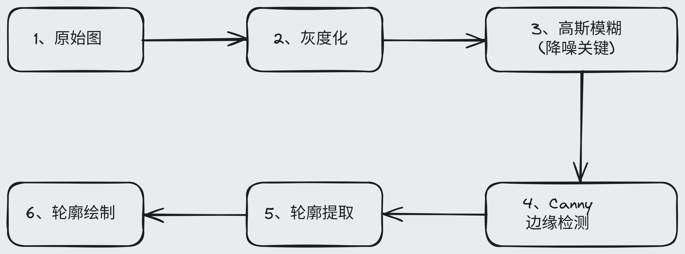

1. **Threshold**  二值化流向(适合高对比度物体提取)
	
	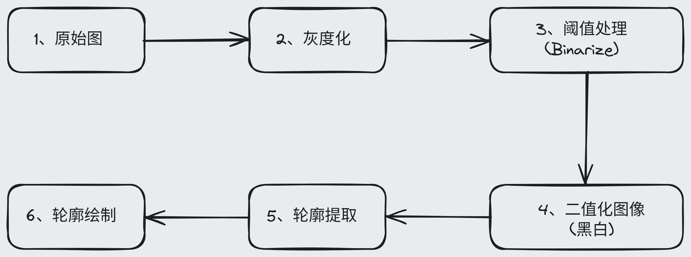


### 4. 完整的 API 与参数详解(轮廓检测)

> _1. 用于在二值图像中查找轮廓。_
```python
cv2.findContours(image, mode, method)  
```

**逐个参数解释 :**

-  `image: ` 
	- 输入后的 **二值图像** (通常是 Canny 边缘检测后的输出, 或是经过 Thershold 处理后的黑白图)。

	- 注: 函数在提取轮廓时会直接把输入当作二进制矩阵来处理据。

-  `mode: 轮廓检索模式`
	-  `cv2.RETR_LIST` : 检索所有轮廓, 但不建立任何层级(Hierarchy)关系。 所有的轮廓都被放在同一平级。

	- `cv2.RETR_EXTERNAL` : 仅检索最外层的轮廓。如果一个大轮廓内部还有小轮廓, 内部的将被忽略。

	- `cv2.RETR_TREE` : 检索所有轮廓, 并重建极其完整的嵌套层级继承树关系。

-  `method: 轮廓近似方法`
	- `cv2.CHAIN_APPROX_NONE` : 保存轮廓上的所有边界点。例如, 一条 100 像素长的直线轮廓将保存全部 100 个点的坐标。内存开销较大。

	- `cv2.CHAIN_APPROX_SIMPLE` : 压缩水平、垂直和对焦线段, 仅保留其终点坐标。 例如, 一个矩形轮廓只需要 4 个顶点即可精确表示, 能极大地节省内存和加快后续计算。

-  返回值: 
	- `contours` : 一个 Python 列表, 其中每个元素都是一个 Numpy 数组(形状为`(N, 1, 2)`), 代表一个独立轮廓的所有顶点坐标。
---


> _2. 用于在图像上绘制找到的轮廓_
```python
cv2.drawContours(image, contours, contourIdx, color, thickness)
```

**逐个参数解释 :**

- `image` : 目标画布图像。 可以是原始的彩色 BGR 图像(轮廓将叠加在原图上), 也可以是新建的空包黑色画布。

- `contours` : 由 `cv2.findContours` 传出的轮廓列表。

- `contourIdx` : 需要绘制的轮廓索引。 如果设置为 `-1`, 则表示绘制列表中的 **所有轮廓** 。

-  `color` : 绘制轮廓的颜色,采用BGR格式(例如 `(0,0,225)` 是为红色)

- `thickness` : 线条的粗细。如果设置为 `-1` 或 `cv2.FILLED`, 则会 **填充** 整个轮廓内部。
---

> _3.用于对图像进行简单的二值化处理_

```python
cv2.threshold(src, thresh, maxval, type)
```

- **逐个元素解释:**

	- `src` : 单通道 **灰度** 图像

	- `thresh` : 设定的阈值分界线

	- `maxval` : 当像素值满足条件时被赋予的目标值(通常设置为`255` 表示白色)

	- `type` : 阈值类型, 本节使用 `cv2.THRESH_BINARY` 。 如果像素值大于 `thresh` , 则设为 `maxval` (白色), 否则设置为 `0` (黑色) 。

- **返回值:**

> 该函数有两个返回值: `retval` 和 `dst` :  

- `retval` : 实际使用的阈值, 如果参数 `type = cv.THRESH_BINARY ` 就是我们自己传入的 `thresh`。 但是如果使用 `cv2.THRESH_OTSU` 等自适应方法, 这个返回值就是算法自动计算出来的。

- `dst` : 阈值处理后的输出图像(和 src 同尺寸同类型) 

---
### 5. 完整代码(轮廓检测)

```python
import cv2 as cv
from pathlib import Path
import numpy as np
path = Path(__file__).parent / "attachments" / "Ellie.png"

src = cv.imread(path)
if src is None:
	raise FileNotFoundError(f"图片读取失败:{path}")
	
📌 用Numpy建立一个新的画布图像
blank = np.zeros(src.shape, dtype=up.uint8)
cv.imshow(blank)

📌 我选择的图片比较大,所以先resize一下,然后后续使用 重新缩放 的图片进行轮廓检测
src_resized = cv.resize(src, (900, 600), interpolation = cv.INTER_CUBIC)

📌 先进行图片灰度化
Src_Gray = cv.cvtcolor(src_resized, cv.COLOR_BGR2GRAY)
cv.imshow()

📌 方法一:使用 cv.Canny() 函数进行边缘检测
src_canny = cv.Canny(src_gray)
cv.imshow(src_canny)

📌 方法二: 使用 cv.threshold()函数进行阈值分析,将图像进行简单的二值化处理

retval, dst = cv.threshold(gray, 125, 255, cv.THRESH_BINARY)
cv.imshow("Threshold", thresh)

vontours, hierarchy = cv.findContours(Canny, cv.RETR_LIST, cv.CHAIN_APPROX_NONE)
print(f"轮廓数量:{len{contours}}")

cv.drawContours(blank, contours, -1, (0, 255, 0), 1)
cv.imshow("Contours Drawn", blank)

cv.waitKey(0)
cv.destoryAllwindows()

```


## 八、图像颜色通道分割与合并(Split & Merge)

> _在数字图像处理中, 彩色图像通常由多个颜色通道叠加而成_

### OpenCV的 BGR 存储机制
- 大多数现代图像库、浏览器和屏幕显示默认使用 **RGB**（红、绿、蓝）顺序。然而，由于历史遗留原因，**OpenCV 默认以 BGR（蓝、绿、红）的顺序读取和存储彩色图像**。

### 为什么拆分出的单通道图像显示未 "灰度图"
- 当我们使用 `cv2.split()` 提取出单个通道（例如 Blue 通道）并用 `cv2.imshow()` 显示时，我们会发现它是一张**黑白灰度图**，而不是蓝色图。这是由通道的维度（Shape）决定的：

	- **彩色原图的 Shape**：`(height, width, 3)` —— 拥有 3 个颜色通道，每个像素点由三个数值 $[B, G, R]$ 决定色彩。

	- **单通道的 Shape**：`(height, width)` —— 维度只有 1。 对于单通道图像，OpenCV 只能将其解释为**灰度强度图（Grayscale Intensity）**：

	- 像素值越接近 $255$ **（纯白）**，代表该通道在这个位置的颜色强度越强；

	- 像素值越接近 $0$ **（纯黑）**，代表该通道在这个位置的颜色强度越弱（甚至没有）。

### 彩色单通道可视化原理

> _如果我们想直观地看到 "纯蓝色" 的单通道图像, 就必须重建一个三通道图像_

先使用 `blank = np.zeros(src.shape[:2], dtype = np.uint8)` 建立一个和源图像尺寸相同的画布。

- **纯蓝色 :** 将原图的 Blue 数据放到第一通道, 再用充满 0 (黑色) 的空白数据取填充 Green 和 Red 通道。其像素结构即为 `[B, blank, blank]`

- **纯绿通道图像**：其像素结构为 `[blank, G, blank]`

- **纯红通道图像**：其像素结构为 `[blank, blank, R]`

### 完整的 API 与参数详解(颜色通道分割与合并)
1. `cv2.split(m)`

>_将一个多通道数组分割成多个单通道数组。_

- `m` : 输入的彩色多通道图像(形状为 `(height, width, channels)`)

- **返回值 :** 一个元组 `(B, G, R)` ,分别对应蓝色、绿色和红色通道的单通道图像矩阵(形状均为`(height, width)`)。

2. `cv2.merge(mv)`

> _将多个单通道数组合并为一个多通道数组。_

- `mv` : 由单通道图像矩阵组成的列表或元组(例如 `[B, G, R]` 或者 `[B, blank, blank]` ) 。列表中的元素必须具有完全相同的尺寸和深度。

 - **返回值 :** 合并后的多通道彩色图像(例如形状为: `(height, width, 3)`)。

3. `np.zeros(shape, dtype)`

> _建立新画布用来显示纯颜色,用于创建指定形状并以 0 填充的数组 。_

- `shape` : 输出矩阵的形状。在构建单通道空白北京时, 我们使用原图的前两个维度 : `img.shape[:2]`, 即`(height, weight)` 。

- `dtype` : 数据类型。为了匹配OpenCV 图像格式,必须指定为 `uint8` (即无符号8为整型, 范围 0 - 255)。
---
### 完整代码(颜色通道分割与合并)

```python
import cv2 as cv
import numpy as np
from pathlib import Path

path = Path(_file_).parent /"attachments" / "Elden Ring_Stormveil Castle.png"

src = cv.imread(path)
if src is None:
	raise FileNotFoundError(f"图片未找到:{path}")
	
b, g, r = cv.split(src)
cv.imshow("Split B", b)
cv.imshow("Split G", g)
cv.imshow("Split R", r)

merge_img = cv.merge(b, g, r)
cv.imshow("Merge Image", merge_img)

📌 建立一个全新画布,来重构纯B, G, R 彩色图像

blank = np.zeros(src.shape[:2], dtype = uint8)

blue_img = cv.merge(b, blank, blank)
cv.imshow("Pure Blue", blue_img)

green_img = cv.merge([blank, g, blank])
cv.imshow("Pure Green", green_img)

red_img = cv.merge([blank, blank, r])
cv.imshow("Pure Red", red_img)

cv.waitKey(0)
cv.destroyAllWindows
```

---

## 九、图像平滑与模糊（Smoothing & Blurring）

> _在数字图像处理中，噪声（由相机传感器、光照不足或传输干扰引起）通常表现为孤立的高频信号。要滤除这些信号，需要使用 **低通滤波（Low-Pass Filtering）**，即平滑和模糊。_

### 卷积核（Kernel）与邻域（Neighborhood）
- **卷积核 :** 是一个特定尺寸（如 $3 \times 3$, $5 \times 5$）的二维小矩阵。在图像平滑时，这个小矩阵就像一扇“滑动窗口（Window）”，在图像的所有像素点上由左及右、由上及下进行滑动。

- **中心像素与邻域**：窗口的最正中心格对应当前要处理的像素点，其余格子覆盖的点则是其“邻域像素”。模糊算法正是通过 **邻域像素的属性** 来重新计算并改写 **中心像素的值** 。

### 四大模糊算法原理
1.  均值模糊 (Averaging)
**原理 :** 将卷积核内所有邻域像素的灰度值进行相加，再除以像素总个数，计算其算术平均值作为中心像素的新值

2.  高斯模糊 (Gaussian Blur)
**原理**：不同于均值模糊的“人人平等”，高斯模糊引入了 **空间权重**。越靠近中心点的像素，分配到的权重越大；越远离中心的像素，权重越小。权重分布符合二维高斯分布。其优点是过渡极其自然。

3.  中值模糊 (Median Blur)
**原理**：不进行任何加权或求平均运算。它将卷积核内的所有像素值从小到大进行排序，直接取其中间的那个数（中位数）填入中心。它能100%消灭图像中的黑白“椒盐颗粒”（即噪点不是渐变，而是直接跳跃到最黑 0 或最白 255）

4.  双边滤波 (Bilateral Filter)
- **原理**：传统模糊算法在过滤噪声的同时，由于一视同仁地平滑了边界（突变区域），会导致物体边缘变得模糊不清。双边滤波不仅考虑了**像素点之间的空间距离（近的权重大）**，还额外考虑了**像素值之间的色彩/亮度相似度（颜色相近的权重大）**。
    
- 当滑窗滑到边缘（一侧是黑，一侧是白）时，由于黑白之间像素值相差巨大，两边的像素不会互相干扰，因此**边缘被完美保护了下来**，只有纯色区域内部的微小噪声被平滑掉了。

### 完整的 API 与参数解释(模糊)

1. `cv2.blur(src,  ksize)`
	- `src` : 输入图像（通道数不限，但深度应为 `CV_8U`, `CV_16U`, `CV_16S`, `CV_32F` 或 `CV_64F`）。

2. `cv2.GaussianBlur(src, ksize, sigmaX, sigmaY, borderType)`
	-  `ksize` : 高斯核大小 `(width, height)`。宽高可以不同，但必须是**奇数**。

	- **`sigmaX`**：X 方向的高斯核标准差。若设为 `0`，则系统会根据核宽公式自动计算。

	- **`sigmaY`**：Y 方向的高斯核标准差。若设为 `0` 且 `sigmaX` 也不为0，则 `sigmaY` 会被强制设定为与 `sigmaX` 相同。

	- **`borderType`**：边界扩充类型，通常保持默认（`cv2.BORDER_DEFAULT`）。

3. `cv2.medianBlur(src, kise)` 
	- **`src`**：输入图像。当核大小时为 $3$ 或 $5$ 时，图像深度可以为 `CV_8U`, `CV_16U`, `CV_32F`，但对于更大的核，只能是 `CV_8U`。

	- **`ksize`**：**注意：这里不是元组，直接传一个单整型数**（例如 `3`、`5`、`7`），代表一个 $k \times k$ 的正方形核。必须是大于 1 的奇数。

4. `cv2.bilateralFilter(src, d, sigmaColor, sigmaSpace)`
	- **`src`**：输入图像，通常必须是 8 位或浮点型单通道/三通道图像。

	- **`d`**：过滤期间使用的各像素邻域的直径。如果设为非正数（如 `0`），系统会根据 `sigmaSpace` 自动计算。对于实时处理系统，推荐使用 `d = 5`，若在极其多噪的离线场景下，可设为 `d = 9`。

	- **`sigmaColor`**：颜色空间滤波器标准差。这个值越大，代表越宽的颜色区间会被混在一起（即只要色差在这个范围内，就被认为是可以平滑的同色区）。
	
	- **`sigmaSpace`**：坐标空间滤波器标准差。值越大，意味着越远的像素会互相影响（前提是它们的颜色足够相似）。
---
### 完整代码(平滑与模糊)

```python
import cv2 as cv
import numpy as np
from pathlib as Path

path = Path(__file__).parent /"attachments" / "Elden Ring_Stormveil Castle.png"

src = cv.imread(path)
if src is None:
	raise FileNotFoundError(f"图片未找到:{path}")
	
📌 我习惯做一个缩放
resized = cv.resize(src, (900, 600),interpolation=cv.INTER_AREA)
cv.imshow("Original Image")

📌 均值模糊 - 最基本的平滑
ava_blur = cv.blur(resized, (3, 3))
ava_blur = cv.blur(resized, (7, 7))
cv.imshow("Averaging Blur", ava_blur)

📌 高斯模糊 - 最自然的平滑

gaussian_blur = cv.GaussianBlur(resized, (7, 7), 0)
cv.imshow("Gaussian Blur", gaussian_blur)

📌 中值模糊 - 消除孤立噪点、椒盐噪声
📌 注意 该模糊的 核大小 是 单个整数,比如 3 ,代表(3,3)矩阵

median_blur = cv.medianBlur(resized, 7) # 7 会发现图像产生了类似"水彩涂抹"的效果

median_blur2 = cv.medianBlur(resized, 3)

cv.imshow("Median Blur(ks=7)", median_blur)

cv.imshow("Median Blur(ks=3)", median_blur2)

📌 进阶- 双边滤波 - 在保留边缘的同时进行平滑

📌 d=10(局部搜索直径), sigmaColor=35(较小色差内混合), sigmaSpace=25(空间平滑跨度)

bilateral_optimized = cv.bilateralFilter(resized, d=10, sigmaColor=35, sigmaSpace=25)

cv.imshow("Bilateral Filter", bilateral_optimized)

```

>[!abstract] 总结与调参对比
>1.  **均值模糊 :** 计算最快，但会无差别地糊掉所有细节。
>2.  **高斯模糊 :** 最符合镜头自然散景效果，最常用。
> 3. **中值模糊 :** 不参与均值计算，适合暴力清除单像素死点（椒盐噪点）
> 4. **双边滤波 :** 虽然计算耗时最高，但是美颜、边缘提取前置滤波的“神兵利器”。
> 

---

### 为什么要模糊、什么时候该用什么时候不该用?
> _在实际工程开发中，“把画质变糊”听起来像是一种倒退，但对计算机视觉算法来说, 模糊（低通滤波）是帮助机器“排除干扰、聚焦结构”的必经之路 _

1. **为什么要模糊？**

	- **人眼看的是“语义”（如：这是一只猫，那是一辆车）**。

	- **机器看的是“数字的突变（梯度）”**。如果图像中包含繁杂的纹理、毛发、或相机的雪花噪点，机器会把每一个毛孔、每一粒灰尘都当成一个突变的“大事件（边界）”去处理，导致核心算法直接被干扰信息淹没。

	- **物理本质**：模糊通过抹平高频的微观细节噪声，暴露出低频的宏观物体结构轮廓。这相当于**让机器眯起眼睛、退后几步看图像**，帮助它更好地看清全局结构。

 2. **黄金决策清单：什么时候该用？什么时候不该用？**

> 在编写具体图像处理管道（Image Pipeline）时，可以直接套用以下决策准则：

#### 🟢 必须使用模糊的场景（去噪/聚焦）：

1. **背景十分繁杂，干扰强纹理区域**：
    
    - _典型实例_：在一片草地上提取红色足球的边界，或者在猫咪身上检测其外廓。草地的草丝和猫咪的毛发是严重的突变噪点，必须先用**高斯模糊**抹平这些高频干扰，才能顺利提取出圆润平滑的核心边界。
        
2. **图像中存在明显的雪花点或单像素坏点（椒盐噪声）**：
    
    - _典型实例_：低光照下的夜间闭路监控图像、或者是传输受损的传感器画面。这种非连续、极端跳跃的坏点，必须使用**中值模糊**。
        
3. **需要进行美颜磨皮或柔和光效，且不能弄脏主要器官边界**：
    
    - _典型实例_：人脸检测后的美颜功能。需要平滑皮肤上的微弱杂色、斑点和细纹，但眼睛、嘴唇、鼻梁等色差极大的核心区域必须保持绝对锐利。此时必须使用**双边滤波**。
        
4. **进行边缘提取（Canny）的前置步骤**：
    
    - _典型定律_：除非图像是完美的、无任何渐变和噪声的黑白矢量图，否则做 Canny 前，**必须**先用高斯模糊降噪。如果不模糊，提取出来的边缘图将是一团由噪点和微观梯度组成的混乱碎线。
        

#### 🔴 绝对禁止模糊的场景（保真/精确）：

1. **高精度几何尺寸测量与工业质检**：
    
    - _典型实例_：用工业相机检测精密螺丝钉、齿轮的咬合间距是否达到 $1.000\text{ mm}$ 级别。如果使用模糊算法，金属边界的像素会向外晕染、过渡带变宽。一旦锐利的突变变为了渐变，测量算法计算出的边界位置将产生严重漂移，导致质检数据直接报废。
        
2. **目标特征本身就极其微小、纤细**：
    
    - _典型实例_：识别远景街拍图里极其细小的车牌字体，或在医学影像中检测几个像素宽的微细血管、微小病灶。模糊算法会将这些弱小的、好不容易保留下来的纤细信号**彻底融化、抹杀**在周围背景中。
        
3. **寻找几何尖锐角点（Corner Detection）**：
    
    - _典型实例_：相机标定的黑白棋盘格角点检测、3D 视觉重建。这些算法需要准确定位像素级的 $90^\circ$ 垂直折角。模糊会直接把锋利的尖角“磨成”弧形圆角，导致亚像素定位产生方向性偏离。
        

> [!tip] 💡 **终极决策口诀 : ** 如果你的任务是 **“抓大放小”**（定位大体位置、提取宏观轮廓、模糊美化），**闭眼用模糊**。 如果你的任务是 **“锱铢必较”**（工业精密测宽、读超小字符、找几何死角），**坚决不用模糊**。

---

###  模糊算法在工业级 CV 管道中的核心地位

1.  **为边缘提取（Canny）铺路**： 正如我们在上一节所感悟的，如果不做高斯模糊，Canny 检测器会在毛发、粗糙背景处画出上千个噪点边缘。做一个中等强度的 `GaussianBlur(src, (5, 5), 0)` 相当于图像的“降噪器”，能够屏蔽微观纹理，只留下核心骨架。

2.   **多尺度金字塔与计算优化** ： 在进行大规模的目标识别、模板匹配时，高分辨率图像计算量极大。通过使用 `cv2.blur` 进行降采样（下平滑），可以把图像在空间尺度上“缩小并平滑”，用低分辨率的模糊图先确定大体方位，再在高分辨率精细查找，能节省惊人的算力资源。

3.  **双边滤波（Bilateral）在“美颜/去斑”领域的应用**： 双边滤波是所有美颜、磨皮算法的核心。因为它完美地结合了空间邻域和颜色差：人的皮肤由于长斑（像素值和皮肤底色差很多），颜色滤波器会把斑点作为边缘保留？不，当色差极大时它不平滑，但当色差微小时它会平滑。通过微调 `sigmaColor`，可以把皮肤上的小细纹和微弱杂色（斑点）在平滑中融合掉，而眼睛、鼻梁、嘴唇（色差极大，属于强边界）由于超出了 `sigmaColor` 的平滑区间，得以完好无损地保留下来。

## 十、 图像位运算（Bitwise Operators）
- 在 OpenCV 的图像处理中，位运算是在二进制（Binary）层面按像素（Pixel-by-pixel）独立进行的。对于 8 位无符号单通道图像（`uint8`），其逻辑建立在以下两个状态的控制之上：
	
	- $0$ **（纯黑，二进制表示 `00000000`）**：表示该像素处于 **”关闭（OFF）”** 状态，在逻辑运算中视作 `False`。
	
	-  $255$  **（纯白，二进制表示 `11111111`）**：表示该像素处于 **“开启（ON）”** 状态，在逻辑运算中视作 `True`。

### 四大位运算符逻辑模型

设 $A$ 为图像 A 的像素值， $B$ 为图像 B 在相同坐标处的像素值：

#### ① 按位与 (Bitwise AND)

- **逻辑代数**： $Y = A \cdot B$
    
- **物理意义**：**提取交集**。只有当两个图像在相同位置的像素点都为”白（ $255$ ）”时，输出结果才为”白”；只要其中任意一方是”黑（ $0$ ）”，结果即为”黑”。
    
- **真值表**：
    
    - $0 \cdot 0 = 0$
        
    - $255 \cdot 0 = 0$
        
    - $255 \cdot 255 = 255$
        

#### ② 按位或 (Bitwise OR)

- **逻辑代数**： $Y = A + B$
    
- **物理意义**：**提取并集**。只要两个图像在相同位置的像素点有任意一个是“白”，输出结果就为“白”；只有两边都是“黑”时，结果才为“黑”。
    
- **真值表**：
    
    - $0 + 0 = 0$
        
    - $255 + 0 = 255$
        
    - $255 + 255 = 255$
        

#### ③ 按位异或 (Bitwise XOR)

- **逻辑代数**： $Y = A \oplus B$
    
- **物理意义**：**提取非交集**。当两个图像在相同位置的像素值不相同时（一个白、一个黑），输出为“白”；如果两边都是白或者都是黑，输出为“黑”。常用于寻找两幅图之间的差异。
    
- **真值表**：
    
    - $0 \oplus 0 = 0$
        
    - $255 \oplus 0 = 255$
        
    - $255 \oplus 255 = 0$
        

#### ④ 按位非 (Bitwise NOT)

- **逻辑代数**： $Y = \bar{A} = 255 - A$
    
- **物理意义**：**颜色反转**。一元操作，单图输入。将白（ $255$ ）变成黑（ $0$ ），黑（ $0$ ）变成白（ $255$ ）。

### 图解处理流向 (位运算)
>_在进行位运算时, 两张图片是想透明胶片一样物理上下重叠(对齐最外侧边界)的。为了直观展现像素在水平方向上的精确对齐，我们在下方的并排对照图中直接标出了每张图在 0~16 列上的像素位置。

1. 经典几何图形分布

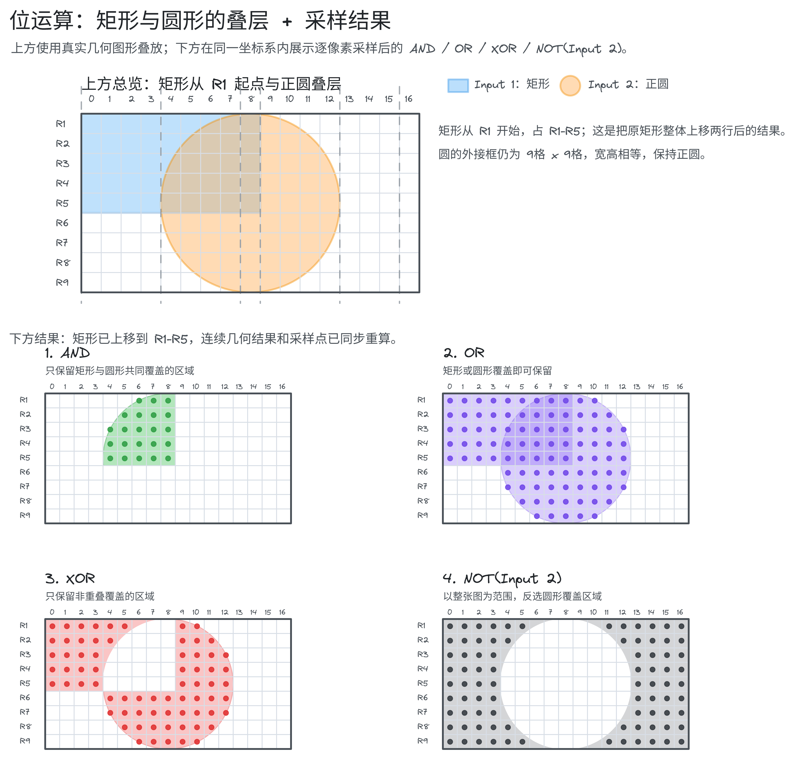

---

### 完整的 API 与参数详解(位运算)
1. `cv2.bitwise_and(src1, src2, dst=None, mask=None)`
	- **`src1`**：第一个输入图像矩阵（可以是单通道灰度图，也可以是彩色图）。
	
	- **`src2`**：第二个输入图像矩阵。尺寸、通道数和深度必须与 `src1` 完全一致。
	
	- **`mask`**：可选参数，一个 8 位单通道二进制掩膜图像。只有掩膜中对应像素值不为 $0$ 的区域才参与运算。 

2. `cv2.bitwise_or(src1, src2, dst=None, mask=None)`
	- 对两个矩阵执行 按像素 的逻辑"或"操作, 参数约束同上。

3. `cv2.bitwise_xor(src1, src2, dst=None, mask=None)`
	- 对两个矩阵执行按像素的逻辑“异或”操作，参数约束同上。

4. `cv2.bitwise_not(src, dst=None, mask=None)`
	- `src`: 输入图像矩阵。
	
	- 注: 作为一元操作符, 它只需要传入一个输入源, 返回图像像素值 取反 后的结果(即用 255 减去当前像素值)。  

### 为什么要使用位运算?
1. 为什么不能用普通图像数学加减法？
	- **饱和溢出问题**：如果直接做加法，两个像素点相加 $200 + 100 = 300$ 。但对于 8 位无符号图像，最大值只有 $255$ 。这会导致数值饱和截断，或者产生溢出（全白过曝），丢失大量原图纹理细节。

	- **逻辑控制能力**：普通的代数加减法无法精确表达“只有两张图相同位置都是白色时才保留，否则一律变黑”这种经典的开关条件控制。
	
	- **计算速度优势**：位运算直接在计算机底层的逻辑门（与/或/非/异或）层面按位秒级处理，不涉及浮点或大数的代数乘除，执行速度高出一个数量级，是多媒体和算法管道中的运算首选。

### 什么时候用哪种位运算?

|     运算符     | 🟢 适用场景（优势区）                                               | 🔴 禁用场景（避坑区）                           |
| :---------: | ---------------------------------------------------------- | -------------------------------------- |
| **AND（与）**  | 1. 图像抠图与掩膜（Masking）：用白色图形作为大门，提取原彩色图像的特定区域。<br>2. 相交区域提取。  | 不适合用来合并多张图像的内容，因为这会导致非重叠区域全部丢失变黑。      |
|  **OR（或）**  | 1. 图像融合与贴图：将两个不重叠的特征（如将一个红苹果贴到绿叶背景上）融合进一张画布。<br>2. 提取合并区域。 | 绝对不能用于掩膜过滤，因为它会将无关背景全部染白。              |
| **XOR（异或）** | 1. 寻找图像差异：对比两帧监控画面的不同点（运动检测）。<br>2. 制作几何边缘镂空效果。            | 如果你想保留相交的重合部分，千万不要用它，因为相交部分在异或中会被强制抹黑。 |
| **NOT（非）**  | 1. 图像反转：快速制作底片效果、黑白二值图前景色与背景色对调。                           | 无法用于两张图像之间的复合运算。                       |

---

### 位运算在大型复杂系统中的地位

>  位运算看似基础，但它是所有高级图像处理管道（Image Pipelines）的底层阀门：

1. **高效的图像剪裁与 ROI 提取（掩膜技术）**： 在人脸检测（Face Detection）、车牌定位、医学病灶提取等高级应用中，我们第一步会用神经网络或传统算法确定目标所在的轮廓。接着，用位运算 `cv2.bitwise_and` 把这个轮廓以外的所有无用噪点全部“一键变黑”。这能让后续的分类和识别算法**计算量直接暴降** $80\%$ 。

2. **视频监控中的运动目标检测（帧差法）**： 最经典的监控防盗算法就是利用位运算。摄像头通过高频比对当前帧与上一帧像素。两帧图像进行 **`cv2.bitwise_xor`（按位异或）**。由于静止的背景像素值完全相同，异或结果为 $0$ （全黑）；只有运动的小偷（像素发生改变）会作为白色高亮暴露出来。这在资源紧张的嵌入式芯片中是算力开销极低的绝对首选算法。

## 十一、图像掩膜（Image Masking）
> _在机器人视觉感知中, 面对高分辨率的多模态输入, 我们往往只关注特定的局部空间(例如双足人形机器人的足部接触区域、灵巧手抓取的目标物体)。 掩膜(Masking) 正是过滤无关背景噪声、聚焦特征的物理级别"手术刀"_


### 什么是掩膜(Mask)
- **物理类比 :** 掩膜 就像是一张不透光的黑色卡片, 我们在上面用剪刀裁剪出一个特定形状的 "透光孔" (如圆形、多边形)。 当把这张卡片叠在彩色照片上时, 只有透光孔区域的画面能呈现出来, 其余部分全部被黑色遮挡。

- **数据维度 :** 掩膜 是 一张 _单通道的二值/灰度图像_ , 其空间尺寸(H × W) 与原图完全一致。

### 核心方案对比：掩膜裁剪 vs 矩阵切片（Crop）
> 在提取 感兴趣区域(ROI)时, 这两种方案在机器人特征工程中各有优势 :

| 对比维度 | 🟢 图像掩膜 (Masking) | 🔴 矩阵切片 (NumPy Crop `img[y1:y2, x1:x2]`) |
|:---:|------|------|
| **提取边界形状** | 任意非规则形状（圆形、多边形、不连续的散点域）。 | 仅限规则的矩形（通过行和列的索引切片）。 |
| **输出尺寸变化** | 空间尺寸保持一致（依然是 $H \times W$ ，非保留区填充为 0）。 | 空间尺寸会缩小（变为切片后的子矩阵大小 $H' \times W'$ ）。 |
| **空间坐标对齐** | 完全对齐，输出图像中目标像素的索引 $(x,y)$ 与原图完全一致，无需进行坐标二次换算。 | 坐标系发生平移，局部子图像中的坐标需要加上偏移量 $\Delta x, \Delta y$ 才能还原到原图空间。 |
| **计算复杂度** | 略高（需进行逐像素位运算，或通过硬件加速级逻辑门执行）。 | 极低（仅涉及内存指针和内存视图的切片移动）。 |

### 完整的 API 与参数详解(掩膜)
1. `cv2.bitwise_and:(src1, src2, dst = None, mask=None)` 

在 掩膜 操作中, 该函数通常以 自相与(self-AND) 的形式被调用:  `masked_img = cv.bitwise_and(img, img, mask=mask)`
- **`src1`**：第一个输入矩阵。在抠图场景中，直接传彩色原图 `img`。

- **`src2`**：第二个输入矩阵。同样传彩色原图 `img`。由于相同的数字进行按位与运算结果不变（ $X \cdot X = X$ ），因此自相与的目的就是保持原色不变，仅仅借用 `mask` 参数作为开关通道。

- **`mask`**：**核心门控参数**。必须是 8 位单通道二进制图像（`uint8`），尺寸必须与 `src1` 的空间高度和宽度完全一致。

	- **底层闭门机制**：当 `mask(x, y) == 0` 时，函数直接跳过位运算，强制将输出像素的各个通道直接写为 `0`；只有当 `mask(x, y) != 0` 时，才对输入像素执行 AND 运算并写入输出。
	
	- **返回值**：与原图维度完全一致的掩膜过滤后的图像矩阵。

2. `np.zeros(shape, dtype)`
	- `shape` : 掩膜的形状。必须确保其是 **单通道。**
			- **避坑点 :**  如果使用彩色图像的 `img.shape(带三通道)`, 创建出来的将是三通道全黑图, 将其作为 `mask` 传入 `cv2.bitwise_and` 会发生 **通道错配崩溃点**。必须显式使用 `img.shape[:2]` (仅提取高、宽)。
		
	- `dtype` : 必须设置为 `np.unit8` , 已匹配 OpenCV 的图像深度标准。

---
### 完整代码(掩膜)

```python
import cv2 as cv
import numpy as np
from pathlib import Pat
path = Path(__file__).parent / "attachments" / "Elden Ring_Stormveil Castle.png"
src = cv.imread(str(path))
if src is None:
    raise FileNotFoundError(f"图片未找到:{path}")
resized = cv.resize(src, (860, 550), interpolation=cv.INTER_AREA)

cv.imshow("Resized_img", resized)

📌 先创建一个空白的掩码图像，大小与调整后的图像相同

blank_mask = np.zeros(resized.shape[:2], dtype=np.uint8)

📌 再利用位运算,在掩膜板上雕刻非规则的 "钥匙孔/异性" 透光区域
📌 在临时画布 1 上 绘制圆形

circle_mask = cv.circle(blank_mask.copy(), (450, 300), 100, 255, -1)

📌 在临时画布 2 上 绘矩形

rect_mask = cv.rectangle(

blank_canvas_temp := blank_mask.copy(), (350, 200), (550, 400), 255, -1)

📌 融合圆形和矩形 形成掩膜: 利用异或 bitwise_xor 操作制作出 中间带有空心镂空效果的复杂异性掩膜版

custom_mask = cv.bitwise_xor(circle_mask, rect_mask)

cv.imshow('Custom Advanced Mask (Single Channel)', custom_mask)

msked_result = cv.bitwise_and(resized, resized, mask=custom_mask)

cv.imshow('Masked Result', msked_result)
cv.waitKey(0)
cv.destroyAllWindows()
```

>[!notice]
>1.  使用 `cv.bitwise_and()` 自相与 并挂载 mask 开关 说人话就是把掩膜应用到图像上, 但是因为`cv.bitwise_and()`不能只对一个图像进行操作必须是两个图像,所以就把同一张图像传入两次
>
>2.  底层硬件会对 `custom_mask` 值为 255 的坐标进行彩色无损提取，其余 0 坐标强制置为黑色


---

### 为什么要使用掩膜?
1. 具身智能（Embodied AI）中的痛点直击

>在人形机器人手眼协同抓取任务中：

- 如果我们将整个场景（包含杂乱的桌面背景、机器人机身底座、实验室的人员走动）一股脑作为张量推给 VLA 模型（如 RT-2, Diffusion Policy）的视觉编码器（Visual Encoder），模型会被海量的背景噪声（高频无效 Token）干扰，导致**操作轨迹产生严重漂移，甚至Sim-to-Real（仿真到真实硬件）产生灾难性退化**。
    
- **解决方案**：利用基于深度信息的 Masking 机制，将灵巧手与操作物体周围 30cm 的立体包围盒映射到 2D 图像平面，生成局部掩膜板，把周围的所有干扰背景全部一键抹黑。视觉编码器只接收高保真的 ROI 图像，**让模型的注意力空间（Attention Map）完全聚焦在接触界面（Contact Interface）上。**

### 什么时候使用掩膜?

|   场景    | 🟢 必须使用 Masking 的场景（优势区）                                                                                                                  | 🔴 绝对禁止/不建议直接使用的场景（避坑区）                                                                                            |
| :-----: | ----------------------------------------------------------------------------------------------------------------------------------------- | ------------------------------------------------------------------------------------------------------------------ |
| **场景一** | **多目标追踪与干扰物剔除**：人形机器人在仓库中搬运特定标志的货物，通过生成特定颜色的色彩阈值掩膜（HSV Color Mask），只留出货物边界，背景全部黑化，使检测器能以极低延迟锁定目标。                                         | **全局特征分析（如全局光照计算、图像整体直方图均衡化）**：为了调节整张画面的对比度。如果使用了掩膜，非掩膜区的零值（纯黑 $0$ ）会被加入直方图计算，导致直方图在 $0$ 处产生极高峰值，使整个均衡化算法彻底失效、画面失真。 |
| **场景二** | **多模态传感器视野对齐（FOV Alignment）**：在激光雷达（LiDAR）与深度相机融合建图时，相机的视野只有 $90^\circ$ ，而激光雷达是 $360^\circ$ 。需要使用相机视场角生成的扇形 Mask，过滤雷达的多余点云，实现空间语义上的绝对点对点映射。 | **边缘退化敏感的精密工业尺寸测量**：检测精密齿轮的细微磨损。掩膜在边缘处可能会因为插值产生 $1 \sim 2$ 像素宽的灰度渐变带（半影区），这会导致高精度测量算法在边缘拟合时产生数值漂移。                 |
| **场景三** | **任意非规则局部操作特征提取**：提取圆形瞳孔区域、多边形的路面行驶区域（可通行区域掩膜）。                                                                                           | —                                                                                                                  |

---

## 十二、图像直方图计算与可视化（Histograms Computation & Visualization）
> _在机器人控制和具身感知中，直接分析复杂的 2D 彩色图像会消耗惊人的算力。直方图（Histogram）通过将 2D 空间像素解耦为 1D 的频数分布，极大降低了系统的信息维度，是提取全局环境统计特征的高效手段_

### 什么是直方图?
- **物理直觉 :**  直方图是一个统计图表，它的横轴代表**像素的亮度等级（通常为** $0 \sim 255$ **）**，纵轴代表**该亮度级别在整幅图像中出现的频数（像素个数）**。它能够一眼暴露图像是“过曝光（数据扎堆在 255 侧）”还是“暗光不足（数据扎堆在 0 侧）”。

- **灰度级别与 Bin**：直方图中的“柱子”被称为 **Bin**。如果我们的 Bin 大小设为 $256$ ，代表每一个灰度级都单独统计；如果 Bin 大小设为 $16$ ，则代表每 $16$ 个邻近灰度级合并为一个柱子统计，起到滤波和数据粗糙化的作用。

### 核心概念对比: 灰度直方图 vs 3D 彩色直方图 vs 分离彩色直方图

|    特征维度    | 🟢 灰度直方图 (Grayscale Histogram) | 🟡 分离彩色直方图 (Split BGR Histogram) | 🔴 3D 联合彩色直方图 (3D Color Histogram) |
| :-------: | ---------------------------------- | --------------------------------------- | ------------------------------------------ |
| **通道数量** | $1$ 通道。                            | $3$ 个独立的单通道。                             | $3$ 通道联合。                                    |
| **数据结构** | $256 \times 1$ 的一维向量。              | $3$ 个独立的 $256 \times 1$ 一维向量。             | $256 \times 256 \times 256$ 的三维张量。             |
| **物理意义** | 仅反映图像的整体亮度/能量分布，完全丢失色彩信息。          | 分别反映红、绿、蓝三种颜色在空间中的独立强度分布。               | 精确反映三原色之间的空间搭配/联合概率分布。                       |
| **计算开销** | 极低（直接统计一维像素）。                      | 较低（统计三个独立一维通道）。                         | 极高（内存占用呈立方级 $256^3 \approx 1.6 \times 10^7$ 飙升）。 |
| **应用场景** | 快速曝光检测、自适应二值化前置评估。                 | 基础场景分类、白平衡色彩矫正。                         | 高精度的颜色分割、高级模板匹配。                              |

### 完整的 API 与参数详解(直方图计算与可视化)
1. `cv2.calcHist(images, channels, mask, histSize, ranges, hist=None, accumulate=False)`

> _用于计算一组图像的直方图。这是一个高度优化的 C++ 底层实现, 其参数定义非常严苛, 要求 必须以 列表(list)形式 包装传入。_

- `images` : 输入图像列表。形如 `[img]`。图像的深度必须为 `CV_8U`、`CV_16U` 或 `CV_32F`。

- `channels`：要统计的通道索引列表。形如 `[0]`。
    
    - 如果输入是单通道灰度图，必须传 `[0]`；
        
    - 如果输入是 BGR 彩色图，`[0]` 代表 Blue 通道，`[1]` 代表 Green 通道，`[2]` 代表 Red 通道。

- `mask`：单通道掩膜图像。
	
	- 若要统计整幅图，传 `None`；
    
	- 若只统计局部区域，传入与原图尺寸完全一致的 `uint8` 掩膜图像。
	
- `histSize`：直方图的 Bin 数量列表（即柱子的个数）。形如 `[256]`。代表将亮度区间均分为多少份进行统计。

- `ranges`：用于统计的亮度边界范围列表。对于 8 位图像，我们统计全区间，传 `[0, 256)`（注意：边界是左闭右开，因此上限是 $256$ 对应最大亮度 $255$ ）。

- 返回值 `hist`：一个形状为 `(histSize, 1)` 的 NumPy 二维数组。其中每一个元素代表对应 Bin 的像素计数值。

2. `plt.plot(y, color)`

> [!Warning] 注意我们画的是折线而不是直方图 [[#学术与工程疑难：画“直方图”为什么用的是“折线图 (plt.plot)”而不是“柱状图 (plt.hist)”？| 原因]]
> [[📊 Matplotlib 学习笔记#二、折线图 (Line Plot) 基础与 NumPy 整合]]]
> 

- `y`：要绘制的数据向量。在直方图可视化中，直接传入 `cv2.calcHist` 返回的 `hist` 矩阵。
    
- `color`：折线的颜色。为了在同一个图表上直观展示 B、G、R 的物理分布，我们可以传入 `'b'` (蓝色)、`'g'` (绿色)、`'r'` (红色)。

---

### 完整代码(直方图计算与可视化)

```python
import cv2 as cv
import numpy as np
import matplotlib.pyplot as plt
from pathlib import Path

path = Path(__file__).parent / "attachments" / "wallpaper.png"

src = cv.imread(path)
if src is None:
    raise FileNotFoundError(f"图片读取失败:{path}")
resized = cv.resize(src, (900, 600), interpolation=cv.INTER_AREA)

📌 将图像转换为单通道灰度图, 用于基础灰度分布分析

gray = cv.cvtColor(resized, cv.COLOR_BGR2GRAY)
cv.imshow("Gray Image", gray)

📌 初始化 Matplotlib 图表, 设定科学研究级分辨率
plt.figure(figsize=(10, 6))

plt.title("Grauscale & Color Histogram")

plt.xlabel('Intensity / Bins (0-255) ')

plt.ylabel('Number of Pixels(Count)')

📌 ==========================================================

📌 场景 A: 经典单通道灰度直方图计算与绘制

📌 ==========================================================
📌 注意：calcHist 的前五个参数必须被包裹在方括号 [] 中传入！

📌 gray_hist = cv.calcHist([gray],[0],None,[256], [0,256])

📌 绘制一条黑色曲线代表灰度整体亮度分布

📌 plt.plot(gray_hist, color='black', label='Grayscale Total')

📌 plt.xlim([0,256])

📌 ==========================================================

📌 场景 B: 进阶方案 —— BGR 三通道独立彩色直方图并行绘制

📌 ==========================================================

📌 定义对应的 Matplotlib 绘制颜色

📌 colors = ('b', 'g', 'r')

📌 channel_labels = ('Blue', 'Green', 'Red')


📌 enumerate 同时拿到索引(i)和值(colors) 0->Blue 1->Green 2->Red

📌 for i, col in enumerate(colors):

📌 使用循环让cv.calcHist 可以并行处理三个通道
📌     color_hist = cv.calcHist([resized], [i], None, [256], [0, 256])

📌     plt.plot(color_hist, color=col, label=channel_labels[i], linestyle='--', linewidth=2)

📌     plt.legend()  # 显示图例

📌 背景加参考网格线，方便读数值 linestyle=":" 点状线, alpha=0.6 透明度
📌     plt.grid(True, linestyle=":", alpha=0.6)
📌     plt.draw()

📌 ==========================================================

📌 场景 C: 闭环方案 —— 引入空间掩膜 (Mask) 进行局部感兴趣区域(ROI)直方图统计

📌 ==========================================================

📌 步骤 1: 创建与原图高、宽完全一致的单通道纯黑掩膜板 (尺寸为 600x900)

blank = np.zeros(resized.shape[:2], dtype=np.uint8)

📌 步骤 2: 在掩膜板中心雕刻出半径为 150 的纯白透光圆形区域 (值为 255)

circle_mask = cv.circle(blank.copy(), (450, 300), 150, 255, -1)

📌 步骤 3: 使用 bitwise_and 提取出局部可视化的 ROI，方便对比观察

masked_roi = cv.bitwise_and(gray, gray, mask=circle_mask)

cv.imshow("Masked ROI", masked_roi)

📌 步骤 4: 创建独立的图标绘制局部 ROI 灰度分布直方图

plt.figure(figsize=(10, 6))

plt.title('Masked Region Grauscale Histogram')

plt.xlabel('Intensity / Bins (0-255) ')

plt.ylabel('Pixel Count')

📌 步骤五: 将圆形掩膜板传入 cv.calcHist 的第三个参数 直接挂载到直方图计算器中

masked_hist = cv.calcHist([gray], [0], circle_mask, [256], [0, 256])

plt.plot(masked_hist, color='black', label='Masked ROI Grayscale')

plt.xlim(0, 256)  # 设置 x 轴范围为 0-256

plt.legend()
plt.grid(True, linestyle=":", alpha=0.6)
plt.show()


cv.waitKey(0)
cv.destroyAllWindows()
```
---

### 为什么要用 直方图计算与可视化？
>_作为控制工程与具身智能的研究生，理解直方图的底层直觉能让你在面对不同光照环境和仿真跨度（Sim-to-Real）时，迅速建立起系统级的特征评估准则。_

1. **具身智能与机器人控制中的痛点直击**

> 在人形双足机器人户外导航或工业灵巧手操作任务中：

- **痛点：户外光照剧烈变化导致目标色彩特征崩溃**。 如果我们直接用 BGR 像素值来进行目标分割，当太阳被云彩遮挡、或者机器人从室外走入室内时，由于整体光强暴跌，像素的 BGR 数值会发生大幅度的非线性缩水。这会导致下游基于颜色的检测器彻底失灵。
    
- **解决方案：HSV 亮度直方图均衡化（Histogram Equalization）**。 我们可以将彩色图像转换到 HSV 空间，提取出代表亮度的 $V$ 通道，计算其直方图。如果发现直方图高度集中在左侧（暗光），可以通过直方图均衡化算法，将 $V$ 通道的灰度拉伸、均匀分布到 $0 \sim 255$ 的整个区间。最后重组回 BGR。这样，**无论环境光强如何变化，输出图像的对比度和色相特征都保持高度稳定，极大增强了感知系统的魯棒性！**

### 学术与工程疑难：画“直方图”为什么用的是“折线图 (plt.plot)”而不是“柱状图 (plt.hist)”？

“直方图（Histogram）”在数学与统计学中代表的是一种 **数据频数分布矩阵**（即一维亮度坐标与各亮度像素个数对应的映射关系），而“柱状图（Bar）”和“连续折线包络曲线（Line）”仅仅是这种数学关系的**不同视觉呈现载体**。

在真实的计算机视觉项目调试与学术论文（如 IEEE T-RO）中，研发人员几乎百分之百会使用 **`plt.plot()`（折线图）** 来绘制直方图，其背后有着深厚的工程和美学支撑：

- **避免 256 根柱子粘连产生视觉色块（Pixel Density Disaster）**： 在 $0 \sim 255$ 共 256 个灰度级（Bin 数为 256）的统计中，如果强行用一根一根独立的柱子去填充，在很窄的窗口中由于像素密度极高，这些柱子会紧密粘连、重叠在一起。这会导致最终的直方图看起来像是一个黑色实心、边缘参差不齐的大色块，难以辨识极其细微的局部梯度起伏和多峰分布。而折线图能够画出丝滑的“包络曲线”，清晰优雅。
    
- **多通道并行绘制时的“物理遮挡”痛点（Multi-channel Occlusion）**： 若想在同一张图表上并行直观对比 BGR 三通道的颜色占比：
    
    - 如果采用**柱状图**：红、绿、蓝三色柱子会在相同的位置堆叠挤压。前排的柱子会将后排的柱子**完全遮挡**，造成严重的信息丢失。
        
    - 如果采用**折线图**：三条不同颜色的半透明曲线在空中完美交织，**互不遮挡**。你能清晰看清蓝色波峰在低亮度区（暗光）、红色波峰在高亮度区（过曝高光）的所有细节。

### 什么时候使用直方图分析?

| 场景 | 🟢 必须使用直方图的场景（优势区） | 🔴 绝对禁止/不建议直接使用的场景（避坑区） |
| :---: | --- | --- |
| **场景一** | **自动曝光控制（Auto Exposure）与光照补偿**：车载相机或人形机器人头部相机，以 $30\text{Hz}$ 实时计算灰度直方图，监控波峰在 0 侧（欠曝）还是 255 侧（过曝），反馈给底层控制律动态调节曝光时间和增益，实现闭环反馈控制。 | **空间几何位置极其敏感的精密测量与定位**：定位机器人连杆关节的中心坐标。直方图在计算时将 2D 像素的空间坐标完全解耦并打碎，两个形状完全不同、位置完全相反的物体，只要亮暗像素数量相同，直方图就完全一致 —— **丢失全部空间信息**。 |
| **场景二** | **图像风格域对齐（Sim-to-Real Domain Adaptation）**：具身大模型的 RL 训练通常在 Isaac Sim 或 MuJoCo 仿真环境下进行（色彩鲜艳、光影简单），部署到现实硬件时因真实质感不同极易退化。通过提取 RGB 直方图执行 Histogram Matching，将真实相机的色彩分布强行对齐到仿真环境的概率分布中，实现无缝迁移。 | **多尺度细微纹理边界特征提取**：检测精密铸件上的细微裂纹。此类任务需要高频空间边缘信息（Canny / Sobel），直方图作为全局统计工具，**无法感知局部梯度突变**。 |
| **场景三** | **自适应二值化阀门决策的前置评估**：在提取路面障碍物轮廓前，分析直方图是双峰（前景背景对比度极高）还是单峰，决定使用大津法（Otsu Thresholding）还是自适应局部阈值。 | — |

---

### 直方图计算与可视化 在大型复杂系统/具身机器人管道中的地位

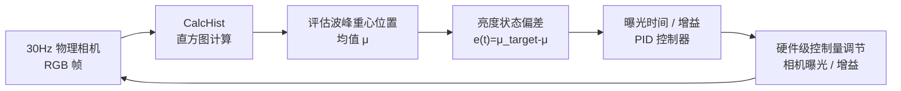


1. **多速率感知闭环的无延迟哨兵**： 在自动驾驶或人形机器人高频奔跑时，前方光影的变化（如进入树荫、隧道）发生得极快。如果等高层视觉大模型（VLA）检测到“看不清”再来调整相机，系统早已因为像素饱和或过黑而发生灾难性碰撞。 通过在底层感知端（通常直接在 FPGA 图像处理板或实时核心中）部署耗时不到 $1\text{ ms}$ 的一维直方图统计计算，计算直方图的质心（Centroid）：
    
    $$
    \mu = \frac{\sum_{q=0}^{255} q \cdot H(q)}{\sum_{q=0}^{255} H(q)}
    $$
    
    若发现 $\mu < 60$ （过暗）或 $\mu > 200$ （过亮），直接将偏差 $e(t) = \mu_{target} - \mu$ 输入给高频的曝光控制 PID 律，在硬件层调节相机感光度。这是一种经典且极具鲁棒性的“感知自适应负反馈控制回路”。
    
2. **特征匹配特征描述符（SIFT/SURF）的亮度归一化依赖**： 在视觉 SLAM 中，我们需要在前后帧之间进行关键点特征匹配以计算机器人的位姿变换（Odometry）。如果环境光线渐变，普通的描述符匹配极易失败。而 SIFT 等算法在提取特征向量时，底层其实是在局部区域（利用掩膜 Mask 约束）计算梯度方向的加权直方图，并进行 L2 范数归一化，通过这种方式，消除了全局亮度的影响，实现了强悍的**光照不变性特征匹配（Illumination Invariance）**。


## 十三、图像阈值化与二值化（Thresholding / Binarization）
>_在机器人视觉感知中, 面对高分辨率的多模态输入, 直接分析具有 256 个灰度级阶梯的渐变图像十分耗时。 二值化(Binarization) 旨在丢弃不必要的质感 、反光等干扰信息, 将其转换为极简的二进制矩阵, 从而实现超快速的目标定位与形状分析。_

### 什么是简单全局阈值化(Simple Thresholding)
- **物理直觉 :** 在整幅图像中强行画下一条绝对的分界线 **T**。 所有像素根据其亮度值与 **T** 的大小关系,被一刀切地划分。

- **局限性 :** 由于外界光源的漫反射和透视投影, 真实图像中物体表面往往会存在梯度阴影。如果采用单一的全局阈值 **T** , 阴影处的物体像素亮度会低于 **T** ,导致最终的二值化图像产生大量的 "死黑斑",丢失核心结构边界。

### 核心概念对比：简单阈值化 vs 自适应均值滤波 vs 自适应高斯滤波

| 特征维度 | 🔴 简单全局阈值 (Simple Global) | 🟡 自适应均值 (Adaptive Mean) | 🟢 自适应高斯 (Adaptive Gaussian) |
| :-------: | :-------: | :-------: | :-------: |
| 阈值计算域 | 全局唯一（矩阵级常数 $T$ ） | 像素局部邻域（ $BlockSize \times BlockSize$ 矩阵均值） | 像素局部邻域（以高斯核 $G_{\sigma}$ 进行加权求和） |
| 局部邻域权重分配 | 无（不看邻域） | 一视同仁（算术平均），所有局部邻域内的像素权重完全相等 | 空间加权（高斯分布），越靠近中心像素权重越高，边缘越小 |
| 抗图像噪点能力 | 极低。极易因为孤立噪点产生碎纸屑般的黑白坏点 | 较低。极易将细小的斑点噪声也当成边界提取出来 | 极高。由于引入了空间权重，能极其自然地滤除局部高频颗粒噪声 |
| 边界平滑度/保真度 | 取决于光照是否均匀。光照均匀时边界极度连续 | 边缘呈微观锯齿状，且容易产生轻微的椒盐杂色轮廓 | 边缘极其丝滑、连续，完美保留曲线物体的精细几何形态 |
| 计算时间复杂度 | $O(1)$ ，微秒级执行 | $O(N \cdot BlockSize^2)$ ，较低（可用滑窗积分图加速） | $O(N \cdot BlockSize^2)$ ，略高（需进行二维高斯核乘加操作） |
| 典型应用场景 | 白底黑字、高对比度机器视觉、工业固定漫射光源质检 | 快速的局部背景分离，文字 OCR 前置粗提取 | 车载相机不均匀阴影处理、人形机器人手眼协同抓取、视觉导航特征归一化 |

---
### 系统架构与数据流/处理图解(阈值化与二值化)

1. **局部自适应阈值化（Adaptive Thresholding）局部滑动窗数据流向**

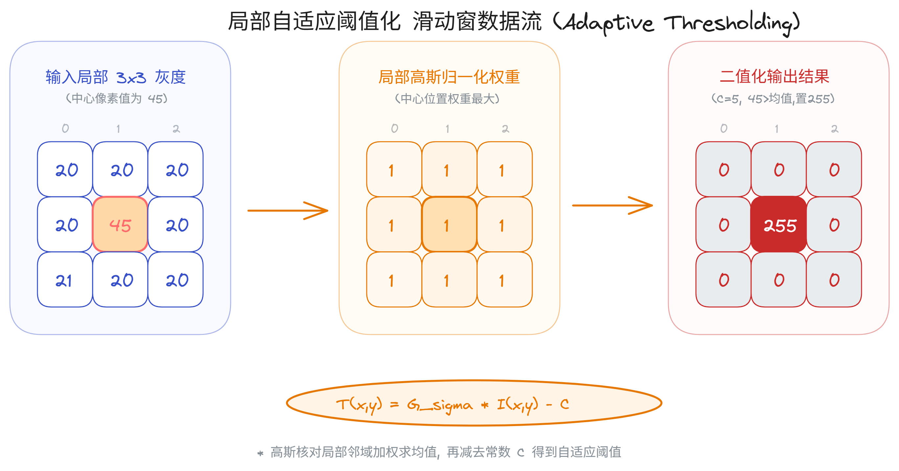

2. **复杂阴影图像二值化管道（Pipeline）**

当输入图像包含一侧是高光漫反射、另一侧是深色投影时，常规处理管道的控制分支流如下：

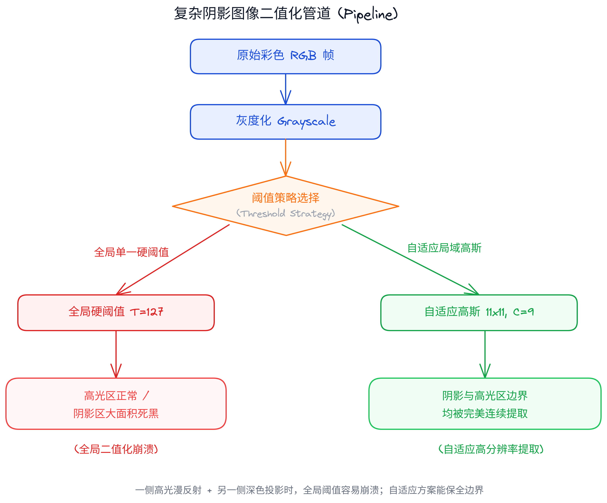

---

### 完整的 API 与参数详解(阈值化与二值化)
1. `cv2.threshold(src, thresh, maxval, type, dst=None)`

 > _对输入图像应用一个全局、固定的硬阈值。_
 
- `src` : 输入图像, **必须是单通道灰度图** (`uint8` 或者 `float32`)

- `thresh` : 全局设定的阈值分界线。常用推荐值 127(灰度中值点)。

- `maxval` : 当像素值满足阈值判断条件时, 被赋予的最大像素数值。常设为 255(机纯白色)。

- `type` : 阈值类型
	-  `cv.THRESH_BINARY` : 正向二值化。像素值超过`thresh` 则设为 `maxval`,其余设为 `0` 。

	 - `cv.THRESH_BINARY_INV` : 反向二值化。像素值超过 `thresh` 则设为 `0` 。其余设为 `maxval`。

- **返回值 :** 
	- `ret` : 返回实际使用的阈值大小(对于该函数即为你传入的 `thresh` 参数)。

	- `dst` : 输出的二值化结果矩阵。

2. `cv2.adaptiveThreshold(src, maxValue, adaptiveMethod, thresholdType, blockSize, C, dst=None)`

> _对于单通道图像,在每一个像素的局部领域中动态、智能地计算阈值。_

- `src` : 输入的 8 位单通道灰度图像。

- `maxValue` : 非零像素被赋予的最大值。通常设为 255。

- `adaptiveMethod` : 局部阈值计算方法。
	- `cv.ADAPTIVE_THRESH_MEAN_C` : 计算领域中 `BlockSize × BlockSize` 所有像素的均值。
	
	- `cv.ADAPTIVE)THRESH_GUASSIAN_C` : 以像素点为中心, 计算领域的高斯加权求和值。 

- `thresholdType` : 二值化映射方法。必须是 `cv.THRESH_BINARY` 或者 `cv.THRESH_BINATU_INV` 之一。

- `blockSize` : **极高危、最核心参数** 。用于计算局部阈值的方窗大小。 
	- **硬性约束 : 必须是大于 1 的正奇数** ,用以保证窗口拥有唯一的正中心物理像素。

	- **选择准则 :** 值越大,对大面积均匀区域的处理越连贯,但对局部微小细节的提取精度越差。

- ` C ` : **核心调谐参数 :** 从计算均值或加权均值中减去的 **微调常数**
	-  **物理调律**：常取正数（如 `3`、`5`、`9`）。值越大，代表二值化的容忍度越低，能有效消除由于相机噪点或背景微弱渐变产生的小斑点，让背景更干净，但设置过大会把物体的边缘特征“啃食”掉。如果为负数，则会逆向补偿。
	
- **返回值**：直接返回自适应二值化处理后的图像矩阵。

---
### 完整代码(阈值化与二值化)

- 以下代码演示了如何等比例缩放一张彩色风景图，分别计算并绘制其**整体灰度直方图**、**BGR 三通道真彩直方图**，以及在**挂载圆形空间掩膜后、局部感兴趣区域（ROI）的特征直方图**。
```python

import cv2 as cv
import numpy as np
from pathlib import Path

path = Path(__file__).parent / "attachments" / \

    "Elden Ring_Stormveil Castle.png"
src = cv.imread(path)
if src is None:

    raise FileNotFoundError(f"未找到该图像:{path}")
resized = cv.resize(src, (1200, 720), interpolation=cv.INTER_AREA)

📌 注意 使用cv.cvtColor()函数将彩色图像转换为单通道灰度图像, 这是阈值化处理必不可少的前置条件。
gray = cv.cvtColor(resized, cv.COLOR_BGR2GRAY)
cv.imshow("Gray Img", gray)

📌 ==========================================================

📌 场景 A: 简单全局阈值二值化 (THRESH_BINARY & INV)

📌 ==========================================================

📌 试验 1: 正向全局阈值化，阈值设为 127，最大值设为 255
📌 亮度 > 127 的像素变纯白(255)，其余一律变纯黑(0)

ret, simple_binary = cv.threshold(gray, 127, 255, cv.THRESH_BINARY)

cv.imshow("Simple Global Binary(Threshold = 127)", simple_binary)

📌 试验 2: 反向全局阈值化 (Inverse Binary)

📌 亮度 > 127 的像素变纯黑(0)，其余一律变纯白(255)

_, simple_binary_inv = cv.threshold(gray, 127, 255, cv.THRESH_BINARY_INV)

cv.imshow("Simple Global Binary Inverse(Threshold = 127)", simple_binary_inv)

📌 ==========================================================

📌 场景 B: 进阶方案 —— 自适应局部阈值二值化 (Adaptive Thresholding)

📌 ==========================================================

📌 在复杂光影环境下, 单一的 127 全局分界线会导致大片阴影区由于地域 127 而死黑。

📌 我们引入 局部滑窗,在每个像素周围 11×11 领域内动态计算高保真阈值, C 设定为 9, 以隔离高频微小噪声。

📌 方案1: 自适应均值阈值化 (Adaptive Mean Thresholding)

adaptive_mean = cv.adaptiveThreshold(
    gray,
    255,
    cv.ADAPTIVE_THRESH_MEAN_C,
    cv.THRESH_BINARY,
    blockSize=17,
    C=9
)
cv.imshow('Adaptive Binarization (Mean Method, 11x11, C=9)', adaptive_mean)

📌 方案 2: 自适应高斯法(Adaptive Gaussian) - 推荐工业级降噪首选

adaptive_gaussian = cv.adaptiveThreshold(
    gray,
    255,
    cv.ADAPTIVE_THRESH_GAUSSIAN_C,
    cv.THRESH_BINARY,
    blockSize=11,
    C=7
)

cv.imshow('Adaptive Binarization (Gaussian Method, 11x11, C=9)', adaptive_gaussian)

cv.waitKey(0)
cv.destroyAllWindows()
```

---

### 为什么要用 阈值化与二值化?
> _作为控制工程与具身智能的研究生，理解自适应二值化的物理直觉和设计哲学，能让你在处理复杂的机器人手眼协同抓取（Eye-in-Hand Manipulation）和外界物理光线剧烈变化时，瞬间构建出最具环境容错率的系统反馈。_

1. 具身智能（Embodied AI）中的痛点直击

**在人形机器人的手臂控制中：**

- **痛点：反光与复杂投影导致目标边界变形崩溃**。 当人形机器人从室外走到室内工作台前准备抓取金属零件（如一个螺母）时，顶部的白炽灯和窗外的太阳光会在零件和工作台上产生极其复杂、错综交织的局部阴影与刺眼的高光漫反射（Specular Reflections）。
    
    - 如果你使用普通的全局二值化（如固定硬阈值 `127`），由于阴影处的工作台和零件反射的光强度普遍低于 `127`，这一部分画面会**在内存中瞬间坍塌成一片毫无特征、无法解析的死黑大块**。
        
    - 所有的特征检测算法（SIFT、ORB、Canny 甚至是神经网络视觉编码器）直接在这里失焦。
        
- **自适应高斯的破局物理直觉**： 自适应高斯二值化抛弃了对绝对亮度的依赖，完全聚焦于**局部的微小对比度（相对突变）**。即便零件正处于光线最暗淡的死角里，只要零件本体和周围阴影工作台有哪怕 10 个灰度级级的微弱高频落差，自适应高斯的 $11\times11$ 邻域算子加权平均后，依然能够在这片深邃阴影中把零件的闭合圆形二值化外边沿，以极高的边缘保真度提取出来！这保证了后续手眼伺服计算中 **3D 轨迹规划与力矩调节参数的绝对稳定。**

### 什么时候该用 阈值化与二值化?

|   场景    |                                                🟢 必须/极力推荐使用阈值二值化的场景（优势区）                                                |                                                                        🔴 绝对禁止/不建议直接使用的场景（避坑区）                                                                         |
| :-----: | :---------------------------------------------------------------------------------------------------------------------: | :--------------------------------------------------------------------------------------------------------------------------------------------------------------------: |
| **场景一** |               **路面标识线提取与可通行区域分割**：人形机器人在室内地面导航。需要将反光的瓷砖地面和灰白色的防滑路面标识线区分开来。由于路面有各种大面积投影和漫反射，必须使用自适应高斯二值化。                |                                **多纹理渐变表面的物体分类与材质识别**：通过相机识别桌面上是苹果（有微弱红色渐变）还是橘子（表面粗糙纹理）。二值化会彻底把图像拍扁成纯黑和纯白，像素携带的所有细微渐变和材料质地特征将被物理级毁灭、归零。                                 |
| **场景二** | **高频手眼协同抓取前的非规则特征聚焦**：机器人手臂摄像头高速接近目标工件。通过自适应二值化配合轮廓提取（ `findContours` ），滤去无关色彩信息，只提取物体的长宽比、几何重心。计算复杂度极低，能保证系统控制循环刷新率飙升。 | **边缘退化极其敏感的精密机械零件亚像素测量**：检测发动机阀片在工业运动时的 $0.01\text{ mm}$ 级精密摆幅。自适应阈值在局部边界处会产生由参数 $C$ 和邻域大小引起的 $1\sim2$ 像素宽的浮动微观锯齿（边界硬突变），导致高精度拟合算子（如 Subpixel Contour Fitting）的数据产生漂移。 |
| **场景三** |               **印刷体字符提取与 OCR 前置预处理**：机器人通过头部相机对快递包裹进行条形码、二维码或快递单文本识别。二值化能大幅拉高黑白对比度，使神经网络识别率提升至 $99\%$ 以上。               |                                                                                   —                                                                                    |

### 阈值化与二值化 在大型复杂系统/具身机器人管道中的地位
在最前沿的具身人形机器人视觉运动决策系统中，自适应二值化往往扮演着“感知-动作”（Perception-Action）循环中关键的低级特征提取阀门（Low-Level Feature Selector）：

1. **多速率分层控制的低延迟解耦阀（Low-Latency Feature Bridge）**： 在具身智能中，顶层的 VLA 视觉大模型（Vision-Language-Action）虽然决策精确，但前向推理极其耗时（通常只有 $5 \sim 15\text{ Hz}$ ）。 如果让手臂关节控制（WBC）实时盯着大模型传过来的图像张量，机器人在高速运动时手臂会产生严重的**自激震荡与失稳**。 通过在物理前置端（Eye-in-Hand Camera）部署超快速、小于 $1\text{ ms}$ 的 **自适应高斯二值化 + 几何外廓质心提取** 硬件闭合，可以连续、无延迟地以 $100\text{ Hz}$ 的速率向手眼伺服 PID 输出工件的空间绝对偏差 $e(t)$ ，将复杂的场景归一化为一个二维几何点，从而实现大时延决策模型下的超低延迟高频实时控制。
    
2. **解决 Sim-to-Real 的绝佳语义屏障**： 仿真器（MuJoCo / Isaac Sim）中的光影分布往往是高度理想化的（纯净反射、光滑表面），而现实世界有着无数的随机微光反射、灰尘和粗糙斑点。通过在视觉前端加入**高斯自适应二值化**作为屏障，可以把仿真中的理想工件边界，和真实世界中杂乱无章的工件边界，**高度统一归一化为纯黑背景下的白线轮廓语义。** 神经网络和强化学习（RL）决策模型只需要在这条“白线轮廓”上做强化学习，物理现实世界的色彩噪声将被物理阻断，从而实现了 $100\%$ **的零退化无缝仿真部署（Sim-to-Real Deployment）**。


## 十四、图像梯度与边缘检测（Gradients & Edge Detection）

### 核心概念与底层物理/数学逻辑模型
> _在机器人控制与具身感知中, 图像梯度是空间几何流的数学映射。图像梯度(Image Gradient)_

>1. **梯度的数学定义**

将 2D 图像视作一个二维连续亮度分布函数 $I(x, y)$ 。其在坐标 $(x, y)$ 处的梯度定义为一个二维向量 $\nabla I$ ：

$$
\nabla I = \begin{bmatrix} g_x \\ g_y \end{bmatrix} = \begin{bmatrix} \frac{\partial I}{\partial x} \\ \frac{\partial I}{\partial y} \end{bmatrix}
$$

其中，梯度的幅值（Magnitude）与方向（Direction / Orientation）分别表示为：

$$
\|\nabla I\| = \sqrt{g_x^2 + g_y^2}
$$

$$
\theta = \arctan\left( \frac{g_y}{g_x} \right)
$$

在离散图像像素网格中，偏导数通常使用一阶差分（如后向、前向或中心差分）来近似计算：

$$
g_x \approx I(x+1, y) - I(x-1, y)
$$

$$
g_y \approx I(x, y+1) - I(x, y-1)
$$

---

>2. **算子数理模型**

##### ① 索贝尔算子 (Sobel Operator)

Sobel 算子在进行空间求导时，引入了邻域加权平滑（对中心像素分配更高权重），能有效抑制高频随机噪声。其包含水平方向卷积核 $K_x$ （计算 $g_x$ ）与垂直方向卷积核 $K_y$ （计算 $g_y$ ）：

$$
K_x = \begin{bmatrix} -1 & 0 & 1 \\ -2 & 0 & 2 \\ -1 & 0 & 1 \end{bmatrix}, \quad K_y = \begin{bmatrix} -1 & -2 & -1 \\ 0 & 0 & 0 \\ 1 & 2 & 1 \end{bmatrix}
$$

##### ② 拉普拉斯算子 (Laplacian Operator)

Laplacian 算子是一种各向同性（Rotation Invariant）的二阶微分算子。它不关注某一特定方向，而是通过计算二阶偏导数之和（即散度 $\nabla^2 I$ ）来寻找像素跃变的最剧烈点：

$$
\nabla^2 I = \frac{\partial^2 I}{\partial x^2} + \frac{\partial^2 I}{\partial y^2}
$$

在离散 $3 \times 3$ 邻域中，其数学离散近似核通常采用中心值为负（或正）的环形拉普拉斯卷积核：

$$
K_{\mathrm{Laplacian}} = \begin{bmatrix} 0 & 1 & 0 \\ 1 & -4 & 1 \\ 0 & 1 & 0 \end{bmatrix} \quad \mathrm{or} \quad \begin{bmatrix} 1 & 1 & 1 \\ 1 & -8 & 1 \\ 1 & 1 & 1 \end{bmatrix}
$$

---

>3. **`cv2.CV_64F` 负值跃变保护机制**

 _在 8 位无符号单通道图像 (uint8) 中,像素的表示范围是紧凑的 [0, 255] 。_

- 当图像从黑（0）过渡到白（255）时：求得的微分梯度为正数（例如 $255 - 0 = +255$ ）。由于正数在 `uint8` 范围内，能够被完美保留为高亮白色边缘。

- 当图像从**白（255）过渡到黑（0）** 时：求得的微分梯度为负数（例如 $0 - 255 = -255$ ****）。由于 `uint8` 无法表示负数，计算机在类型限制下会**强制将所有负梯度截断、归零（归为纯黑色 0）**。

因此，如果直接在输入上使用 `uint8` 类型的输出矩阵，我们会**丢失整幅图像中整整一半（所有相反过渡方向）的边界轮廓特征**。

>[!tip] 💡 解决方案：
> 1. **高精度中间寄存**：将梯度计算的临时数据存储为 64 位有符号浮点数格式 `cv2.CV_64F`，完美保留所有的正、负梯度值。
>    
> 2. **绝对值回归**：通过 `cv2.convertScaleAbs()` 对浮点矩阵的每个元素求绝对值，并将范围按比例缩放重新映射回标准的 `uint8`，将所有的负向梯度重新高亮激活，合成为一张连续、不失真的全相边界图像。

---

> 4. **核心算子对比**

| 特征维度 | 🟡 索贝尔算子 (Sobel) | 🔵 拉普拉斯算子 (Laplacian) | 🟢 卡尼算子 (Canny) |
| :-------: | :-------: | :-------: | :-------: |
| 导数阶数 | 一阶偏导数（分方向 $g_x, g_y$ ） | 二阶导数（无方向，散度） | 一阶偏导数 + 多级非极大值抑制 |
| 输出物理意义 | 强烈的方向性边缘特征，易捕捉水平/垂直过渡线 | 图像的高频微观细节与全方向突变线 | 干净、无噪点、物理级连续的一像素宽极细骨架 |
| 对噪点的鲁棒性 | 较好。卷积核中自带加权高斯平滑功能 | 极低。由于是二阶导数，会对细小的颗粒噪声产生毁灭性的极度放大 | 极高。管道前置端强制执行 Gaussian Blur 和双阈值滞后边缘检测 |
| 边缘定位精度 | 较低。边缘较宽、有晕染，由于没有进行抑制非极大 | 较高。能精确锁定拐角与斑点高频跃变 | 极高（亚像素级）。通过非极大值抑制（NMS）实现一像素极限收敛 |
| 工业级典型应用 | GelSight 触觉三维形变光度立体分析、视觉 SLAM 方向描述符 | 图像清晰度、对焦度快速无延迟评估 | 自动驾驶可通行区域分割、人形机器人手眼协同特征轮廓高频提取 |

---

### 完整 API 与 参数详解
1. `cv2.Laplacian(src, ddepth, dx, dy, dst=None, ksize=1, scale=1, delta=0, borderType= BORDER_DEFAULT`)`

- `src`：输入的单通道灰度图像。

- `ddepth`：**极高危、最核心参数**。目标图像的深度/存储类型。
	- **硬性约束**：在任何涉及梯度微分的场景下，**必须设为 `cv2.CV_64F`**，以在底层浮点级临时存储负值梯度。

-  `dx`、`dy`：导数的阶数。
    
    - **计算水平梯度（Sobel X）**：设 `dx = 1`，`dy = 0`。
        
    - **计算垂直梯度（Sobel Y）**：设 `dx = 0`，`dy = 1`。
	
- `ksize`：用于计算二阶导数的内部核的大小。必须是**正奇数**（例如 `1`、`3`、`5`）。

- `scale`、`delta`：用于调节输出亮度的比例因子和偏移常数，通常保持默认值。

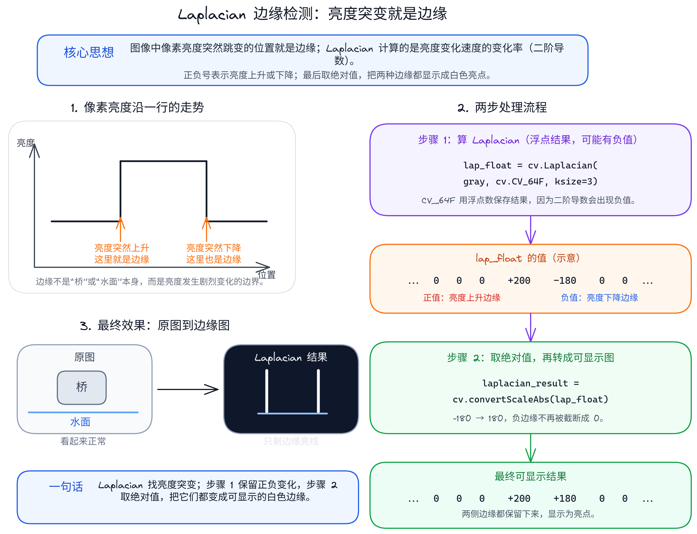

---

2. `cv2.Soble(src, ddepth, dx, dy, dst=None, ksize=3, scale=1, delta=0, borderType=BORDER_DEFAULT`)`

> _计算单通道图像的一阶方向索贝尔梯度。_
- `src`：输入的单通道灰度图像。
    
- `ddepth`：目标图像深度。出于负值截断保护，**必须设为 `cv2.CV_64F`**。
    
- `dx`、`dy`：导数的阶数。
    
    - **计算水平梯度（Sobel X）**：设 `dx = 1`，`dy = 0`。
        
    - **计算垂直梯度（Sobel Y）**：设 `dx = 0`，`dy = 1`。
        
- `ksize`：Sobel 算子的核大小。必须是 `1`、`3`、`5` 或 `7` 等正奇数。当 `ksize = 3` 时，其计算精度与抗噪性能达到了理论上的平衡。

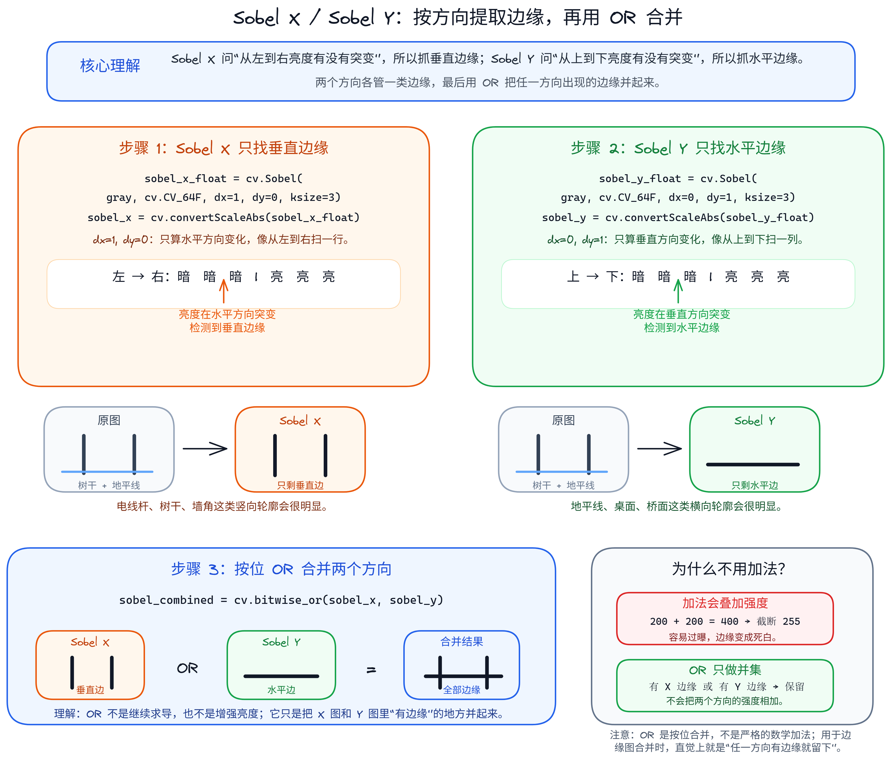

---

3. `cv2.convertScaleAbs(src, dst=None, alpha=1, beta=0)` 

>_对输入图像的每个像素进行以下操作：计算绝对值、缩放比例系数、并强行转换为无符号 8 位整型（`uint8`）。_


这里的 `saturate_cast<uchar>` 可以理解为：先把结果限制在 `0~255`，再转换成 `uint8`。

$$
dst(x, y) =
\mathrm{sat}_{[0,255]}
\left(
\left| \alpha \cdot src(x, y) + \beta \right|
\right)
$$

- `src`：输入矩阵（通常是 `cv.CV_64F` 浮点型的梯度结果）。
    
- 返回值：返回可以直接用于在窗口中正常显示和后续特征处理的 `uint8` 单通道边界强度图像。

4. `cv2.Canny(image, threshold1, threshold2, edges=None, apertureSize=3, L2gradient=False)`

> _利用高效的 Canny 算法在图像中寻找高鲁棒、一像素宽极细边缘。_

- `image`：输入的 8 位单通道图像（推荐在计算前先用 `cv2.GaussianBlur` 进行温和降噪）。
    
- `threshold1`：**第一阈值（低阈值 MinVal）**。
    
    - 如果梯度强度低于此值，该像素点被物理级剔除（标记为非边缘）。
        
- `threshold2`：**第二阈值（高阈值 MaxVal）**。
    
    - 如果梯度强度高于此值，该像素点被确认为强边缘。
        
    - **滞后连接法则**：若梯度值处于 `[threshold1, threshold2]` 之间，只有当该像素点与已确认为强边缘的像素直接**在空间上相连**时，它才会被作为边缘保留；否则同样被一并剔除。

---

### 完整代码

以下代码演示了如何等比例加载彩色原图并转换为灰度，分别执行并可视化**高精度 Laplacian 二阶边缘提取**、分方向的 **Sobel X / Sobel Y** 提取、利用按位或实现的 **Sobel 综合特征图**、以及代表工业最高降噪边缘定位标准的 **Canny 极限骨架图**。

```python
import cv2 as cv
import numpy as np
from pathlib import Path

path = Path(__file__).parent / "attachments" / "Malenia.png"
src = cv.imread(str(path))
if src is None:
    raise FileNotFoundError(f"图像未找到:{path}")
resized = cv.resize(src, (1200, 720), interpolation=cv.INTER_AREA)

📌 灰度图像 是梯度计算的必需前置条件

gray = cv.cvtColor(resized, cv.COLOR_BGR2GRAY)

cv.imshow("Gray Img", gray)

📌 ==========================================================

📌 场景 A: 拉普拉斯二阶微分梯度 (Laplacian)

📌 找出图像中「变化最剧烈的地方」 :

📌 图像中像素亮度突然跳变的地方就是边缘。Laplacian 做的事就是算「亮度变化的速度的变化率」（二阶导数）

📌 步骤 1 算出带正负号的变化率，步骤 2 取绝对值让它能正常显示为白色亮点。 ==========================================================

📌 步骤 1: 使用高精度浮点数存储，防止高频跃变处的负梯度被强制归零

lap_float = cv.Laplacian(gray, cv.CV_64F, ksize=3)

📌 步骤 2: 绝对值化，将负梯度转换为 uint8 强亮度，完美还原边界

Laplacian_abs = cv.convertScaleAbs(lap_float)

cv.imshow('Laplacian Edge (All Directions, ksize=3)', Laplacian_abs)

  

📌 ==========================================================

📌 场景 B: 索贝尔一阶微分梯度 (Sobel X / Sobel Y / Combined)

📌==========================================================

📌 步骤 1: 计算 Sobel X (dx=1, dy=0) —— 提取水平梯度 (检测垂直边缘，如树干、栏杆边沿)
sobel_x_float = cv.Sobel(gray, cv.CV_64F, dx=1, dy=0, ksize=3)

sobel_x = cv.convertScaleAbs(sobel_x_float)

cv.imshow('Sobel X Edge (Detects Vertical Edges, ksize=3)', sobel_x)

  

📌 步骤 2: 计算 Sobel Y (dx=0, dy=1) —— 提取垂直梯度 (检测水平边缘，如桥面、地平线)

sobel_y_float = cv.Sobel(gray, cv.CV_64F, dx=0, dy=1, ksize=3)

sobel_y = cv.convertScaleAbs(sobel_y_float)

cv.imshow('Sobel Y Edge (Detects Horizontal Edges, ksize=3)', sobel_y)

  

📌 步骤 3: 利用 按位或 将 Sobel X 和 Sobel Y 在空间上融为一体
📌 注意: 严禁直接通过代数加法加在一起,否则会产生严重的亮度饱和死白!
sobel_combined = cv.bitwise_or(sobel_x, sobel_y)

cv.imshow('Combined Sobel (X | Y)', sobel_combined)
  
📌 ==========================================================
📌 场景 C: 卡尼极限一像素边缘骨架 (Canny) —— 机器人特征工程推荐
📌 ==========================================================
📌 设定高低滞后阈值分别为 150 和 225，完美剥离环境杂纹，只留下物体主干一像素极细边缘
canny_edges = cv.Canny(gray, 150, 255)
cv.imshow('Canny Extreme Skeleton (Hysteresis 150-225)', canny_edges)


cv.waitKey(0)
cv.destroyAllWindows()

```

> [!success] 总结与调参对比 :
>1. Laplacian 算子速度极快, 能够捕捉围观噪声细节, 但极易引入大量混乱雪花斑点。
>     
>2. Sobel 算子在提取 水平、垂直方向的物理轴心边缘时最为鲁棒,常用于机器人结构检测。
>   
>3. Canny 作为算法金字塔方案, 产生的白线最细、无噪点且几乎完全连贯闭合,最适宜后续检测。


### 为什么要用它?
1. 具身智能与机器人控制中的痛点直击

>_在人形双手机器人灵巧抓取和 GelSight-style 触觉重构任务中：_

- **痛点 A：视觉伺服（Visual Servoing）中的高延迟特征提取**。 若你想让机械臂高速跟踪一个非规则物体的轨迹（例如跟踪一个管道接缝），直接把原彩色 RGB 张量扔给 VLA 语义大模型，会让延迟攀升至 $100\text{ ms}$ 以上，导致伺服系统失稳晃动。
    
    - **解决方案**：利用最底层的 Sobel 算子快速计算特定方向的图像梯度，通过计算梯度的幅值质心 $e(t)$，将复杂的画面极速简化为 $1\text{ ms}$ 内的高频位置偏差，无延迟输入给关节驱动力矩 PID 环，实现丝滑流畅的反馈控制。
        
- **痛点 B：基于微观反光梯度的触觉表面重建**。 在具身人形机器人中，GelSight 触觉传感器（利用弹性橡胶表层反光）被广泛应用于触觉测量。其弹性橡胶在抓取物体发生三维形变时，会产生微弱的光影明暗变化。
    
    - **物理破局**：在光度立体视觉（Photometric Stereo）重构中，通过计算图像的 $g_x, g_y$ 一阶梯度图，直接将表面的“明暗光影变化”映射为“法向量（Surface Normal）梯度”，最后通过求解二维泊松方程（Poisson Equation）对梯度求导数积分，**直接在内存中重构出物体表面的亚毫米级 3D 接触几何形状！** 这直接让机器人获得了如同人类双手般的极高触觉保真度。

### 什么时候使用微分梯度?

|   场景    |                                                🟢 必须/极力推荐使用图像梯度的场景（优势区）                                                |                                                                        🔴 绝对禁止/不建议直接使用的场景（避坑区）                                                                         |
| :-----: | :---------------------------------------------------------------------------------------------------------------------: | :--------------------------------------------------------------------------------------------------------------------------------------------------------------------: |
| **场景一** |               **视觉惯性里程计（VIO）与 SLAM 特征描述符**：在 ORB-SLAM、SVO、LSD-SLAM 等定位建图算法中，通过计算局部关键点周围的像素梯度方向和幅值直方图，生成具有旋转与光照不变性的特征描述子，使机器人能够在高速奔跑中精确估计位移。                |                                **未经高斯模糊降噪的原始传感器图像**：夜间摄像头、大噪点图像。Laplacian 和一阶 Sobel 基于像素差分运行，极易将微弱噪点成百上千倍地放大成"满天繁星"，使真实边缘特征被彻底遮挡。                                 |
| **场景二** | **相机几何自动对焦检测（Auto Focus Feedback Loop）**：人形机器人头部相机在运动时，二阶 Laplacian 算子对高频跃变极为敏感，图像越模糊，Laplacian 矩阵的值之和越小；画面对焦越精准越清晰，其 Laplacian 特征积分能量值呈指数级暴涨，可直接作为自动对焦控制量负反馈。 | **极小物体或长距离下的超细目标高精度几何测宽**：在距离相机 10 米外计算一根 2 像素宽高压输电线的晃动振幅，差分卷积核的空间插值效应会将 2 像素边缘膨胀为 4~6 像素宽，丢失亚像素级测量精度。 |
| **场景三** | **图像特征边缘骨架提取（Canny）**：提取二维码边缘、白线道路车道线轨迹等清晰的结构化边缘信息，Canny 算子结合非极大值抑制和双阈值滞后，能输出单像素级连续骨架，是工业视觉中边缘提取的黄金标准。 | **无梯度方向约束的全局纹理均匀性检测**：检测布料表面是否有均匀织纹。梯度算子只关注局部灰度突变，对"整体是否均匀"这类统计特征完全无感，反而会把正常织纹的微小周期起伏全部标记为"边缘"，产生海量误检。 |


### 梯度与边缘检测 在大型复杂系统/具身机器人管道中的地位
在最前沿的具身人形机器人全身体控制系统（WBC）及视觉 SLAM 定位管道中，梯度与边缘检测常常扮演着“感知分流与高频反馈”的核心枢纽（The High-Frequency Sensory Hub）：

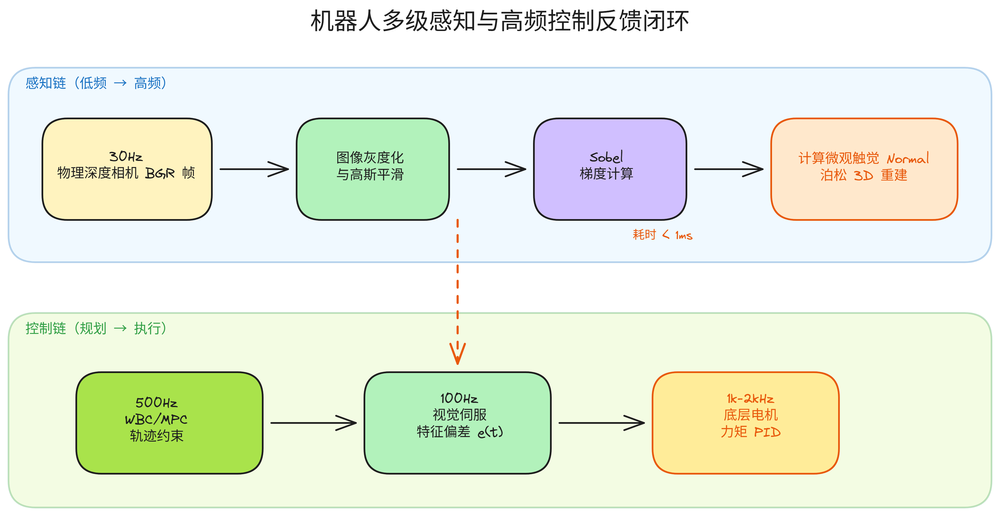


1. **多速率控制管道中的低时延桥梁（Zero-latency Sensory Bridge）**： 具身大模型由于结构庞大，前向推理频率（ $5 \sim 15\text{ Hz}$）难以满足机器人的力反馈与避障响应。而梯度运算耗时小于 $1\text{ ms}$，可以将图像快速精简为极窄的边缘轮廓骨架，无缝传输给 $100\text{ Hz}$ **实时手眼避障反馈环** 或 $500\text{ Hz}$ **质心动力学（MPC）轨迹修正算子**。它扮演了在大时延高级决策与超高频关节力控制之间，不可或缺的低阶高频感知物理阀门。
    
2. **特征点法 SLAM 旋转不变性的数理源头**： 在 SLAM（如经典 ORB-SLAM3）中，特征点提取后必须计算其旋转朝向（Orientation），以保证相机在侧身旋转时依然能认出前一帧对应的物体。而这个旋转朝向的数理推导，底层完全基于该点 $k \times k$ 邻域内的**图像像素梯度质心法（Centroid Method）**。也就是说，没有极速、高保真的图像一阶方向梯度计算，现代视觉 SLAM 里最基础的描述子方向对齐便彻底失去了其数理几何根基。


## 十五、基于 Haar 级联的人脸检测（Face Detection with Haar Cascades）

### 核心概念与底层物理/数学/逻辑模型
>_在具身人形机器人 人机交互、主动相机云台控制中，机器人需要实时、高速地锁定人类面部以保持目光对齐（Gaze Alignment）。Haar 级联检测器（Haar Cascade Detector）是实现极低算力、毫秒级面部边界框（Bounding Box）计算的最经典方案。_

1. **核心理论：Viola-Jones 算法架构**

	人脸虽然千人千面，但是在二维几何投影中，存在着极强的**空间灰度局部一致性**（例如：眼睛区域的亮度明显低于额头和鼻梁；鼻梁两侧的阴影变化等）。 Haar 级联正是基于这种**空间亮度突变**进行**空间特征雕刻**。


2. **数学模型深度拆解**

Haar 级联不是靠一个单独公式直接“认出人脸”，而是把人脸检测拆成三层高速计算模型：

- **Haar-like 特征**：把眼睛、鼻梁、嘴角等局部结构转成矩形区域之间的明暗差。
- **积分图（Integral Image）**：让任意矩形区域的像素和可以用 4 个角点快速算出。
- **AdaBoost + 级联分类器**：从大量特征中选出有效特征，并快速丢弃绝大多数背景窗口。

也就是说，它的核心链路是：

```text
局部明暗差特征 → 快速矩形求和 → 多级分类器筛选 → 输出人脸框
```

#### ① Haar-like 特征：它在算什么

**直觉：** 人脸区域并不是随机灰度图，而是有稳定的局部明暗结构。例如眼窝通常比额头暗，鼻梁两侧通常存在明显阴影差，嘴唇附近也会形成条状明暗变化。

Haar-like 特征就是用黑白矩形去量化这种局部结构。它不直接判断“这里是不是眼睛”，而是先计算一个更底层的问题：**白色矩形区域的像素和 - 黑色矩形区域的像素和**。

**数学表达：**

$$
f(x) = \sum_{(u, v) \in R_{\mathrm{white}}} I(u, v) - \sum_{(u, v) \in R_{\mathrm{black}}} I(u, v)
$$

**符号含义：**

- $I(u, v)$：图像在坐标 $(u, v)$ 处的灰度值。
- $R_{\mathrm{white}}$：白色矩形区域。
- $R_{\mathrm{black}}$：黑色矩形区域。
- $f(x)$：当前滑动窗口位置 $x$ 上的 Haar 特征响应值。

**常见特征类型：**

| 特征类型 | 典型结构 | 适合捕捉的面部信息 |
| --- | --- | --- |
| **边缘特征**（Edge features） | 上黑下白、左黑右白 | 额头/眼窝、鼻梁两侧的明暗边界 |
| **线性特征**（Line features） | 中黑两侧白、中心亮两侧暗 | 眼睑、鼻梁、嘴唇等条状结构 |
| **中心环绕特征**（Four-rectangle features） | 交叉黑白 | 眼角、鼻翼等局部角点变化 |

**在人脸检测中的作用：** Haar-like 特征把“人脸长什么样”转成了很多个可计算的矩形明暗差。后面的分类器并不直接看原图，而是看这些特征值是否符合人脸区域的统计规律。

#### ② 积分图：为什么能快速计算 Haar 特征

**直觉：** Haar-like 特征需要频繁计算矩形区域内的像素和。如果每个滑动窗口、每个尺度都重新遍历矩形里的所有像素，实时检测会非常慢。

Viola-Jones 的关键优化是先生成**积分图（Integral Image）**。积分图相当于提前缓存了“从图像左上角到当前位置为止的所有像素累加值”。

**积分图定义：**

$$
II(x, y) = \sum_{u \le x,\ v \le y} I(u, v)
$$

**递推生成：**

$$
\begin{aligned}
s(x, y) &= s(x, y - 1) + I(x, y) \\
II(x, y) &= II(x - 1, y) + s(x, y)
\end{aligned}
$$

其中 $s(x, y)$ 表示当前位置所在列方向上的累加值。积分图只需要对原图扫描一次即可生成。

**四点求矩形区域和：**

积分图生成后，任意矩形区域 $R$ 的像素总和只需要访问四个角点：

$$
\mathrm{Sum}(R) = II(D) + II(A) - II(B) - II(C)
$$

**直观理解：**

- $II(D)$：拿到大矩形左上到右下角 $D$ 的全部累加值。
- $II(B)$ 和 $II(C)$：减掉目标区域上方和左侧多算的部分。
- $II(A)$：左上角区域被减了两次，所以需要加回来一次。

**在人脸检测中的作用：** Haar-like 特征本质上就是多个矩形区域像素和之间的加减。积分图把每个矩形求和从“遍历大量像素”压缩成“读取四个角点”，所以单个矩形求和变成恒定时间 $O(1)$。

#### ③ AdaBoost + Cascade：为什么不用算完所有特征

**直觉：** 一张图像中可以生成数十万种 Haar-like 特征，但真正能区分人脸和背景的特征只占很小一部分。如果每个窗口都算完所有特征，速度仍然会很慢。

AdaBoost 的作用是从大量弱分类器中筛选出少量有效特征，并把它们组合成一个更可靠的强分类器。

**强分类器表达：**

$$
\begin{aligned}
H(x) &=
\mathrm{sign}
\left(
\sum_{t=1}^{T} \alpha_t h_t(x) - \theta
\right)
\end{aligned}
$$

**符号含义：**

- $h_t(x)$：第 $t$ 个弱分类器，通常对应一个 Haar-like 特征判断。
- $\alpha_t$：该弱分类器的权重，权重越大说明判别力越强。
- $\theta$：最终判定阈值。
- $H(x)$：当前窗口是否像人脸的最终判定结果。

**级联分类器的提前退出机制：**

分类器级联（Cascading）的核心逻辑是：**先用便宜的规则快速排除大部分背景，再把少量可疑窗口交给后面的复杂规则**。

1. 第一级 Stage 只包含少量 Haar 特征，负责快速判断“明显不是人脸”的窗口。
2. 一旦某个窗口在任意一级被判为负样本，就立刻丢弃，不再进入后续计算。
3. 只有连续通过所有 Stage 的少数候选窗口，才会被确认为人脸区域。

**在人脸检测中的作用：** 大多数滑动窗口其实都是背景。级联结构让这些背景窗口在前几级就被丢弃，真正进入深层判断的只剩少量疑似人脸区域。

#### ④ 整体流程：从图像到人脸框

```text
输入灰度图像
  ↓
多尺度滑动窗口扫描
  ↓
在每个窗口中计算 Haar-like 特征
  ↓
用积分图快速得到每个矩形区域的像素和
  ↓
AdaBoost 强分类器判断窗口是否像人脸
  ↓
级联 Stage 逐层过滤：
  - 任意一级失败 → 立即丢弃
  - 全部通过 → 保留为候选人脸框
  ↓
输出最终人脸检测框
```

**一句话总结：**

Haar-like 特征解决“人脸局部结构怎么表示”，积分图解决“矩形特征怎么算得快”，AdaBoost + 级联结构解决“大量背景窗口怎么尽早排除”。这三者组合在一起，才构成了 Haar 级联检测器能够实时运行的数学基础。

### 核心概念对比：Haar 级联 vs LBP 级联 vs 深度学习检测器（如 MTCNN / YOLO-Face）

为了在具身控制架构中进行最鲁棒的前端感知选型，下表进行了多维对比：

| 评估维度 | 🟢 Haar 级联检测器 | 🟡 LBP (局部二值模式) 级联 | 🔴 深度学习检测器 (YOLO/MTCNN) |
| :--- | :--- | :--- | :--- |
| **底层提取特征** | 空间矩形块的亮暗差值特征。 | 局部相邻像素的二进制大小编码。 | 深度卷积神经网络（CNN）提取的非线性特征。 |
| **计算复杂度** | 极低。受益于积分图，全过程只有基础加减法。 | 极低。全过程只有整数位移与逻辑比较。 | 极高。需要大量的浮点型乘加、激活函数运算。 |
| **对硬件的依赖** | 仅依赖轻量级 CPU、MCU 或单片机，无需任何硬件加速器。 | 仅依赖极轻量级 CPU，适合嵌入式微系统。 | 高度依赖 GPU/NPU。否则延迟会呈指数级飙升。 |
| **检测精度与虚警率** | 精度中等，在背景杂乱时易产生虚警（如误将衣服、背景检测为人脸）。 | 精度略低于 Haar，但对局部光影反光比 Haar 更不敏感。 | 极高。几乎无虚警，能提取亚像素级面部关键点。 |
| **大姿态角适应度** | 极差。头部一旦侧偏超过 $20^\circ \sim 30^\circ$ 会瞬间跟丢。 | 较差。同样高度依赖正面平行投影。 | 极强。支持全向偏转、大范围俯仰与剧烈遮挡。 |
| **应用场景** | 智能音箱唤醒、小型扫地机低算力人脸跟随、MCU端轻量互动。 | 算力受限极其苛刻的微控制器（如 Cortex-M4）。 | 具身人形机器人精细手眼交互、工业级人脸活体刷脸支付、高级辅助驾驶系统。 |

---

### 系统架构与数据流/处理图解
1. **积分图 $II(x,y)$ 物理区域快速求和 $O(1)$ 几何拓扑**

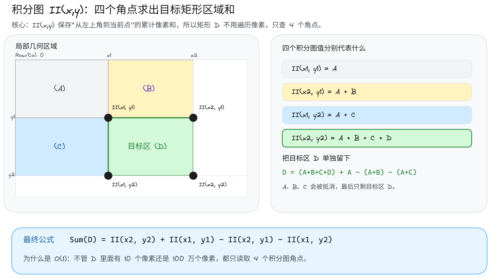

---

- **几何求和原理**：
    
    - $II(x_1, y_1)$ 的累加值代表区域 $(A)$ 的像素和。
        
    - $II(x_2, y_1)$ 的累加值代表区域 $(A) + (B)$ 的像素和。
        
    - $II(x_1, y_2)$ 的累加值代表区域 $(A) + (C)$ 的像素和。
        
    - $II(x_2, y_2)$ 的累加值代表区域 $(A) + (B) + (C) + (D)$ 的像素和。
        
    - **结论**：区域 $(D)$ 内所有灰度值的精确累加和计算为：

$$
\mathrm{Sum}(D) = II(x_2, y_2) + II(x_1, y_1) - II(x_2, y_1) - II(x_1, y_2)
$$

2. Haar 级联分类器的“级联过滤漏斗”(The Stage Cascading Funnel)

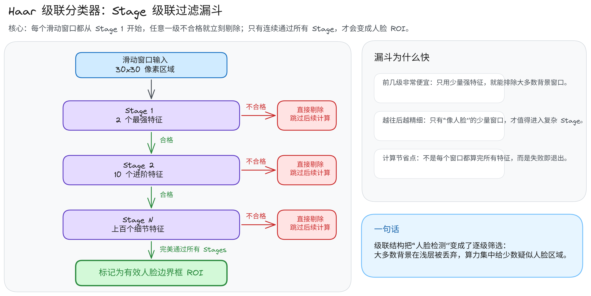

---

### 完整的 API 与参数详解
1. `cv2.CascadeClassifier(filename)`

> _用于从本地系统磁盘加载已经预训练训练好的决策树级联分类器模型（通常为 XML 文本文件）。_

- `filename`：XML 路径。若加载失败，会抛出 `cv2.error` 断言异常，物理上通常是由于文件路径错误、或者 XML 文件不完整损坏导

2.  `detectMultiScale(image, scaleFactor=1.1, minNeighbors=3, flags=0, minSize=None, maxSize=None)`

> _最硬核、调优频率最高的检测器核心执行算子。_

- `image`：**必须是 8 位无符号单通道灰度图像**（`uint8`）。
    
    - _避坑点_：虽然该函数能强行接收三通道彩色图像，但是底层的积分图引擎会无差别地只读取其一通道、或者在内存中产生二次计算开销，降低系统帧率。传入前必须用 `cv2.cvtColor` 进行灰度化。

- `scaleFactor`：**缩放因子参数**。它决定了在每次扫描后，图像尺寸被缩小的比例。
    
    - **物理调律**：通常设在 `[1.05, 1.3]` 之间。例如，`scaleFactor = 1.1` 代表图像每次缩小 $10\%$。
        
    - **性能折配（Trade-off）**：
        
        - **值越小**（如 `1.05`）：尺度金字塔越稠密，检测越细致。这能捕获隐藏极深的距离相机极远的超小人脸。但是，**计算耗时会呈线性大幅攀升**，且容易引入更多的虚警噪点。
            
        - **值越大**（如 `1.3`）：尺度金字塔越稀疏。扫描速度大幅提高，可以达到极高帧率。但是，可能会错失某些边界处在缩放断层内的人脸。

- `minNeighbors`：**最小邻域邻居数限制（置信度闸门）**。
    
    - **数理本质**：在多尺度图像金字塔扫描中，如果某一个区域确实存在一张人脸，由于空间连贯性，检测器在相邻的缩放窗口和微小的空间平移中，都会频繁触发脸部判别。这就产生了一簇互相重叠的候选矩形框（Candidate Bounding Boxes）。
        
    - **控制律表现**：
        
        - **值设小**（如 `1` 或 `2`、`3`）：表示只要有少量重叠框就认定为人脸。检测灵敏度高。但会造成**虚警率（False Positive Rate）飙升**。如视频中，由于肚子或脖子的空间褶皱灰度变化与眼睑、鼻梁的 Haar 矩形特征分布高度相似，就会在这些区域误标记产生多余的“人脸框”（如图所示，这些区域在单次判定中通过了 Stages，由于 `minNeighbors` 限制过低，导致被无情放出）。
            
        - **值设大**（如 `6` 或 `7`）：强行要求该候选框周围必须有 6 次以上的反复重合确认才能被确认为人脸。这在物理上能够**瞬间抹除几乎所有的虚警误检测点**，使画面极其干净；但代价是，如果人脸在侧偏、背光、或者过远时导致重叠判定次数只有 5 次，它就会被过滤丢弃，增加了漏检率（False Negatives）。

- **返回值 `faces_rect`**：返回一个形状为 `(N, 4)` 的 NumPy 二维数组。其中每一行包含一个检测到的人脸区域：`[x, y, w, h]`（分别代表矩形左上角物理像素横坐标、纵坐标、以及矩形的高宽、高度）。若无结果，返回一个空列表。

>[!warning]  利用 `cv2.data.haarcascades` 免去 GitHub 下载步骤

在实际系统级部署（部署到多台机器人、Docker 镜像或云端）时，手动去 GitHub 复制 3 万多行 XML 存在极大的维护开销，一旦 xml 丢失，代码将抛出致命错误。

为了解决这个痛点，OpenCV 提供了一个**绝佳的内置系统指针：`cv2.data.haarcascades`**。

- **物理机制**：只要你通过 pip 安装了 `opencv-python`，所有的官方级联模型（XML 文件）其实**已经静静地躺在你的 Python 安装目录（`site-packages`）里了**。

- **获取绝对路径方法**：
```python
import cv2 as cv
from pathlib as Path
📌 打印你的系统内置 XML 权重库绝对路径
print(cv.data.haarcascades)

📌 拼接 XML 
xml_path = Path(cv.data.haarcascades) / "haarcascade_frontalface_default.xml"

📌加一个if判断是否存在内置的XML文件
if not xml_path.exists():
	raise FileNotFoundError(f"XML 文件不存在:{xml_path}")

📌 将模型装载到分类器中
face_cascade = cv.CascadeClassifier(xml_path) # 或者写 str(xml_path)

📌 再加一个判断:看这个分类器对象里面有没有成功装载模型？
if face_cascade.empty():
	raise RuntimeError("XML 文件存在，但 OpenCV 没有成功加载分类器")

```

---

### 完整代码

>_以下是完整 Python 代码。代码在逻辑上展示了如何处理 **单目标精准检测**、以及在面对**多目标群像干扰**时通过动态微调超参数控制虚警噪点。_

```python
import cv2 as cv
import numpy as np
from pathlib import Path

📌 1.读取图像

path_single = Path(__file__).parent / "attachments" / "Melina.png"

path_group = Path(__file__).parent / "attachments" / "NJ.jpg"

Img_SingleFace = cv.imread(path_single)

Img_GroupFace = cv.imread(path_group)

if Img_SingleFace is None:

    raise FileNotFoundError(f"图像未找到:{path_single}")
if Img_GroupFace is None:

    Img_GroupFace = Img_SingleFace

resized_singleFace = cv.resize(Img_SingleFace, (1200, 700), interpolation=cv.INTER_AREA)

resized_groupFace = cv.resize(Img_GroupFace, (650, 750), interpolation=cv.INTER_AREA)

📌 cv.imshow("Single Face", resized_singleFace)
📌 cv.imshow("Group Face", resized_groupFace)


📌 ==========================================================
📌 2.灰度化是 Haar 级联人脸检测的必需前置条件

gray_singleFace = cv.cvtColor(resized_singleFace, cv.COLOR_BGR2GRAY)

gray_groupFace = cv.cvtColor(resized_groupFace, cv.COLOR_BGR2GRAY)

  
  

📌 3.初始化级联分类器:将模型装载到分类器中

xml_path = Path(cv.data.haarcascades) / "haarcascade_frontalface_default.xml"

📌 加一个判断看看是否存在这个 xml 文件

if not xml_path.exists():
    raise FileNotFoundError(f"xml 文件未找到:{xml_path}")
📌 有的OpenCV版本需要加上 str() 转换为字符串,否则报错:TypeError: Expected Ptr<cv::CascadeClassifier> for argument 'self'

face_cascade = cv.CascadeClassifier(xml_path)

📌 再加一个判断:看这个分类器对象里面有没有成功装载模型？

if face_cascade.empty():
    raise IOError("XML 文件存在，但 OpenCV 没有成功加载分类器")
else:
    print(f"xml 文件已成功加载:{xml_path}")

  

📌 ==========================================================

📌 场景 A: 经典单人脸高保真检测

📌 ==========================================================

📌 单人图像明暗度高，无背景噪点。设定 scaleFactor=1.1, minNeighbors=3 保证灵敏度

 face_rect_single = face_cascade.detectMultiScale(
     gray_singleFace,
     scaleFactor=1.08,
     minNeighbors=5,
)
print(f"单人图像中检测到的人脸数量为:{len(face_rect_single)}")

📌 可视化单人脸提取结果
img_single_output = resized_singleFace.copy()
for (x, y, w, h) in face_rect_single:

📌绘制高保真绿色边界框
cv.rectangle(img_single_output, (x, y), (x + w, y + h), (0, 255, 0), thickness=2)

cv.imshow('Scene A - Single High-Precision Detection', img_single_output)

📌 ==========================================================

📌 场景 B: 多目标群像检测 (伴随严重的局部虚警噪声干扰)

📌 ==========================================================

📌 如果继续使用 minNeighbors=3 级别判定

face_rect_group = face_cascade.detectMultiScale(
      gray_groupFace,
      scaleFactor=1.08,
      minNeighbors=3
)
print(f"【优化前】群像图像中检测到的人脸数量为:{len(face_rect_group)}")

📌 ==========================================================

📌 场景 C: 进阶保优方案 —— 提高置信度闸门 (minNeighbors=6)

📌 ==========================================================

📌 通过将 minNeighbors 提升至 6，物理级剔除由于衣服、身体皮肤褶皱等与 Haar-like 高度相似的干扰伪轮廓。

faces_rect_group_opt = face_cascade.detectMultiScale(

    gray_groupFace,

    scaleFactor=1.08,

    minNeighbors=7

)

print(f"【优化后】人脸数量收敛至: {len(faces_rect_group_opt)} (干扰噪点已被过滤)")

📌 绘制优化后的群体人脸边界框
img_group_output = resized_groupFace.copy()
for (x, y, w, h) in faces_rect_group_opt:
📌 使用红色标记确认为真人脸
    cv.rectangle(img_group_output, (x, y), (x + w, y + h), (0, 0, 255), thickness=2)
cv.imshow('Scene C - Optimized Group Face Detection', img_group_output)

cv.waitKey(0)
cv.destroyAllWindows()
```

---

### 为什么要用它?为什么不用高级 CNN 神经网络?
- **内存与算力的极限断崖**： 在一个安装了低成本 ARM Cortex-M7 微控制芯片（MCU）的扫地机器人、或者无人机微型控制板上，系统不仅要保持高频的控制律解算（电机 PID、足部接触状态反馈），还要从外界感知。这些边缘算力硬件**根本无法在线运行带有数千万参数的神经网络。**
    
    - **Haar 的算力降维奇迹**： 由于积分图将卷积和减法完全转化为 $O(1)$ 的内存四点寻址，它**不需要进行任何矩阵乘法、激活函数推导。** 几乎仅需纯 CPU 进行数千次基本逻辑加减即可完成扫描，甚至可以在一秒内处理几百张高分辨率画面！
        
- **零功耗焦虑（Green Compute）**： 使用 GPU/NPU 运行大模型会让机器发热严重、电池功耗瞬间拉满。而在便携式、依靠微型电池供电的具身设备中，Haar 级联是极致低能耗感知的不二法门。

### 什么时候该用 Haar 级联

|   场景    |                                                                                🟢 必须/极力推荐使用 Haar 级联的场景（优势区）                                                                                 |                                                       🔴 绝对禁止/不建议直接使用 Haar 级联的场景（避坑区）                                                       |
| :-----: | :-----------------------------------------------------------------------------------------------------------------------------------------------------------------------------------------: | :-----------------------------------------------------------------------------------------------------------------------------------------: |
| **场景一** | **超高刷新率的微型主动云台跟随（Active Tracking）**：人形机器人头部两个执行器。机器人需要通过高频（$>60\text{ Hz}$）跟随前方人类面部的坐标，使其居中。因为相机运动时画面会抖动，必须要在极短时间内输出面部重心坐标。Haar 在普通 CPU 上耗时 $<5\text{ ms}$，几乎完全零时延反馈给俯仰（Pitch）和偏航（Yaw）电机驱动。 | **大范围多姿态人脸检测（Multi-angle Pose Detection）**：人形机器人在仓库中行走，需要检测周围侧着脸走动、或低头看手机的工人们。Haar 在人脸侧角超过 $30^\circ$ 时漏检率呈断崖式上升，机器人会直接"无视"身边的侧脸，造成严重的碰撞风险。 |
| **场景二** |                          **极低端嵌入式设备（Low-power Embedded Sensing）**：使用树莓派、ESP32-CAM 制作的智能玩具、或者是边缘端智能监控门铃（通过红外唤醒检测人脸判定是否录像）。不需要做人脸属性分类，仅需定位粗略 bounding-box 边界框作为前置过滤。                          |                                   **光影剧烈渐变或室外逆光环境**：机器人由于从逆光或强反光的窗边走过，面部的亮暗分布与 Haar 预训练的模型基准完全不符，导致检测失效。                                    |
| **场景三** |                                                                        **不需要做人脸属性分类，仅需定位粗略 bounding-box 边界框作为前置过滤。**                                                                        |                            **高保真亚像素脸部关键点对准**：通过瞳孔坐标对准进行高精度三维视线追踪。Haar 仅能提取出一个简陋的 2D 矩形框，内部无面部关键点网络特征（Landmarks）。                            |

---

### Haar 级联 在大型复杂系统/具身机器人管道中的地位
在最前沿的具身智能及人机协作（HRI）系统中，级联分类器常作为“层级注意力激活（Hierarchical Attention Trigger）”的零开销“哨兵”：
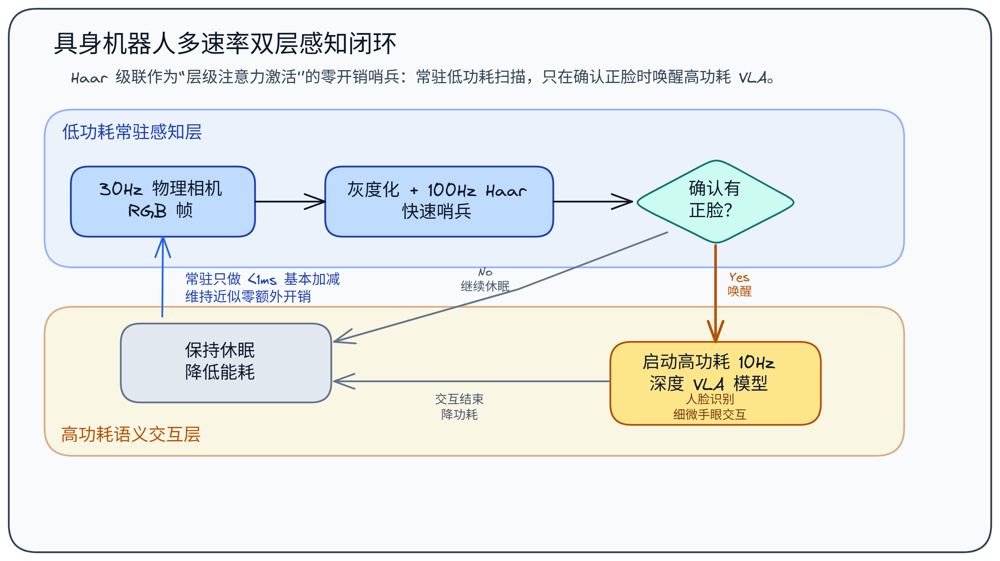

1. **多速率唤醒解耦阀（Hierarchical Awakening Switch）**： 具身机器人在执行长时间任务时（例如：扫地人形机器人在客厅安静待命、寻找人类主人给指令），如果时刻开启高功耗的 VLA 大模型视觉编码器（Visual Encoder），不仅发热量巨大、电池寿命会急剧缩短，还会产生大量的无效数据。 通过在物理前置端（MCU 处理器）部署一个低功耗、高频的 **Haar 级联哨兵机制**，在后台以 $100\text{ Hz}$ 实时极速判定“是否有正脸”出现。一旦判断出现面部，立刻发送中断信号唤醒顶层的 3D 相机和深度大模型，进入精细的面部识别与语音指令交互模式。这极大地保证了整机能源系统的绝对优化。
    
2. **特征点法 SLAM 中人脸动态退避（Visual SLAM Gaze Evasion）**： 在视觉 SLAM 建图时，周围的人脸或走动的人群属于高频的“动态不确定因子”（Dynamic Obstacles）。如果 SLAM 特征匹配（ORB）在人脸上提取了关键点，一旦人走开，定位就会严重漂移失稳。 通过在 SLAM 前置端并行部署 C++ 级快速 Haar 级联检测，一旦在图像某区域锁定人脸 $Bounding\ Box$，立刻在该区域的特征矩阵中生成一块**空间拒绝掩膜（ROI Gaze Mask）**，强制 SLAM 忽略该区域内的任何特征点，从而保证了全局建图地图的静态高鲁棒性。